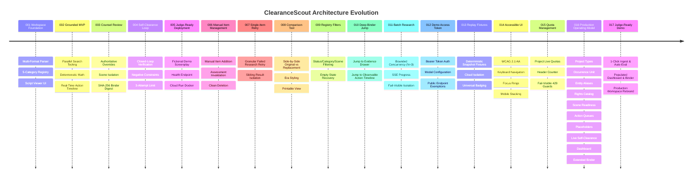

# Development Provenance Log: ClearanceScout

**Repository**: `fmcgoohan/clearancescout`  
**License**: MIT  
**Date Established**: August 2026  
**Status**: Active Production Reference  
**Verified Test Baseline**: 111 Tests Passing across 59 Suites (100% Pass Rate)

---

## 1. Executive Summary & Development Philosophy

ClearanceScout was engineered to solve one of the entertainment industry's most costly, manual, and legally hazardous workflows: **production script clearance, trademark risk assessment, and legal delivery binder management**. The architecture was built from the ground up to embody three fundamental engineering values:

1. **Deterministic Rigor over LLM Fluff**: AI is used strictly for semantic comprehension, contextual spotting, and creative replacement generation. All mathematical metrics, scene readiness states, expiration day deltas, override precedence hierarchies, retry attempt limits, and binder integrity digests are computed deterministically in TypeScript.
2. **Grounded Provenance over Hallucination**: No clearance risk verdict or trademark assertion is ever fabricated. Every finding is anchored to authentic external registry queries via the Parallel Search API (`@parallel-web/sdk`) with explicit provenance tracking (`PARALLEL_LIVE` 🌐, `DEMO_FIXTURE` 📦, `FALLBACK_FIXTURE` ⚡, `MIXED` 🔀).
3. **Chain-of-Thought Privacy & Human-in-the-Loop Governance**: While the platform maintains an Observable Action Timeline via Server-Sent Events, raw internal reasoning is never leaked. Production legal counsel retains authoritative override control at both global and scene-specific granularities.

---

## 2. Technical Stack & Tooling Provenance

| Component | Technology | Version | Justification |
|:---|:---|:---:|:---|
| **Core Reasoning Agent** | Google `@google/genai` (`gemini-3.6-flash`) | `0.1.2` | Rapid semantic document understanding, multi-format script parsing, occurrence context extraction, and risk evaluation. |
| **Concept Artwork Generator** | Google Imagen 3 / Gemini Image Generation | Latest | Generates era-authentic visual packaging and prop cards for cleared replacement marks. |
| **Trademark Grounding Search** | Parallel Web SDK (`@parallel-web/sdk`) | `0.1.3` | Live, authoritative search across global USPTO, WIPO, and commercial brand registries. |
| **Backend API & Event Broker** | Node.js / Express / TypeScript | `4.21.2` | High-throughput REST API with real-time SSE execution event streaming. |
| **Frontend Workspace** | React 18 / Vite 5 / Vanilla CSS Design System | `18.3.1` | Responsive, accessible studio interface with script viewer, entity registry, and timeline drawer. |
| **State Persistence** | Google Cloud Firestore | Latest | Cloud persistence with local in-memory fallback for deterministic test suites. |
| **Testing & CI/CD** | Vitest / Supertest | `1.6.1` | Unit, contract, and integration test execution with 100% automated regression verification. |
| **Containerization** | Google Cloud Run / Docker | Multi-stage | Single unified serverless container hosting API endpoints and built static SPA bundle. |

---

## 3. Complete Architectural Progression & Feature History (001–017)

### Feature 001: Script Workspace & Canonical Entity Registry
- Established `server/` backend isolation standard.
- Implemented multi-format screenplay ingestion (`.fountain`, `.txt`, `.pdf`) and 5-category clearance categorization (`BRAND`, `ART_MUSIC`, `PUBLIC_FIGURE`, `PROPRIETARY_LOCATION`, `GRAPHIC_PROP`).
- Implemented *"Clear once, recognize everywhere"* canonical entity deduplication.

### Feature 002: Live Grounded Research & Observable Action Timeline
- Integrated `@parallel-web/sdk` as the primary live web and trademark research tool.
- Established 3-tier execution mode architecture: `TEST_MODE` (offline mocks), `DEMO_MODE` (deterministic fixtures), `CLOUD_MODE` (live cloud APIs with fail-visible outage handling).
- Implemented Server-Sent Events (SSE) `timelineEmitter` with strict chain-of-thought privacy sanitization.

### Feature 003: Authoritative Counsel Review & Auditable Clearance Binder
- Designed scene-specific override isolation, ensuring overrides applied to a specific scene do not alter canonical entity baselines.
- Implemented hierarchical status resolution: $\text{Effective Status} = \text{Scene Override} \;\;??\;\; \text{Canonical Override} \;\;??\;\; \text{Automated Baseline}$.
- Implemented clearance binder compilation with SHA-256 cryptographic integrity digest and mixed-evidence provenance tallies.

### Feature 004: Autonomous Candidate Self-Clearance Loop
- Created closed-loop replacement candidate clearance verification engine (`replacementGenerator.ts`).
- Enforced deterministic acceptance rule: Candidates accepted iff grounded research returns `NO_ISSUE_SURFACED`.
- Implemented negative prompt constraint accumulation across retry attempts.
- Enforced a deterministic maximum attempt ceiling of 3 attempts with transparent escalation to studio counsel.

### Feature 005: Judge-Ready Demo, Documentation & Cloud Run Deployment
- Authored the bundled entrant-created fully fictional demo screenplay ("The Neon Horizon") with 1-click workspace loading.
- Implemented secret-masked container health checking (`GET /api/health`).
- Created multi-stage `Dockerfile` and single-service Cloud Run deployment configuration.

### Feature 006: Manual Item Addition, Editing & Deletion
- Enabled manual creation of custom clearance items with category and scene mapping.
- Implemented item property edits with automatic invalidation of stale research assessments.
- Enabled clean deletion with cascading occurrence cleanup.

### Feature 007: Single-Item Failed Research Retry
- Built granular retry mechanism for individual items returning `INSUFFICIENT_EVIDENCE` or failed search.
- Isolated retry executions to preserve successful sibling results without expensive whole-script re-evaluations.

### Feature 008: Side-by-Side Original & Replacement Comparison
- Created comparative view pairing original scripted entities with approved fictional replacement prop cards.
- Surfaces risk rationales, Parallel Search evidence, attempt history, and era aesthetic styling in modals and printable binders.

### Feature 009: Multi-Dimension Workspace Registry Filters
- Added client and API filtering across Clearance Status, Entity Category, and Scene Number.
- Provided empty-state recovery banner with 1-click filter reset.

### Feature 010: Read-Only Binder Jump to Evidence & Timeline
- Built deep navigation links from the Legal Clearance Binder to the Citation Drawer (with live URLs) and Observable Action Timeline (with entity context filters).

### Feature 011: Bounded Concurrency Batch Research
- Implemented bounded concurrency ($N=3$) research pipeline to prevent rate limit throttling on large scripts.
- Broadcast real-time per-item progress via SSE timeline events with fail-visible network error isolation.

### Feature 012: Configurable Shared Demo Access Token
- Implemented Bearer token authorization for live AI model invocations and Parallel Search executions.
- Added public route exemptions for container health checks, project listings, and bundled fixtures with an in-app token management modal.

### Feature 013: Record-Replay Fixtures & Universal Provenance Badging
- Captured deterministic snapshot fixtures for 100% offline replay.
- Enforced mode-locked cloud isolation: `CLOUD_MODE` strictly requires live credentials and never falls back silently.
- Displayed universal provenance badges (`PARALLEL_LIVE` 🌐, `DEMO_FIXTURE` 📦, `FALLBACK_FIXTURE` ⚡, `MIXED` 🔀) across cards, drawers, and binder exports.

### Feature 014: Accessible, Responsive Studio Design
- Enforced WCAG 2.1 AA compliance with full keyboard navigation (`Tab`, `Enter`, `Escape`), high-contrast focus rings, touch targets ($\ge 44\text{px}$), and responsive mobile stacking.

### Feature 015: Per-Project Live Research Quota Tracking
- Implemented project-scoped live research quotas to prevent runaway API billing.
- Added header indicator showing real-time quota usage and fail-visible `429 Quota Exceeded` HTTP responses.

### Feature 016: Production Clearance Operating Model (10 Ordered Phases)
- **Phase 1 (Project Types)**: `Movie`, `TV Show`, `Commercial` categorization with multi-project switching and dedicated landing workspace.
- **Phase 2 (Occurrence Unit)**: Evaluates scene action context (dialogue sentiment, background vs foreground depiction) per occurrence; canonical status is a derived roll-up.
- **Phase 3 (Entity Resolution)**: Disambiguates brand aliases, product lines, and parent/subsidiary corporate hierarchies with material equivalence tracking.
- **Phase 4 (Rights Catalog)**: First-class domain records for contractual licenses (`grantType`, `territory`, `mediaWindow`, `effectiveDate`, `expirationDate`, `isPerpetual`, `covenants`).
- **Phase 5 (Scene Readiness)**: Deterministic mathematical state machine evaluating scenes as `RED`, `WORKING CLEAR`, or `FINAL CLEAR`.
- **Phase 6 (Action Queues)**: Automated department task routing to `Art Dept`, `Legal Counsel`, `Locations`, and `Production Mgmt` upon clearance state transitions.
- **Phase 7 (Placeholders)**: Generalized replacement lifecycle across brands, music, artworks, dialogue, and props managing on-set `TEMP_APPROVED` vs post-production `FINAL_CLEARED` tiers.
- **Phase 8 (Live Self-Clearance)**: Evidence-driven candidate self-clearance grounded in live Parallel Search results with negative prompt constraints and $\le 3$ loop ceiling.
- **Phase 9 (Operations Dashboard)**: Executive operational cockpit surfacing active shooting blockers, expiring rights ($\le 90$ days), active placeholders, scene readiness breakdown, and department queues with 1-click mitigation shortcuts.
- **Phase 10 (Extended Legal Binder)**: Comprehensive legal delivery binder compiling multi-domain clearance dossiers with verifiable 64-character SHA-256 cryptographic integrity digest and instant JSON, Markdown, and print-ready PDF export formats.

### Feature 017: Judge-Ready 1-Click Demo & Production Workspace Rebrand
- **1-Click Demo Automation Workflow (`demoAutomationWorkflow.ts`)**: Loads the bundled entrant-authored screenplay (*"The Neon Horizon"*), resolves all entities across 10 scenes, batch executes fixture-backed clearance evaluations with `DEMO_FIXTURE` (📦) provenance, attaches sample rights (`Summit Beverage Group LLC`), creates sample prop placeholders (`NovaTech Zenith`), and computes scene shooting readiness without requiring external API keys.
- **Populated Operations Dashboard & Extended Legal Binder**: Immediately populates executive KPIs, Shoot Readiness %, scene readiness distribution (`FINAL CLEAR`, `WORKING CLEAR`, `RED`), active blockers, upcoming rights expirations, active placeholders, department work queues, and verifiable 64-character SHA-256 integrity seal upon sample load.
- **Production Workspace Rebranding**: Rebranded all user-facing interface copy from "MVP Workspace" / "ClearanceScout MVP" to "ClearanceScout Production Clearance Workspace" / "Production Clearance Studio".

---

## 4. Fictional-Content & Anti-Hallucination Policy

ClearanceScout operates under a strict, non-negotiable fictional-content and evidence-grounding policy:
1. **Public Documentation & Demo Screenplays**: All sample screenplays, documentation examples, and bundled fixtures use exclusively entrant-authored fictional entity names (e.g., *Summit Cola*, *AeroTech Prism*, *Veloce GT*, *Midtown Spire Tower*, *Nocturne of the Wild*, *Elena Vance*, *Titan Industrial Hazard Placard*, *NovaTech Zenith*).
2. **Zero Fabricated Evidence**: AI agents are strictly prohibited from generating simulated search URLs, fabricated trademark serial numbers, or false dispute citations. In `CLOUD_MODE`, any search provider outage immediately fails visibly as `INSUFFICIENT_EVIDENCE` without silent fixture substitution.
3. **Legal Status Disclaimers**: All clearance outputs are strictly framed as operational risk issue-spotting categories (`NO ISSUE SURFACED`, `REVIEW RECOMMENDED`, `ACTION REQUIRED`, `INSUFFICIENT EVIDENCE`) and explicitly disclaim rendering formal legal advice.

---

## 5. Verification & Test Attestation

As of Feature 017, the entire ClearanceScout test suite passes with 100% success rate across all contract, unit, and integration tests:
- **Contract Tests**: Verified endpoint schemas, SSE event taxonomies, health checks, counsel overrides, multi-format parsers, project types, occurrence evaluation, entity resolution, rights management, scene readiness, action queues, placeholders, evidence self-clearance, operations dashboard, extended binder export, and 1-click judge demo automation.
- **Integration Tests**: Verified end-to-end script ingestion, candidate clearance loops, counsel overrides with scene isolation, batch research, offline replay, judge demo workflows, and auditable binder compilation.
- **Test Baseline**: 111 tests passing across 59 test suites (100% pass rate).
- **Build Verification**: Multi-stage production container and Vite production bundle compile with 0 errors across 49 modules.
