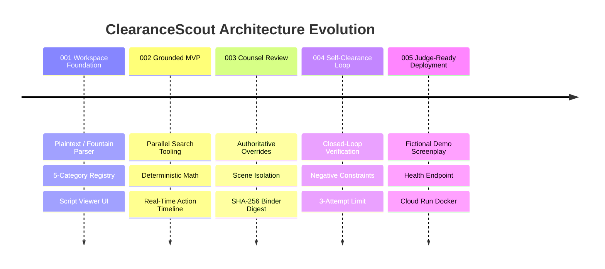

# Development Provenance Log: ClearanceScout

**Repository**: `fmcgoohan/clearancescout`  
**License**: MIT  
**Date Established**: August 2026  
**Status**: Active Production Reference  

---

## 1. Executive Summary & Development Philosophy

ClearanceScout was engineered to solve one of the entertainment industry's most costly, manual, and legally hazardous workflows: **production script clearance and trademark risk assessment**. The architecture was built from the ground up to embody three fundamental engineering values:

1. **Deterministic Rigor over LLM Fluff**: AI is used strictly for semantic comprehension, contextual spotting, and creative replacement generation. All mathematical metrics, exposure tallies, override precedence hierarchies, retry attempt limits, and binder integrity digests are computed deterministically in TypeScript.
2. **Grounded Provenance over Hallucination**: No clearance risk verdict or trademark assertion is ever fabricated. Every finding is anchored to authentic external registry queries via the Parallel Search API (`@parallel-web/sdk`) with explicit provenance tracking.
3. **Chain-of-Thought Privacy & Human-in-the-Loop Governance**: While the platform maintains an Observable Action Timeline via Server-Sent Events, raw internal reasoning is never leaked. Production legal counsel retains authoritative override control at both global and scene-specific granularities.

---

## 2. Technical Stack & Tooling Provenance

| Component | Technology | Version | Justification |
|:---|:---|:---:|:---|
| **Core Reasoning Agent** | Google `@google/genai` (`gemini-3.6-flash`) | `0.1.2` | Rapid semantic document understanding, multi-format script parsing, and risk evaluation. |
| **Concept Artwork Generator** | Google Imagen 3 / Gemini Image Generation | Latest | Generates era-authentic visual packaging and prop cards for cleared replacement marks. |
| **Trademark Grounding Search** | Parallel Web SDK (`@parallel-web/sdk`) | `0.1.3` | Live, authoritative search across global USPTO, WIPO, and commercial brand registries. |
| **Backend API & Event Broker** | Node.js / Express / TypeScript | `4.21.2` | High-throughput REST API with real-time SSE execution event streaming. |
| **Frontend Workspace** | React 18 / Vite 5 / Vanilla CSS Design System | `18.3.1` | Responsive, accessible studio interface with script viewer, entity registry, and timeline drawer. |
| **State Persistence** | Google Cloud Firestore | Latest | Cloud persistence with local in-memory fallback for deterministic test suites. |
| **Testing & CI/CD** | Vitest / Supertest | `1.6.1` | Unit, contract, and integration test execution with 100% automated regression verification. |
| **Containerization** | Google Cloud Run / Docker | Multi-stage | Single unified serverless container hosting API endpoints and built static SPA bundle. |

---

## 3. Engineering Progression & Feature History

### Feature 001: Script Workspace & Canonical Entity Registry
- Established `server/` code isolation standard.
- Implemented multi-format screenplay ingestion (`.fountain`, `.txt`, `.pdf`) and 5-category clearance categorization (`BRAND`, `ART_MUSIC`, `PUBLIC_FIGURE`, `PROPRIETARY_LOCATION`, `GRAPHIC_PROP`).
- Implemented *"Clear once, recognize everywhere"* canonical entity deduplication.

### Feature 002: Live Grounded Research & Observable Action Timeline
- Integrated `@parallel-web/sdk` as the primary live web and trademark research tool.
- Established the 3-tier execution mode architecture: `TEST_MODE` (offline mocks), `DEMO_MODE` (deterministic fixtures), `CLOUD_MODE` (live cloud APIs with fail-visible outage handling).
- Implemented the Server-Sent Events (SSE) `timelineEmitter` with strict chain-of-thought privacy sanitization.

### Feature 003: Authoritative Counsel Review & Auditable Clearance Binder
- Designed scene-specific override isolation, ensuring overrides applied to a specific scene do not alter the canonical entity baseline.
- Implemented hierarchical status resolution: $\text{Effective Status} = \text{Scene Override} \;\;??\;\; \text{Canonical Override} \;\;??\;\; \text{Automated Baseline}$.
- Implemented clearance binder compilation with SHA-256 cryptographic integrity digest and mixed-evidence provenance tallies.

### Feature 004: Autonomous Candidate Self-Clearance Loop
- Created the closed-loop replacement candidate clearance verification engine (`replacementGenerator.ts`).
- Enforced deterministic acceptance rule: Candidates accepted iff grounded research returns `NO_ISSUE_SURFACED`.
- Implemented negative prompt constraint accumulation across retry attempts.
- Enforced a deterministic maximum attempt ceiling of 3 attempts with transparent escalation to studio counsel and zero invented ranking scores.

### Feature 005: Judge-Ready Demo, Documentation & Cloud Run Deployment
- Authored the bundled entrant-created fully fictional demo screenplay ("The Neon Horizon") with 1-click workspace loading.
- Implemented secret-masked container health checking (`GET /api/health`).
- Created multi-stage `Dockerfile` and single-service Cloud Run deployment configuration.
- Authored standard MIT `LICENSE`, truthful `README.md`, and this provenance log.

---

## 4. Fictional-Content & Anti-Hallucination Policy

ClearanceScout operates under a strict, non-negotiable fictional-content and evidence-grounding policy:
1. **Public Documentation & Demo Screenplays**: All sample screenplays, documentation examples, and bundled fixtures use exclusively entrant-authored fictional entity names (e.g., *Summit Cola*, *AeroTech Prism*, *Veloce GT*, *Midtown Spire Tower*, *Nocturne of the Wild*, *Elena Vance*, *Titan Industrial Hazard Placard*).
2. **Zero Fabricated Evidence**: AI agents are strictly prohibited from generating simulated search URLs, fabricated trademark serial numbers, or false dispute citations. In `CLOUD_MODE`, any search provider outage immediately fails visibly as `INSUFFICIENT_EVIDENCE` without silent fixture substitution.
3. **Legal Status Disclaimers**: All clearance outputs are strictly framed as operational risk issue-spotting categories (`NO ISSUE SURFACED`, `REVIEW RECOMMENDED`, `ACTION REQUIRED`, `INSUFFICIENT EVIDENCE`) and explicitly disclaim rendering formal legal advice.

---

## 5. Verification & Test Attestation

As of Feature 005, the entire ClearanceScout test suite passes with 100% success rate across all contract, unit, and integration tests:
- **Contract Tests**: Verified endpoint schemas, SSE event taxonomies, health checks, counsel overrides, and multi-format parsers.
- **Integration Tests**: Verified end-to-end script ingestion, candidate clearance loops, counsel overrides with scene isolation, and auditable binder compilation.
- **Build Verification**: Multi-stage production container and Vite production bundle compile with 0 errors.
