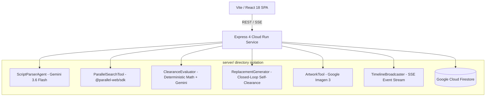

# ClearanceScout 🎬⚖️

**Autonomous Script Clearance & Brand Protection Agent for Film, TV, and Streaming Productions**

[](LICENSE)
[](https://deepmind.google/technologies/gemini/)
[](https://parallel.ai)
[](https://cloud.google.com/run)

ClearanceScout is an enterprise agentic platform designed for studio legal counsel, clearance coordinators, and production teams. It transforms unstructured screenplays into structured, auditable clearance binders by automatically extracting brand marks, music, public figures, proprietary locations, and prop graphics, grounding them against live USPTO and web trademark registries via Parallel Search, generating verified non-infringing replacement assets, and managing authoritative legal counsel overrides.

---

## 🌟 Key Capabilities

1. **Multi-Format Screenplay Ingestion & 5-Category Resolution**:
   - Ingests Fountain (`.fountain`), Plaintext (`.txt`), and PDF screenplays.
   - Extracts and categorizes mentions across 5 critical clearance domains:
     - 🏷️ **`BRAND`**: Trademarks, consumer products, electronics, automotive.
     - 🎵 **`ART_MUSIC`**: Copyrighted compositions, song lyrics, paintings, sculptures.
     - 👤 **`PUBLIC_FIGURE`**: Living real-world figures, celebrity depictions.
     - 🏛️ **`PROPRIETARY_LOCATION`**: Trademarked architectural landmarks, private venues.
     - ⚠️ **`GRAPHIC_PROP`**: Industrial placards, caution symbols, prop slogans.
   - *“Clear once, recognize everywhere”*: Canonical registry resolves entity occurrences across scenes.

2. **Live Grounded Trademark & Case-Law Research**:
   - Grounded directly via the official `@parallel-web/sdk` web search engine.
   - Retains exact source URLs, trademark owner details, registration statuses, and precedent snippets with verifiable provenance badges (`PARALLEL_LIVE`, `DEMO_FIXTURE`, `FALLBACK_FIXTURE`).
   - Strict anti-hallucination invariant: Never invents external web evidence.

3. **Autonomous Candidate Self-Clearance Loop**:
   - Generates era-authentic fictional prop replacements (e.g. replacing a high-risk brand with an era-authentic mark like *Summit Cola* or *Veloce GT*).
   - Automatically runs candidate proposals through the live Parallel Search clearance research pipeline before accepting.
   - Closed-loop retry with negative prompt constraints accumulating past collisions.
   - Deterministic $\le 3$ attempt ceiling with transparent escalation to studio counsel.

4. **Authoritative Counsel Overrides & Scene Isolation**:
   - Studio counsel can record signed overrides (`NO_ISSUE_SURFACED`, `REVIEW_RECOMMENDED`, `ACTION_REQUIRED`, `INSUFFICIENT_EVIDENCE`) globally or with scene-specific scope.
   - Scene overrides isolate modifications without altering canonical entity baselines.
   - Hierarchical status resolution: $\text{Effective Status} = \text{Scene Override} \;\;??\;\; \text{Canonical Override} \;\;??\;\; \text{Automated Baseline}$.

5. **Auditable Clearance Binder Export**:
   - Compiles production clearance dossiers with scene breakdowns, entity risk assessments, research citations, counsel audit histories, and approved replacement cards.
   - Calculates cryptographic SHA-256 integrity digests and mixed-evidence provenance tallies.
   - Instant export to auditable JSON and print-ready PDF layouts.

6. **Observable Action Timeline (CoT Privacy)**:
   - Streams live execution events (`TOOL_CALL`, `DOCUMENT_QUERY`, `RISK_EVAL`, `CITATION_ADDED`, `REPLACEMENT_ATTEMPT`, `REPLACEMENT_ACCEPTED`, etc.) via Server-Sent Events (SSE).
   - Enforces chain-of-thought privacy: Raw internal reasoning is strictly sanitized.

---

## 🏛️ System Architecture



### Deterministic Calculation & AI Reasoning Division of Labor
1. **Gemini 3.6 Flash**: Identifies unstructured document contents, scene context, dialogue sentiment, and era aesthetic constraints.
2. **Deterministic TypeScript**: Computes objective mathematical values (sentiment polarity scores, exposure durations, attempt limits, hierarchical overrides, SHA-256 binder digest).
3. **Gemini 3.6 Flash**: Reasons over calculated objective outputs against studio requirements to issue final risk categorizations.

---

## ⚙️ Execution Modes

| Mode | Target | Description |
|:---|:---|:---|
| **`TEST_MODE`** | Automated CI/CD | Deterministic local fixtures for instant, isolated unit and contract testing. |
| **`DEMO_MODE`** | Interactive Evaluation | Zero-configuration evaluation using synthetic datasets and bundled demo screenplay. |
| **`CLOUD_MODE`** | Production Runtime | Live Google Gemini 3.6 Flash and Parallel Search APIs. Fails visibly with diagnostics if credentials are missing. |

---

## 🚀 Quickstart Guide

### Prerequisites
- Node.js 20+
- npm 10+

### 1. Installation
```bash
git clone https://github.com/fmcgoohan/clearancescout.git
cd clearancescout
npm install
```

### 2. Environment Setup (Optional for Demo Mode)
Create a `.env` file in the project root:
```env
PORT=3000
EXECUTION_MODE=DEMO_MODE
# Required only for CLOUD_MODE:
# GEMINI_API_KEY=your_google_gemini_api_key
# PARALLEL_WEB_API_KEY=your_parallel_search_api_key
```

### 3. Run Locally
```bash
# Start Vite development server & Express API
npm run dev
```
Open your browser at `http://localhost:5173`.

### 4. Zero-Setup Demo Evaluation
1. Click **"🎬 Load Sample Screenplay"** in the workspace.
2. "The Neon Horizon" (fully fictional 5-category screenplay) is loaded into the editor.
3. Click **"Ingest Screenplay"** to trigger automated scene parsing and entity extraction.
4. Click **"Research Clearance"** on any entity to view grounded citations and risk verdicts.
5. Click **"Generate Replacement Brand"** to observe the candidate self-clearance loop in real time.
6. Click **"Export Clearance Binder"** to generate the auditable production binder with SHA-256 digest.

---

## 🧪 Testing & Validation

Run the complete Vitest test suite (unit, contract, and integration tests):
```bash
npm test
```

Run production bundle build verification:
```bash
npm run build
```

---

## 🐳 Google Cloud Run Deployment

ClearanceScout is packaged as a single unified container serving both the Express REST/SSE API and compiled static React frontend.

### Build & Run Container Locally
```bash
docker build -t clearancescout:latest .
docker run -p 8080:8080 -e EXECUTION_MODE=DEMO_MODE clearancescout:latest
```

### Deploy to Google Cloud Run
```bash
gcloud run deploy clearancescout \
  --source . \
  --platform managed \
  --region us-central1 \
  --allow-unauthenticated \
  --port 8080 \
  --set-env-vars EXECUTION_MODE=CLOUD_MODE \
  --set-secrets GEMINI_API_KEY=clearancescout-gemini-key:latest,PARALLEL_WEB_API_KEY=clearancescout-parallel-key:latest
```

### Health & Readiness Check
```bash
curl -s http://localhost:8080/api/health
```

---

## ⚖️ Legal Disclaimer

> **IMPORTANT**: ClearanceScout is an automated research, issue-spotting, and clearance workflow management tool. It classifies risk under four operational categories (`NO ISSUE SURFACED`, `REVIEW RECOMMENDED`, `ACTION REQUIRED`, `INSUFFICIENT EVIDENCE`). ClearanceScout **does NOT render formal legal opinions or legal advice**. Production teams must have clearance binders reviewed and approved by qualified entertainment legal counsel prior to principal photography.

---

## 📄 License

ClearanceScout is open-source software licensed under the [MIT License](LICENSE).
