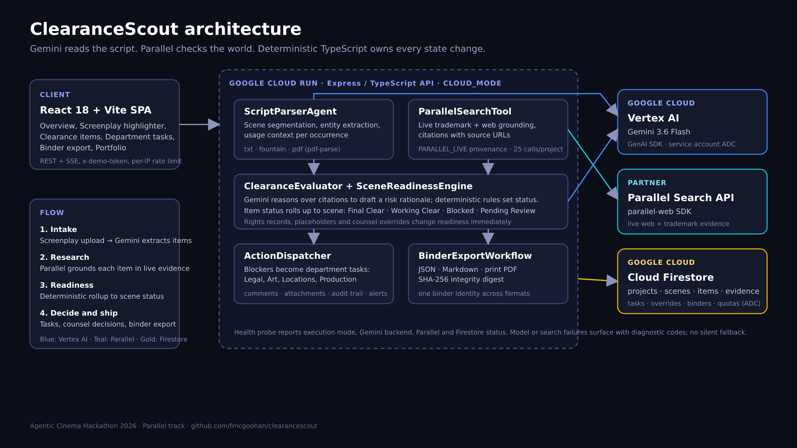

# ClearanceScout 🎬⚖️

**Autonomous Script Clearance & Brand Protection Agent for Film, TV, and Streaming Productions**

[](LICENSE)
[-4285F4)](https://cloud.google.com/vertex-ai)
[](https://parallel.ai)
[](https://cloud.google.com/run)
[-34D399)](tests/)
[](https://clearancescout-n3tcx4jcbq-uc.a.run.app)

**Live demo (CLOUD_MODE):** [https://clearancescout-n3tcx4jcbq-uc.a.run.app](https://clearancescout-n3tcx4jcbq-uc.a.run.app)  
*First-time visitors in `CLOUD_MODE` can enter the documented judge access token `judge-pass-2026` in the access modal to unlock live project data access, screenplay uploads, observable timeline streams, and clearance workflows.*

ClearanceScout is an enterprise agentic platform designed for studio legal counsel, clearance coordinators, art directors, and production delivery supervisors. It transforms unstructured screenplays into structured, auditable clearance binders by automatically extracting brand marks, music compositions, public figures, proprietary locations, and prop graphics, grounding them against live USPTO and web trademark registries via Parallel Search, generating verified non-infringing replacement assets, and orchestrating comprehensive production clearance operating workflows.

---

## ⚖️ For Reviewers (2-Minute Walkthrough)

Follow this quick workflow on the live Cloud Run deployment:

1. **Open the app**: Navigate to [https://clearancescout-n3tcx4jcbq-uc.a.run.app](https://clearancescout-n3tcx4jcbq-uc.a.run.app) and enter judge access token `judge-pass-2026`.
2. **Create your isolated workspace**: Click the project switcher in the header, then click **"+ New Project"** (e.g. *"Judge Evaluation Project"*, Studio: *"Apex Films"*). This guarantees an isolated workspace and research quota.
3. **Upload a sample two-scene script**: Click **"Upload Screenplay"**, select the **"Paste Text"** tab (or save as `.txt`), and paste the 10-line screenplay below:
   ```text
   EXT. DOWNTOWN ROOFTOP - NIGHT

   ELENA stands near the edge of the neon-lit parapet. The city hums below.
   She reaches into her pocket and pulls out a sleek can of RED BULL.

   ELENA
   We only have until sunrise.

   INT. TECH LAB - CONTINUOUS

   MARCUS furiously types away at a dual-monitor workstation.
   A half-eaten pizza sits next to his glowing TERMINAL.

   MARCUS
   (without looking up)
   The firewall is down. We're in.
   ```
   Click **"Ingest Screenplay"** to parse scenes and entities via Vertex Gemini.
4. **Live trademark research**: In the Entity Registry table, click **"Research"** on **Red Bull** to watch live Parallel Search API citations appear with real source links.
5. **Export Binder**: Open **"Export Binder"** in the header, verify preflight readiness, and click **"Generate PDF Binder"** to export the sealed clearance dossier.

---

## 🌟 Key Capabilities & Complete Feature Architecture

### 1. Multi-Format Screenplay Ingestion & 5-Category Resolution
- Ingests Fountain (`.fountain`), Plaintext (`.txt`), and PDF screenplays.
- Extracts and categorizes mentions across 5 critical clearance domains:
  - 🏷️ **`BRAND`**: Trademarks, consumer products, electronics, automotive.
  - 🎵 **`ART_MUSIC`**: Copyrighted compositions, song lyrics, paintings, sculptures.
  - 👤 **`PUBLIC_FIGURE`**: Living real-world figures, celebrity depictions.
  - 🏛️ **`PROPRIETARY_LOCATION`**: Trademarked architectural landmarks, private venues.
  - ⚠️ **`GRAPHIC_PROP`**: Industrial placards, caution symbols, prop slogans.
- *“Clear once, recognize everywhere”*: Canonical registry resolves entity occurrences across scenes.

### 2. Live Grounded Trademark & Case-Law Research
- Grounded directly via the official `parallel-web` (`^1.3.0`) TypeScript SDK (direct backend integration, no MCP required).
- Returns explicit structured `searchOutcome` metadata (`ZERO_RESULTS` | `MATCHES_FOUND` | `SERVICE_FALLBACK`) rather than relying on citation prose heuristics.
- Retains exact source URLs, trademark owner details, registration statuses, and precedent snippets with verifiable provenance badges (`PARALLEL_LIVE` 🌐, `DEMO_FIXTURE` 📦, `FALLBACK_FIXTURE` ⚡, `MIXED` 🔀).
- Strict anti-hallucination invariant: Never invents external web evidence or claims `TRADEMARK_ACTIVE` when status is unconfirmed.

### 3. Production Projects & Multi-Type Management (`016 Phase 1`)
- Studio project organization categorized by `projectType` (`Movie`, `TV Show`, `Commercial`).
- Fast, multi-project switching with project-scoped entity registries, rights databases, and quota counters.

### 4. Occurrence-Level Evaluation as Fundamental Unit (`016 Phase 2`)
- Clearance risk is evaluated per scene occurrence using specific scene action context (dialogue sentiment, background vs foreground depiction, defamatory vs incidental use).
- Canonical entity status is deterministically derived from its most severe active occurrence status.

### 5. Advanced Entity Resolution & Material Equivalence (`016 Phase 3`)
- Disambiguates brand aliases, product lines, and parent/subsidiary corporate relationships.
- Tracks material equivalence groups to eliminate redundant research and unify cross-scene clearance decisions.

### 6. Contractual Rights & Restrictions Catalog (`016 Phase 4`)
- First-class tracking of executed licenses and agreements: `grantType` (`EXCLUSIVE`, `NON_EXCLUSIVE`, `GRATIS`, `WORK_FOR_HIRE`), `territory`, `mediaWindow`, `effectiveDate`, `expirationDate`, `isPerpetual`, and contractual covenants.

### 7. Deterministic Scene Shooting Readiness State Machine (`016 Phase 5`)
- Mathematical readiness evaluation:
  - 🟢 **`FINAL CLEAR`**: 100% of scene occurrences are clean, covered by active rights, or signed off via counsel override.
  - 🟡 **`WORKING CLEAR`**: All un-cleared items have temporary on-set approvals (`TEMP_APPROVED` placeholders).
  - 🔴 **`RED`**: Scene has at least one unresolved clearance blocker (`ACTION_REQUIRED`).

### 8. State-Transition Action & Notification Queues (`016 Phase 6`)
- Automated department task generation upon clearance state changes, routing work items to `Art Dept`, `Legal Counsel`, `Locations`, and `Production Mgmt`.
- Automatic task resolution when mitigating rights or placeholders are attached.

### 9. Generalized Replacements & Fictional Placeholders (`016 Phase 7`)
- Multi-category replacement tracking for brands, music tracks, artworks, dialogue lines, and graphic props.
- Manages on-set `TEMP_APPROVED` vs post-production `FINAL_CLEARED` lifecycles.

### 10. Evidence-Driven Live Self-Clearance Verification (`016 Phase 8`)
- Closed-loop candidate clearance loop grounded in live Parallel Search trademark evidence.
- Accumulates negative prompt constraints upon collision, enforces a deterministic loop ceiling of $\le 3$ attempts, and streams live 4-event SSE timelines (`REPLACEMENT_ATTEMPT`, `REPLACEMENT_RESEARCH_STARTED`, `REPLACEMENT_REJECTED`, `REPLACEMENT_ACCEPTED`).

### 11. Production Clearance Operations Dashboard (`016 Phase 9`)
- Executive operational cockpit surfacing active shooting blockers, upcoming rights expirations ($\le 90$ days), active placeholders, scene readiness breakdown, and department work queues with direct 1-click mitigation shortcuts.

### 12. Comprehensive Legal Clearance Binder with SHA-256 Digest (`016 Phase 10`)
- Audit-grade legal delivery dossier compiling scene schedules, canonical entities, contractual rights, fictional placeholders, open action items, research citations, and signed counsel overrides.
- Deterministic 64-character SHA-256 cryptographic integrity digest ensuring tamper-evident provenance for studio E&O insurance.
- Export formats: Auditable JSON, formatted Markdown (`.md`), and print-ready PDF.

### 13. Manual Item Management & Correction (`006`)
- Manual entity addition, property editing with automatic assessment invalidation, and clean entity deletion.

### 14. Single-Item Failed Research Retry (`007`)
- Granular retry for individual items returning `INSUFFICIENT_EVIDENCE` without re-running entire scripts.

### 15. Side-by-Side Original & Replacement Comparison (`008`)
- Visual and legal comparison view contrasting original scripted items with approved fictional replacement prop cards.

### 16. Multi-Dimension Workspace Registry Filters (`009`)
- Instant client and API filtering across Clearance Status, Entity Category, and Scene Number with 1-click reset recovery.

### 17. Deep Binder Jump to Evidence & Timeline (`010`)
- Direct navigation from exported binder dossiers into citation source drawers and observable action timeline events.

### 18. Bounded Concurrency Batch Research (`011`)
- High-throughput parallel evaluation ($N=3$) with live progress broadcast and fail-visible item isolation.

### 19. Shared Demo Access Token & Quota Controls (`012`, `015`)
- Bearer token security with client modal configuration, project-scoped live research quotas, and fail-visible 429 warnings.

### 20. Accessible, Responsive Studio Design (`014`)
- WCAG 2.1 AA accessible with full keyboard navigation (`Tab`, `Enter`, `Escape`), high-contrast focus rings, touch targets ($\ge 44\text{px}$), and responsive mobile stacking.

### 21. Judge-Ready 1-Click Demo & Production Workspace Rebrand (`017`)
- Single-click demo loading (`POST /api/projects/:id/script/demo`) ingesting *"The Neon Horizon"*, auto-running deterministic batch evaluations with `DEMO_FIXTURE` (📦) provenance, attaching active beverage rights (`Summit Beverage Group LLC`) and approved fictional placeholders (`NovaTech Zenith`), and computing scene readiness without requiring external API keys.
- Immediately populates the Operations Dashboard and Legal Clearance Binder with realistic multi-scene metrics, department queues, and verifiable 64-character SHA-256 integrity seal.

### 22. Production Hardening & Live Evidence Integrity (`018`)
- **`CLOUD_MODE` Fail-Closed Rule**: Unmitigated fallback fixtures and search failures in production runtime fail closed to `INSUFFICIENT_EVIDENCE` and scene status evaluates to `RED`.
- **Structured Search Outcomes**: Parallel Search results return structured `searchOutcome` metadata (`ZERO_RESULTS` | `MATCHES_FOUND` | `SERVICE_FALLBACK`), isolating prose heuristics to legacy compatibility fallbacks.
- **Zero-Hit `PARALLEL_LIVE` Precision**: Live search returning zero trademark hits is documented as completed live research with `ZERO_TRADEMARK_CONFLICTS_SURFACED` without inventing fictional corporate owners or registration classifications.
- **Baseline BRAND Non-Auto-Clear**: Baseline / un-occurred brand evaluations never independently assign `NO_ISSUE_SURFACED` from absence of records; they evaluate as `REVIEW_RECOMMENDED`.
- **`RETRY_RESEARCH` Action Routing**: Items with `INSUFFICIENT_EVIDENCE` dispatch a `RETRY_RESEARCH` action item for Legal Counsel and auto-resolve upon successful research retry.
- **Gemini Structured Scene Context**: Gemini 3.6 Flash semantically interprets scene occurrence tone, prominence, and defamation risks while deterministic TypeScript logic maintains authoritative state ownership.
- **Granular Scoped Placeholders**: Supports occurrence-level and scene-level replacement scoping, preventing placeholders from over-mitigating un-scoped occurrences.
- **Strict `WORKING_CLEAR` Invariant**: `WORKING_CLEAR` requires affirmative interim mitigations; unmitigated `REVIEW_RECOMMENDED` occurrences remain blockers until authorized.
- **Genuine Ingestion Diagnostics**: Scanned or unparseable PDF uploads return structured `400 Bad Request` diagnostics with code `PDF_EXTRACTION_FAILED`.

### 23. Live Runtime & Real-Script Integrity (`019`)
- **Native File Picker & Multipart Upload**: Native dialog and drag-and-drop file ingestion supporting `.fountain`, `.txt`, and `.pdf` files up to 25MB with visible error banners and SHA-256 checksums.
- **Windowed Chunk Parsing**: Robust multi-scene chunking with 1-scene overlap buffers allowing seamless ingestion of 120+ page feature-length screenplays without LLM context overflows.
- **Authoritative Server `CLOUD_MODE` Precedence**: Server runtime execution mode is globally authoritative; client headers and persisted project flags cannot force demo fallbacks or override live AI evaluators.
- **Strict Model Error Visibility**: In `CLOUD_MODE`, Gemini parser exceptions fail visibly with structured diagnostic code `PARSING_FAILED` rather than silently leaking demo recognizers.
- **Google Cloud Firestore ADC Persistence**: Production runtime connects directly to Google Cloud Firestore via Application Default Credentials (ADC), failing health probes (`503 Service Unavailable`) if the database is unreachable.
- **Protected Public Endpoints**: Mutating endpoints (`/upload`, `/replacements`, `/overrides`, `/rights`, `/actions`) are guarded with Bearer authentication while preserving public access for health checks and demo exploration.
- **Fail-Closed Replacement Candidate Gate**: Gemini replacement candidate generation and collision checks fail closed on model exceptions, excluding failed/proposed replacements from interim mitigations.
- **Strict Interim Mitigation Gating**: `WORKING_CLEAR` interim scene mitigation strictly requires placeholders in `TEMP_APPROVED` or `FINAL_CLEARED` tiers, or replacement cards with status `APPROVED` and `selfClearanceResult: ACCEPTED`.
- **Atomic 25-Call Live Quota Accounting**: Enforces atomic Firestore transaction boundaries so project live research quotas strictly honor the 25-call allocation under high concurrency.
- **Worst-Case Canonical Status Roll-Up**: Derived canonical entity status factors in all active occurrences across the script, preventing `NO_ISSUE_SURFACED` if any occurrence is non-cleared or unresolved (`INSUFFICIENT_EVIDENCE`).
- **Grounding Cache Invalidation & Clean Screenplay Draft Replacement**: Entity edits immediately invalidate grounding caches; screenplay re-uploads execute an atomic replacement transaction that purges old scenes, re-indexes occurrences, and auto-supersedes orphaned action items (`SCRIPT_REVISION_SUPERSEDED`).

---

## 🏛️ System Architecture

```mermaid
graph TD
    Client[Vite / React 18 SPA] -->|REST / SSE| Server[Express 4 Cloud Run Service]
    subgraph Backend[server/ directory isolation]
        Parser[ScriptParserAgent - Gemini 3.6 Flash]
        Grounding[ParallelSearchTool - parallel-web SDK]
        Evaluator[ClearanceEvaluator - Deterministic Math + Gemini]
        Replacements[ReplacementGenerator - Closed-Loop Self-Clearance]
        RightsEngine[RightsManagementWorkflow - Contractual Terms]
        SceneEngine[SceneReadinessEngine - Deterministic RED/WORKING/FINAL]
        ActionEngine[ActionDispatcher - Department Work Queues]
        DashEngine[DashboardEngine - Operations Cockpit]
        BinderEngine[BinderExportWorkflow - SHA-256 Audit Seal]
        Artwork[ArtworkTool - Google Imagen 3]
        Timeline[TimelineBroadcaster - SSE Event Stream]
        Store[(Google Cloud Firestore)]
    end
    Server --> Parser
    Server --> Grounding
    Server --> Evaluator
    Server --> Replacements
    Server --> RightsEngine
    Server --> SceneEngine
    Server --> ActionEngine
    Server --> DashEngine
    Server --> BinderEngine
    Server --> Artwork
    Server --> Timeline
    Server --> Store
```





### Division of Labor Invariant
1. **Gemini 3.6 Flash on Vertex AI**: Semantic document understanding, occurrence context extraction, dialogue sentiment, and creative replacement generation.
2. **Deterministic TypeScript**: Computes objective mathematical values (scene readiness status, expiration day deltas, override precedence, attempt counters, and SHA-256 checksums).
3. **Gemini 3.6 Flash on Vertex AI**: Reasons over calculated outputs against legal specifications to issue final validation verdicts.

---

## ⚙️ Execution Modes

| Mode | Target | Description |
|:---|:---|:---|
| **`TEST_MODE`** | Automated CI/CD | Deterministic local fixtures for instant, isolated unit and contract testing (152/152 tests pass). |
| **`DEMO_MODE`** | Interactive Evaluation | Zero-configuration evaluation using synthetic datasets and bundled demo screenplay ("The Neon Horizon"). |
| **`CLOUD_MODE`** | Production Runtime | Live Google Gemini 3.6 Flash on Vertex AI and Parallel Search APIs. Fails visibly with diagnostics if credentials/project are missing. |

---

## 🚀 Quickstart & Validation Guide

### Prerequisites
- Node.js 20+
- npm 10+

### 1. Installation
```bash
git clone https://github.com/fmcgoohan/clearancescout.git
cd clearancescout
npm install
```

### 2. Run Test Suite
```bash
npm test
```
*Executes all 152 tests across 74 test files spanning contract and integration suites with 0 failures.*

### 3. Build & Run
```bash
# Build production bundle
npm run build

# Start local server
npm start
```
Open [http://localhost:8080](http://localhost:8080) to access the ClearanceScout Studio Workspace.

---

## 🐳 Google Cloud Run Deployment

**Live service (CLOUD_MODE):** [https://clearancescout-n3tcx4jcbq-uc.a.run.app](https://clearancescout-n3tcx4jcbq-uc.a.run.app)

GCP project: `clearance-scout-2026`. Service: `clearancescout` in `us-central1`.

ClearanceScout is packaged as a single unified container serving both the Express REST/SSE API and compiled static React frontend.

### 1. Vertex AI IAM Permissions
The Cloud Run runtime service account requires the `roles/aiplatform.user` role to invoke Gemini 3.6 Flash on Vertex AI without an API key:

```bash
gcloud projects add-iam-policy-binding clearance-scout-2026 \
  --member="serviceAccount:clearance-scout-runtime@clearance-scout-2026.iam.gserviceaccount.com" \
  --role="roles/aiplatform.user" \
  --condition=None
```

### 2. Deploy to Google Cloud Run (Vertex AI Backend)
```bash
gcloud run deploy clearancescout \
  --image gcr.io/clearance-scout-2026/clearancescout:<IMAGE_TAG> \
  --project clearance-scout-2026 \
  --platform managed \
  --region us-central1 \
  --allow-unauthenticated \
  --port 8080 \
  --set-env-vars "EXECUTION_MODE=CLOUD_MODE,GEMINI_BACKEND=vertex,GOOGLE_CLOUD_PROJECT=clearance-scout-2026,GOOGLE_CLOUD_LOCATION=us-central1" \
  --set-secrets "PARALLEL_WEB_API_KEY=clearance-parallel-api-key:latest,DEMO_ACCESS_TOKEN=clearance-demo-access-token:latest"
```

Missing production credentials must fail visibly. Do not silently substitute DEMO fixtures in `CLOUD_MODE`.

### 3. Rollback Instructions (API Key Fallback)
If Vertex AI needs to be reverted to the API key backend without downtime:
1. Re-attach the `GEMINI_API_KEY` secret from Secret Manager.
2. Set environment variable `GEMINI_BACKEND=apikey`.

```bash
gcloud run services update clearancescout \
  --region us-central1 \
  --project clearance-scout-2026 \
  --update-env-vars "GEMINI_BACKEND=apikey" \
  --update-secrets "GEMINI_API_KEY=clearance-gemini-api-key:latest"
```

### 4. Health & Readiness Check
```bash
curl -s https://clearancescout-n3tcx4jcbq-uc.a.run.app/api/health
```

---

## ⚖️ Legal Notice & Disclaimer Invariant
ClearanceScout provides automated issue-spotting, trademark research provenance, and clearance workflow management. It does **not** render formal legal opinions or replace independent legal counsel. Production counsel should independently review all chain-of-title and rights documents prior to distribution.
