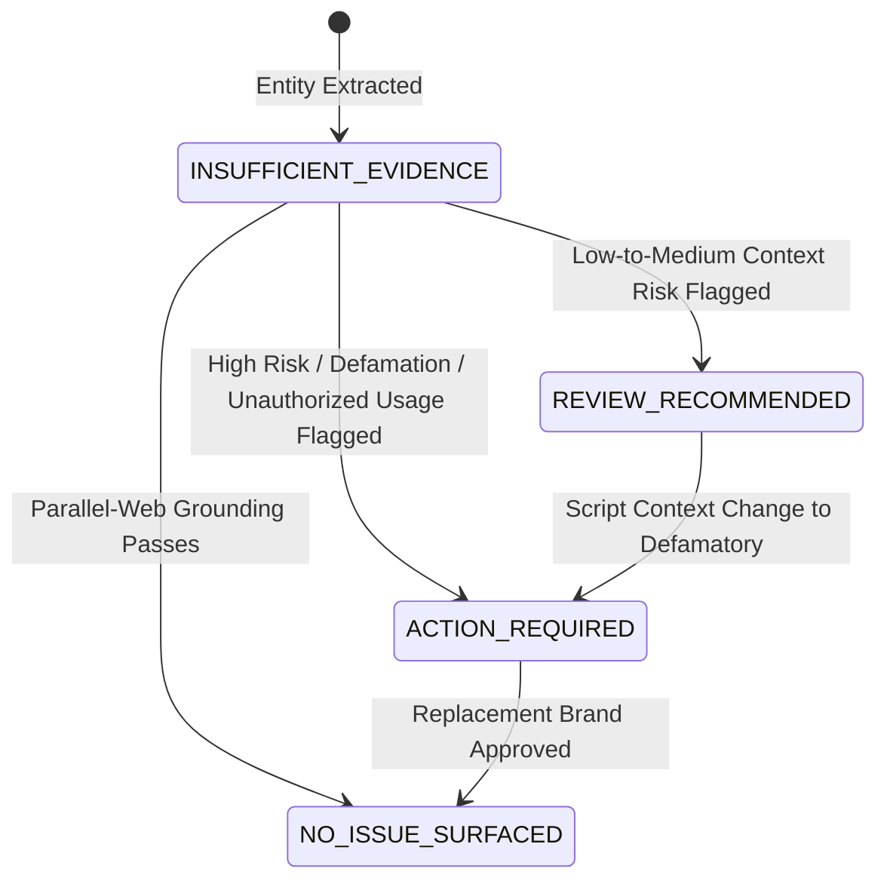

# Data Model Specification: ClearanceScout Workspace

**Feature**: `specs/001-clearance-workspace`  
**Date**: 2026-08-17  
**Persistence**: Google Cloud Firestore (Native Mode)

---

## Firestore Collection Structure

```text
projects/{projectId}
├── scenes/{sceneId}
│   └── occurrences/{occurrenceId}
├── entities/{canonicalEntityId}
├── assessments/{assessmentId}
├── replacements/{replacementId}
└── events/{eventId}
```

---

## Entity Schemas

### 1. Project (`projects`)

Represents a film, TV, or media production project workspace.

| Field | Type | Required | Description |
|-------|------|----------|-------------|
| `id` | string (UUID) | Yes | Primary key |
| `title` | string | Yes | Project title (e.g. "The Great Heist") |
| `productionCompany` | string | Yes | Production entity name |
| `scriptVersion` | string | Yes | Script version identifier (e.g., "v1.2-ShootingDraft") |
| `executionMode` | string | Yes | `TEST_MODE` \| `DEMO_MODE` \| `CLOUD_MODE` |
| `createdAt` | string (ISO-8601) | Yes | Creation timestamp |
| `updatedAt` | string (ISO-8601) | Yes | Last update timestamp |

---

### 2. Scene (`projects/{projectId}/scenes`)

Represents an individual scene parsed from a production script.

| Field | Type | Required | Description |
|-------|------|----------|-------------|
| `id` | string (UUID) | Yes | Primary key |
| `projectId` | string | Yes | Parent project ID |
| `sceneNumber` | number | Yes | Sequential scene number |
| `heading` | string | Yes | Full scene heading (e.g., "INT. COFFEE SHOP - DAY") |
| `locationType` | string | Yes | `INT` \| `EXT` \| `INT/EXT` |
| `timeOfDay` | string | Yes | `DAY` \| `NIGHT` \| `CONTINUOUS` |
| `rawText` | string | Yes | Original parsed script text |
| `characterActionSummary` | string | Yes | Summary of characters and actions |

---

### 3. CanonicalEntity (`projects/{projectId}/entities`)

Represents a unique real-world brand, trademark, product, logo, or organization ("Clear once, recognize everywhere").

| Field | Type | Required | Description |
|-------|------|----------|-------------|
| `id` | string (UUID) | Yes | Primary key |
| `projectId` | string | Yes | Parent project ID |
| `canonicalName` | string | Yes | Normalized entity name (e.g. "Coca-Cola") |
| `entityCategory` | string | Yes | `BRAND` \| `TRADEMARK` \| `PRODUCT` \| `LOGO` \| `LOCATION` \| `CHARACTER_NAME` |
| `description` | string | Yes | Brief description of the real-world entity |
| `overallClearanceStatus` | string | Yes | `NO_ISSUE_SURFACED` \| `REVIEW_RECOMMENDED` \| `ACTION_REQUIRED` \| `INSUFFICIENT_EVIDENCE` |
| `createdAt` | string (ISO-8601) | Yes | Creation timestamp |
| `updatedAt` | string (ISO-8601) | Yes | Last update timestamp |

---

### 4. SceneEntityOccurrence (`projects/{projectId}/scenes/{sceneId}/occurrences`)

Links a `CanonicalEntity` to a specific `Scene`.

| Field | Type | Required | Description |
|-------|------|----------|-------------|
| `id` | string (UUID) | Yes | Primary key |
| `sceneId` | string | Yes | Parent scene ID |
| `canonicalEntityId` | string | Yes | Linked canonical entity ID |
| `scriptLineNumber` | number | Yes | Line number in script |
| `excerptText` | string | Yes | Specific text excerpt mentioning the entity |
| `usageContext` | string | Yes | Contextual description (e.g., "Held by villain during robbery") |

---

### 5. ClearanceRiskAssessment (`projects/{projectId}/assessments`)

Captures the legal risk evaluation of an entity occurrence within its scene context.

| Field | Type | Required | Description |
|-------|------|----------|-------------|
| `id` | string (UUID) | Yes | Primary key |
| `occurrenceId` | string | Yes | Linked occurrence ID |
| `canonicalEntityId` | string | Yes | Linked canonical entity ID |
| `sceneId` | string | Yes | Linked scene ID |
| `riskStatus` | string | Yes | `NO_ISSUE_SURFACED` \| `REVIEW_RECOMMENDED` \| `ACTION_REQUIRED` \| `INSUFFICIENT_EVIDENCE` |
| `riskScore` | number (0-100) | Yes | Computed numerical risk score |
| `legalRationale` | string | Yes | Non-legal-advice legal issue-spotting rationale |
| `contextFlags` | string[] | Yes | Array of risk flags (e.g., `["DEFAMATION_RISK", "UNAUTHORIZED_LOGO"]`) |
| `citations` | object[] | Yes | Array of embedded `ClearanceCitation` objects |
| `evaluatedAt` | string (ISO-8601) | Yes | Evaluation timestamp |

---

### 6. ClearanceCitation (Embedded struct inside `ClearanceRiskAssessment`)

| Field | Type | Required | Description |
|-------|------|----------|-------------|
| `id` | string (UUID) | Yes | Citation ID |
| `sourceUrl` | string | Yes | Live web/trademark URL from `parallel-web` |
| `query` | string | Yes | Search query used |
| `retrievedAt` | string (ISO-8601) | Yes | Citation timestamp |
| `excerptSnippet` | string | Yes | Grounded text excerpt from source |
| `registrationStatus` | string | Yes | `REGISTERED_ACTIVE` \| `PENDING` \| `EXPIRED` \| `UNKNOWN` |

---

### 7. ReplacementConceptCard (`projects/{projectId}/replacements`)

Represents a generated fictional replacement brand for high-risk entities.

| Field | Type | Required | Description |
|-------|------|----------|-------------|
| `id` | string (UUID) | Yes | Primary key |
| `canonicalEntityId` | string | Yes | Linked canonical entity ID |
| `fictionalBrandName` | string | Yes | Generated non-infringement brand name (e.g., "Summit Sip") |
| `designBrief` | string | Yes | Visual design prompt and color palette description |
| `artworkImageUrl` | string | Yes | Image asset URL generated by Imagen 3 |
| `nonInfringementRationale` | string | Yes | Rationale explaining why replacement avoids conflict |
| `status` | string | Yes | `DRAFT` \| `PROPOSED` \| `APPROVED` \| `REJECTED` |
| `createdAt` | string (ISO-8601) | Yes | Creation timestamp |

---

### 8. ExecutionEvent (`projects/{projectId}/events`)

An observable timeline entry tracking agent workflow actions.

| Field | Type | Required | Description |
|-------|------|----------|-------------|
| `id` | string (UUID) | Yes | Primary key |
| `projectId` | string | Yes | Linked project ID |
| `eventType` | string | Yes | `TOOL_CALL` \| `DOCUMENT_QUERY` \| `DETERMINISTIC_CALC` \| `RISK_EVAL` \| `CITATION_ADDED` \| `STATE_TRANSITION` \| `REPLACEMENT_GEN` |
| `label` | string | Yes | Human-readable event title |
| `payload` | object | Yes | Structured event detail (stripped of raw chain-of-thought) |
| `timestamp` | string (ISO-8601) | Yes | Event timestamp |

---

## State Transition Rules

### Clearance Status Lifecycle


