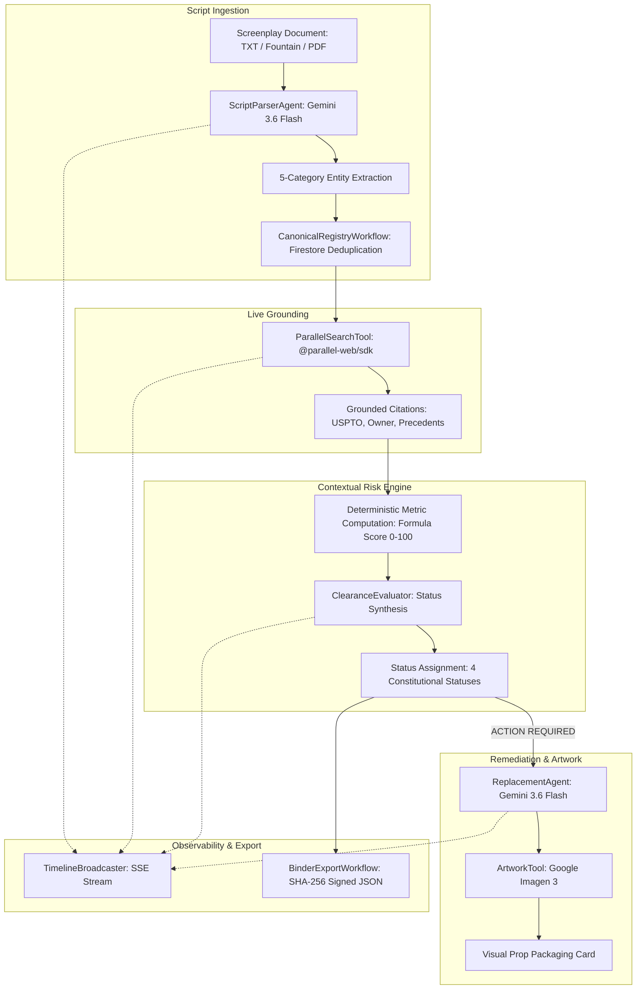

# Implementation Architecture Plan: ClearanceScout MVP Engine

**Branch**: `002-clearancescout-mvp` | **Date**: 2026-08-17 | **Spec**: [`specs/002-clearancescout-mvp/spec.md`](spec.md)  
**Governance**: Constitution v1.0.0

---

## 1. Directory Structure & Strict Code Isolation

The architecture enforces strict separation of concerns between backend reasoning/services (`server/`) and the client user interface (`src/`):

```text
clearancescout/
├── Dockerfile                      # Multi-stage production container build for Google Cloud Run
├── .dockerignore                   # Build artifact exclusions
├── .gitignore                      # Git tracking exclusions
├── package.json                    # Dependencies & scripts
├── tsconfig.json                   # TypeScript strict config
├── vite.config.ts                  # Vite SPA bundler & proxy configuration
│
├── server/                         # BACKEND ISOLATION: ADK Agents, Models, Search & Storage
│   ├── config.ts                   # Multi-mode resolver (TEST_MODE, DEMO_MODE, CLOUD_MODE)
│   ├── index.ts                    # Express server entrypoint & static frontend host
│   ├── agents/                     # Google ADK Agents
│   │   ├── ScriptParserAgent.ts    # Screenplay parsing & 5-category entity extraction (Gemini 3.6 Flash)
│   │   └── ReplacementAgent.ts     # Fictional replacement brand generator (Gemini 3.6 Flash)
│   ├── tools/                      # Native ADK Tools & FunctionDeclarations
│   │   ├── parallelSearchTool.ts   # @parallel-web/sdk live search grounding tool
│   │   └── artworkTool.ts          # Google Imagen 3 / Gemini Image Generation tool
│   ├── workflows/                  # Business Logic & Orchestration
│   │   ├── canonicalRegistryWorkflow.ts  # "Clear once, recognize everywhere" deduplication
│   │   ├── clearanceEvaluator.ts         # 3-step hybrid deterministic + semantic risk engine
│   │   └── binderExportWorkflow.ts       # Project clearance binder compilation & signing
│   ├── repositories/               # Firestore Native Repositories
│   │   ├── firestoreClient.ts      # Native Firestore client with in-memory fallback
│   │   ├── ProjectRepo.ts          # Projects collection
│   │   ├── SceneRepo.ts            # Scenes subcollection
│   │   ├── EntityRepo.ts           # Canonical entities & occurrences
│   │   ├── AssessmentRepo.ts       # Risk assessments & citation provenance
│   │   ├── ReplacementRepo.ts      # Replacement brand concept cards
│   │   └── BinderRepo.ts           # Auditable clearance binder exports
│   ├── events/                     # Real-Time Event Streaming
│   │   └── timelineEmitter.ts      # SSE broadcaster with Chain-of-Thought privacy filter
│   ├── integrations/               # External SDK Wrappers & Offline Fixtures
│   │   └── cache/
│   │       └── demoCacheProvider.ts # 5-category dictionary fixtures
│   └── api/                        # REST Controllers & Routes
│       ├── projectRoutes.ts        # Projects, scenes, and script ingestion
│       ├── clearanceRoutes.ts      # Clearance risk evaluation
│       ├── replacementRoutes.ts    # Replacement brand card generation
│       ├── timelineRoutes.ts       # SSE event stream & event history
│       └── binderRoutes.ts         # Clearance binder export & verification
│
├── src/                            # FRONTEND BUNDLE: React SPA (UI Only, No Direct AI Keys)
│   ├── App.tsx                     # Main layout shell, mode switcher, and binder trigger
│   ├── index.css                   # Dark-mode glassmorphism design tokens & badge styles
│   ├── main.tsx                    # React DOM entrypoint
│   ├── components/                 # Reusable UI Components
│   │   ├── ScriptViewer.tsx        # Screenplay scene breakdown viewer
│   │   ├── EntityRegistryTable.tsx # 5-category canonical registry with category filters
│   │   ├── SceneRiskBadge.tsx      # Clearance status indicator badges
│   │   ├── CitationDrawer.tsx      # Source provenance drawer with legal disclaimer
│   │   ├── ReplacementCardModal.tsx # Era-appropriate replacement artwork modal
│   │   ├── BinderExportModal.tsx   # Auditable clearance binder download modal
│   │   └── TimelineDrawer.tsx      # Real-time observable action timeline
│   ├── pages/
│   │   └── WorkspacePage.tsx       # Primary multi-format script & entity workspace
│   ├── services/                   # API client bindings
│   └── hooks/                      # Custom React Hooks
│       ├── useExecutionMode.ts     # Execution mode detector
│       └── useTimelineSSE.ts       # SSE timeline event hook
│
└── tests/                          # Automated Test Suites
    ├── contract/                   # Interface & endpoint contract tests
    │   ├── test_script_parser.test.ts
    │   ├── test_multiformat_ingestion.test.ts
    │   ├── test_grounded_risk.test.ts
    │   ├── test_clearance_eval.test.ts
    │   ├── test_era_replacement.test.ts
    │   ├── test_replacement_gen.test.ts
    │   ├── test_binder_export.test.ts
    │   └── test_timeline_sse.test.ts
    └── integration/                # End-to-end integration workflows
        ├── clearance_workflow.test.ts
        └── clearancescout_mvp.test.ts
```

---

## 2. Google ADK Agent & Tool Architecture



### Key ADK Agents & Tools
1. **ScriptParserAgent (`server/agents/ScriptParserAgent.ts`)**:
   - Model: `gemini-3.6-flash`.
   - Extracts structured scenes (sluglines, locations, dialogue) and candidate mentions across 5 categories: `BRAND`, `ART_MUSIC`, `PUBLIC_FIGURE`, `PROPRIETARY_LOCATION`, and `GRAPHIC_PROP`.
2. **CanonicalRegistryWorkflow (`server/workflows/canonicalRegistryWorkflow.ts`)**:
   - Performs semantic and lexical hashing to match mentions across scenes to a single canonical ID ("Clear once, recognize everywhere").
3. **ParallelSearchTool (`server/tools/parallelSearchTool.ts`)**:
   - Native ADK Tool wrapping `@parallel-web/sdk`.
   - Generates targeted trademark search queries and extracts corporate owner, registration status, and enforcement dispute precedents with exact source URLs.
4. **ClearanceEvaluator (`server/workflows/clearanceEvaluator.ts`)**:
   - Computes deterministic composite risk score:
     $$\text{Risk Score} = \text{Base Risk (30)} + \text{Sentiment Penalty (0–40)} + \text{Exposure Weight (0–20)} + \text{Defamation Flag (+30)}$$
   - Formally assigns one of 4 statuses: `NO ISSUE SURFACED`, `REVIEW RECOMMENDED`, `ACTION REQUIRED`, `INSUFFICIENT EVIDENCE`.
5. **ReplacementAgent & ArtworkTool (`server/agents/ReplacementAgent.ts` & `server/tools/artworkTool.ts`)**:
   - Generates era-appropriate fictional brand names and design briefs via `gemini-3.6-flash`.
   - Generates visual packaging concept cards via Google Imagen 3 (`imagen-3.0-generate-002`).

---

## 3. Data Persistence & Firestore Collection Topology

```text
projects/{projectId}
├── scenes/{sceneId}
│   └── occurrences/{occurrenceId}
├── entities/{canonicalEntityId}
├── assessments/{assessmentId}
├── replacements/{replacementId}
├── events/{eventId}
└── binder_exports/{exportId}
```

### Composite Indexes
- `projects/{projectId}/scenes`: `(projectId ASC, sceneNumber ASC)`
- `projects/{projectId}/entities`: `(projectId ASC, entityCategory ASC, overallClearanceStatus ASC)`
- `projects/{projectId}/assessments`: `(canonicalEntityId ASC, evaluatedAt DESC)`
- `projects/{projectId}/binder_exports`: `(projectId ASC, exportedAt DESC)`

---

## 4. API & Event Streaming Contract

### REST Endpoints
- `POST /api/projects`: Create project workspace
- `GET /api/projects/:id`: Get project metadata
- `POST /api/projects/:id/script`: Ingest Plaintext, Fountain, or PDF screenplay
- `GET /api/projects/:id/scenes`: List parsed scenes
- `GET /api/projects/:id/entities`: List canonical entity registry with category filtering
- `POST /api/projects/:id/clearance/evaluate`: Trigger live grounded clearance risk evaluation
- `POST /api/projects/:id/replacements/generate`: Generate era-appropriate replacement concept card
- `GET /api/projects/:id/binder/export`: Compile, sign (SHA-256), and export Project Clearance Binder
- `GET /api/health`: Service health check & execution mode diagnostic

### Observable Action Timeline SSE Stream
- **Endpoints**: `GET /api/projects/:id/timeline/stream` & `GET /api/events/stream`
- **Protocol**: Server-Sent Events (`text/event-stream`)
- **Privacy Standard**: 100% sanitized of raw model chain-of-thought (`thought`, `thinking`, `chainOfThought` fields strictly omitted).

---

## 5. Multi-Mode Configuration Strategy

| Mode | External Network Calls | AI / Search Runtime | Primary Use Case |
|------|------------------------|---------------------|------------------|
| `TEST_MODE` | **0 calls** | Local deterministic fixtures & In-memory Firestore store | Fast automated CI/CD and unit test suites |
| `DEMO_MODE` | **0 calls** | 5-category dictionary cache (`DemoCacheProvider`) & SVG concept cards | Interactive zero-cost client demonstrations |
| `CLOUD_MODE` | **Live APIs** | Live `gemini-3.6-flash`, Imagen 3, and `@parallel-web/sdk` | Production execution on Google Cloud Run |

---

## 6. Google Cloud Run Deployment Architecture

- **Stateless Container**: Containerized with Node.js 20 Alpine using a multi-stage Docker build (`Dockerfile`).
- **Static Asset Serving**: Production bundle (`dist/`) served directly by the Express server on port `8080`.
- **Database Connection**: Firestore Native mode accessed via Application Default Credentials (ADC) or managed service account.
- **Environment Variables**:
  - `PORT=8080`
  - `EXECUTION_MODE=CLOUD_MODE` (or `DEMO_MODE`)
  - `GEMINI_API_KEY=<secret>`
  - `PARALLEL_WEB_API_KEY=<secret>`

### Deployment Command
```bash
gcloud run deploy clearancescout \
  --source . \
  --platform managed \
  --region us-central1 \
  --allow-unauthenticated \
  --set-env-vars EXECUTION_MODE=CLOUD_MODE,PORT=8080 \
  --set-secrets GEMINI_API_KEY=gemini-api-key:latest,PARALLEL_WEB_API_KEY=parallel-web-api-key:latest
```
