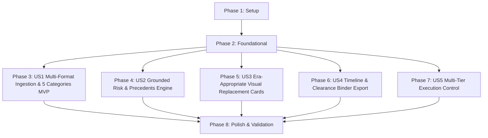

# Tasks: ClearanceScout MVP Engine

**Feature**: `specs/002-clearancescout-mvp` | **Branch**: `002-clearancescout-mvp`  
**Input**: Plan from [`specs/002-clearancescout-mvp/plan.md`](plan.md), Spec from [`specs/002-clearancescout-mvp/spec.md`](spec.md)

---

## Phase 1: Setup (Shared Infrastructure)

**Purpose**: Project initialization and multi-format script parsing toolchain setup.

- [x] T001 Verify project structure and directories for MVP engine in `server/` and `src/`
- [x] T002 Ensure screenplay parsing dependencies and utilities are configured in `package.json`
- [x] T003 [P] Configure Vitest test runner paths in `vite.config.ts` and `tsconfig.json`

---

## Phase 2: Foundational (Blocking Prerequisites)

**Purpose**: Core data models and repositories required before user story implementation.

- [x] T004 [P] Implement 5-category entity schema and Firestore models in `server/repositories/EntityRepo.ts`
- [x] T005 [P] Implement ClearanceBinder repository and audit signature generator in `server/repositories/BinderRepo.ts`
- [x] T006 [P] Enhance timeline event broadcaster with binder export event tracking in `server/events/timelineEmitter.ts`

**Checkpoint**: Core 5-category repository and binder export models ready. User story implementation can begin.

---

## Phase 3: User Story 1 - Multi-Format Script Ingestion & 5-Category Detection (Priority: P1) 🎯 MVP

**Goal**: Ingest Plaintext, Fountain, and PDF screenplays, parse structured scenes, and extract candidate items across 5 core categories with semantic deduplication in Firestore ("Clear once, recognize everywhere").

**Independent Test**: Upload Fountain, PDF, and text screenplay samples; verify structured scenes and 5-category entity mentions are extracted and mapped to canonical IDs.

### Tests for User Story 1

- [x] T007 [P] [US1] Contract test for multi-format screenplay ingestion in `tests/contract/test_multiformat_ingestion.test.ts`

### Implementation for User Story 1

- [x] T008 [P] [US1] Implement multi-format screenplay parser agent supporting Plaintext, Fountain, and PDF in `server/agents/ScriptParserAgent.ts`
- [x] T009 [US1] Implement 5-category entity extraction and canonical resolution workflow in `server/workflows/canonicalRegistryWorkflow.ts` (depends on T004, T008)
- [x] T010 [US1] Implement multi-format script upload endpoint (`POST /api/projects/:id/script`) supporting format flags in `server/api/projectRoutes.ts`
- [x] T011 [P] [US1] Enhance ScriptViewer and EntityRegistryTable UI components to display 5 categories in `src/components/ScriptViewer.tsx` and `src/components/EntityRegistryTable.tsx`
- [x] T012 [US1] Connect multi-format upload and category filters to workspace view in `src/pages/WorkspacePage.tsx`

**Checkpoint**: User Story 1 complete (MVP). Screenplays in any format can be parsed with 5-category entity resolution.

---

## Phase 4: User Story 2 - Live Trademark Grounding & Contextual Risk Engine (Priority: P2)

**Goal**: Query live trademark data via `@parallel-web/sdk`, compute deterministic sentiment and exposure metrics, assign 4 formal clearance statuses with verifiable citations, and render legal disclaimer.

**Independent Test**: Trigger clearance evaluation; verify live citations with corporate owner and deterministic risk calculation in response.

### Tests for User Story 2

- [x] T013 [P] [US2] Contract test for grounded clearance evaluation with corporate ownership in `tests/contract/test_grounded_risk.test.ts`

### Implementation for User Story 2

- [x] T014 [P] [US2] Enhance ParallelSearchTool to extract corporate owner and dispute precedents in `server/tools/parallelSearchTool.ts`
- [x] T015 [US2] Implement deterministic sentiment and exposure duration calculations in `server/workflows/clearanceEvaluator.ts` (depends on T014)
- [x] T016 [P] [US2] Update CitationDrawer component to render corporate owner and dispute precedents in `src/components/CitationDrawer.tsx`
- [x] T017 [US2] Integrate grounded risk evaluations into workspace view in `src/pages/WorkspacePage.tsx`

**Checkpoint**: User Stories 1 AND 2 complete. Factual grounding with corporate ownership provenance and deterministic risk evaluation operational.

---

## Phase 5: User Story 3 - Visual Asset Remediation & Era-Appropriate Replacement Cards (Priority: P3)

**Goal**: Generate creative, era-appropriate, non-infringing placeholder brand names and Imagen 3 visual concept cards for `ACTION REQUIRED` items.

**Independent Test**: Request replacement card generation with era aesthetic parameter; verify fictional brand, Imagen 3 image URL, and legal rationale.

### Tests for User Story 3

- [x] T018 [P] [US3] Contract test for era-appropriate replacement brand generation in `tests/contract/test_era_replacement.test.ts`

### Implementation for User Story 3

- [x] T019 [P] [US3] Update ReplacementAgent to accept era aesthetic parameters in `server/agents/ReplacementAgent.ts`
- [x] T020 [P] [US3] Enhance ArtworkTool for era-appropriate visual prop packaging card generation in `server/tools/artworkTool.ts`
- [x] T021 [US3] Update replacement REST endpoint (`POST /api/projects/:id/replacements/generate`) in `server/api/replacementRoutes.ts` (depends on T019, T020)
- [x] T022 [P] [US3] Update ReplacementCardModal component to display era aesthetic badges in `src/components/ReplacementCardModal.tsx`

**Checkpoint**: User Stories 1, 2, AND 3 complete. Era-appropriate replacement brand names and visual concept artwork operational.

---

## Phase 6: User Story 4 - Observable Action Timeline & Production Binder Export (Priority: P4)

**Goal**: Real-time SSE timeline streaming and auditable Project Clearance Binder export (JSON & printable summary).

**Independent Test**: Trigger clearance binder export, verify complete JSON export package with audit signature and timestamped records.

### Tests for User Story 4

- [x] T023 [P] [US4] Contract test for Clearance Binder export endpoint in `tests/contract/test_binder_export.test.ts`

### Implementation for User Story 4

- [x] T024 [US4] Implement Clearance Binder compilation workflow with SHA-256 audit signature in `server/workflows/binderExportWorkflow.ts` (depends on T005)
- [x] T025 [US4] Implement Binder Export REST endpoints (`GET /api/projects/:id/binder/export`) in `server/api/binderRoutes.ts`
- [x] T026 [P] [US4] Implement BinderExportModal UI component for downloading and reviewing binder export in `src/components/BinderExportModal.tsx`
- [x] T027 [US4] Integrate Clearance Binder export button into workspace header in `src/App.tsx`

**Checkpoint**: User Stories 1 through 4 complete. Clearance binder export and real-time SSE timeline operational.

---

## Phase 7: User Story 5 - Multi-Tier Execution Control (Priority: P5)

**Goal**: Seamless switching between `TEST_MODE`, `DEMO_MODE`, and `CLOUD_MODE` with descriptive error handling.

**Independent Test**: Verify mode switcher and demo cache response behavior.

### Implementation for User Story 5

- [x] T028 [P] [US5] Enhance demo response cache with 5-category items in `server/integrations/cache/demoCacheProvider.ts`
- [x] T029 [US5] Add execution mode selector dropdown to header in `src/App.tsx`

---

## Phase 8: Polish & Cross-Cutting Concerns

**Purpose**: System integration testing, quickstart validation, and security auditing.

- [x] T030 [P] Implement comprehensive end-to-end integration test in `tests/integration/clearancescout_mvp.test.ts`
- [x] T031 Run quickstart validation scenarios defined in `specs/002-clearancescout-mvp/quickstart.md`
- [x] T032 Perform privacy audit verifying zero raw model chain-of-thought in binder exports, SSE streams, and logs

---

## Dependencies & Execution Order



---

## Parallel Execution Examples

### Parallel Foundational Tasks
```bash
Task: "Implement 5-category entity schema and Firestore models in server/repositories/EntityRepo.ts"
Task: "Implement ClearanceBinder repository and audit signature generator in server/repositories/BinderRepo.ts"
Task: "Enhance timeline event broadcaster with binder export event tracking in server/events/timelineEmitter.ts"
```

### Parallel User Story Tasks
```bash
Developer A: "Implement multi-format screenplay parser agent in server/agents/ScriptParserAgent.ts"
Developer B: "Enhance ParallelSearchTool to extract corporate owner in server/tools/parallelSearchTool.ts"
Developer C: "Enhance ArtworkTool for era-appropriate visual prop cards in server/tools/artworkTool.ts"
```

---

## Implementation Strategy

### MVP Scope (User Story 1 Only)
1. Complete **Phase 1: Setup** and **Phase 2: Foundational**.
2. Complete **Phase 3: User Story 1**.
3. **STOP and VALIDATE**: Verify multi-format screenplay parsing and 5-category canonical resolution.

### Incremental Feature Rollout
1. **MVP**: Multi-Format Script Ingestion & 5-Category Entity Detection (US1).
2. **Increment 2**: Trademark Grounding with Corporate Ownership & Deterministic Risk Calculations (US2).
3. **Increment 3**: Era-Appropriate Replacement Brand & Imagen 3 Artwork Cards (US3).
4. **Increment 4**: Auditable Project Clearance Binder Export & SSE Timeline (US4).
5. **Increment 5**: Multi-Tier Execution Control (US5).
