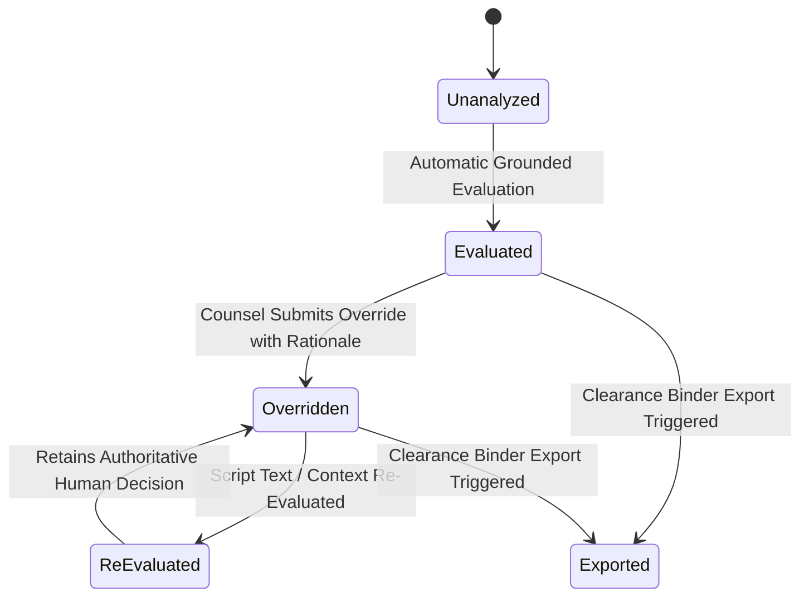

# Data Model: Clearance Binder Export & Studio Counsel Review Module

**Feature**: `specs/003-counsel-review-binder` | **Date**: 2026-08-17

---

## 1. Firestore Schema & Entities

### A. `CounselOverride` Entity
Path: `projects/{projectId}/overrides/{overrideId}`

```typescript
export interface CounselOverride {
  id: string;
  projectId: string;
  canonicalEntityId: string;
  sceneId?: string; // Optional: If undefined, applies globally to canonical entity
  previousStatus: 'NO_ISSUE_SURFACED' | 'REVIEW_RECOMMENDED' | 'ACTION_REQUIRED' | 'INSUFFICIENT_EVIDENCE';
  overrideStatus: 'NO_ISSUE_SURFACED' | 'REVIEW_RECOMMENDED' | 'ACTION_REQUIRED' | 'INSUFFICIENT_EVIDENCE';
  rationale: string;
  counselName: string;
  counselRole?: string; // e.g. "Senior Production Counsel", "Clearance Coordinator"
  timestamp: string; // ISO 8601
}
```

### B. Updated `CanonicalEntity` Entity
Path: `projects/{projectId}/entities/{canonicalEntityId}`

```typescript
export interface CanonicalEntity {
  id: string;
  projectId: string;
  canonicalName: string;
  entityCategory: 'BRAND' | 'ART_MUSIC' | 'PUBLIC_FIGURE' | 'PROPRIETARY_LOCATION' | 'GRAPHIC_PROP';
  baselineRiskStatus: 'NO_ISSUE_SURFACED' | 'REVIEW_RECOMMENDED' | 'ACTION_REQUIRED' | 'INSUFFICIENT_EVIDENCE';
  effectiveClearanceStatus: 'NO_ISSUE_SURFACED' | 'REVIEW_RECOMMENDED' | 'ACTION_REQUIRED' | 'INSUFFICIENT_EVIDENCE';
  isOverridden: boolean;
  latestOverride?: {
    overrideId: string;
    overrideStatus: string;
    rationale: string;
    counselName: string;
    timestamp: string;
  };
  totalOccurrences: number;
  occurrences: string[]; // occurrence IDs
  createdAt: string;
  updatedAt: string;
}
```

### C. Updated `ClearanceBinderExport` Entity
Path: `projects/{projectId}/binder_exports/{exportId}`

```typescript
export interface ClearanceBinderExport {
  id: string;
  projectId: string;
  title: string;
  productionCompany: string;
  scriptVersion: string;
  exportedAt: string;
  auditSignature: string; // SHA-256 hash over normalized export payload
  disclaimer: string;
  summaryMetrics: {
    totalScenes: number;
    totalEntities: number;
    clearedCount: number;
    reviewCount: number;
    actionRequiredCount: number;
    overridesCount: number;
    replacementsCount: number;
  };
  scenes: Array<{
    sceneNumber: number;
    heading: string;
    locationType: string;
    locationName: string;
    timeOfDay: string;
    dialogueExcerpt: string;
  }>;
  canonicalEntities: Array<{
    id: string;
    canonicalName: string;
    category: string;
    baselineStatus: string;
    effectiveStatus: string;
    isOverridden: boolean;
    overrideRationale?: string;
    counselName?: string;
    citations: Array<{
      sourceUrl: string;
      query: string;
      excerptSnippet: string;
      corporateOwner?: string;
      trademarkStatus?: string;
    }>;
  }>;
  replacementCatalog: Array<{
    id: string;
    canonicalEntityId: string;
    originalEntityName: string;
    fictionalBrandName: string;
    eraAesthetic: string;
    designBrief: string;
    artworkImageUrl: string;
    nonInfringementRationale: string;
  }>;
  overridesHistory: CounselOverride[];
}
```

---

## 2. State Lifecycle & Transitions


