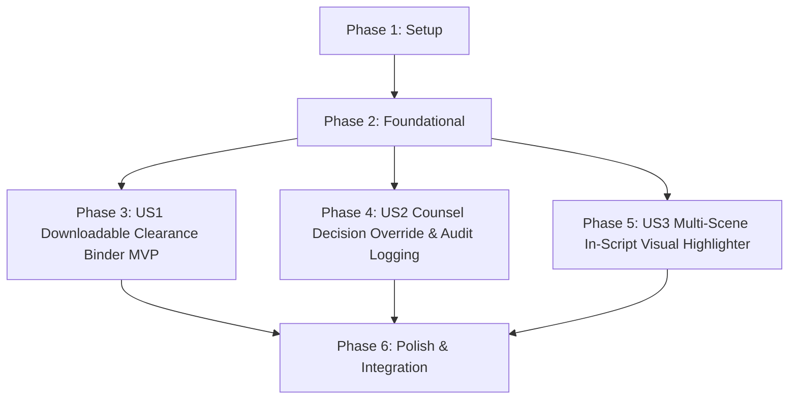

# Tasks: Clearance Binder Export & Studio Counsel Review Module

**Feature**: `specs/003-counsel-review-binder` | **Branch**: `003-counsel-review-binder`  
**Input**: Plan from [`specs/003-counsel-review-binder/plan.md`](plan.md), Spec from [`specs/003-counsel-review-binder/spec.md`](spec.md)

---

## Phase 1: Setup (Shared Infrastructure)

**Purpose**: Project configuration and test runner setup for counsel review module.

- [x] T001 Verify project structure and test paths for counsel review in `vite.config.ts` and `tsconfig.json`
- [x] T002 Ensure event emitter supports `OVERRIDE_RECORDED` event type in `server/events/timelineEmitter.ts`

---

## Phase 2: Foundational (Blocking Prerequisites)

**Purpose**: Core data models and repositories required before user story implementation.

- [x] T003 [P] Implement `CounselOverride` model and `OverrideRepo` in `server/repositories/OverrideRepo.ts`
- [x] T004 [P] Update `CanonicalEntity` schema with `isOverridden` and `latestOverride` in `server/repositories/EntityRepo.ts`
- [x] T005 [P] Update `ClearanceBinder` schema to aggregate `overridesHistory` in `server/repositories/BinderRepo.ts`

**Checkpoint**: Foundation ready - user story implementation can begin in parallel.

---

## Phase 3: User Story 1 - Downloadable Auditable Legal Clearance Binder (Priority: P1) 🎯 MVP

**Goal**: Generate, download, and verify a complete, timestamped Legal Clearance Binder (JSON & printable PDF format) containing scene breakdowns, risk flags, live citations, replacement cards, and SHA-256 audit signatures.

**Independent Test**: Trigger clearance binder export; verify complete payload with SHA-256 audit signature, download JSON, and preview printable layout.

### Tests for User Story 1

- [x] T006 [P] [US1] Contract test for enhanced binder export in `tests/contract/test_binder_export.test.ts`

### Implementation for User Story 1

- [x] T007 [US1] Update `BinderExportWorkflow` to aggregate full project summary, scene breakdown, and SHA-256 signature in `server/workflows/binderExportWorkflow.ts`
- [x] T008 [US1] Update binder REST endpoints in `server/api/binderRoutes.ts`
- [x] T009 [P] [US1] Enhance `BinderExportModal` with `@media print` styling, page break rules, and print-to-PDF layout in `src/components/BinderExportModal.tsx`

**Checkpoint**: User Story 1 complete. Clearance binder export and print-ready layout operational.

---

## Phase 4: User Story 2 - Studio Legal Counsel Decision Override with Audit Logging (Priority: P2)

**Goal**: Provide REST endpoints and UI controls allowing authorized studio legal counsel to override automated risk tiers with mandatory legal rationales, persisting immutable audit logs in Firestore and broadcasting timeline events.

**Independent Test**: Submit a counsel override for an entity; verify status updates in Firestore, `OVERRIDE_RECORDED` timeline event is emitted, and rationale appears in the registry and binder export.

### Tests for User Story 2

- [x] T010 [P] [US2] Contract test for counsel override endpoints in `tests/contract/test_counsel_override.test.ts`

### Implementation for User Story 2

- [x] T011 [P] [US2] Implement override REST endpoints (`POST /api/projects/:id/entities/:entityId/override` and `GET /api/projects/:id/entities/:entityId/overrides`) in `server/api/clearanceRoutes.ts`
- [x] T012 [US2] Add Counsel Override form, status selector, and rationale input to `src/components/CitationDrawer.tsx`
- [x] T013 [P] [US2] Update `EntityRegistryTable.tsx` to render "Overridden by Counsel" badges with rationale tooltips

**Checkpoint**: User Stories 1 AND 2 complete. Authoritative human legal decision overrides and audit history fully operational.

---

## Phase 5: User Story 3 - Multi-Scene In-Script Visual Highlighter (Priority: P3)

**Goal**: Highlight entity occurrences directly within screenplay dialogue and action lines using color-coded badges matching their effective risk status, with one-click opening of citation and counsel review drawers.

**Independent Test**: Load a parsed screenplay scene; verify all entity mentions are highlighted with color-coded badges, and clicking an in-script badge opens the citation drawer.

### Tests for User Story 3

- [x] T014 [P] [US3] Component test for script highlighting and badge clicks in `tests/contract/test_script_highlighter.test.ts`

### Implementation for User Story 3

- [x] T015 [P] [US3] Implement dynamic regex tokenization and badge rendering in `src/components/ScriptViewer.tsx`
- [x] T016 [US3] Connect script highlight badge click events to open `CitationDrawer` and focus entity in `src/pages/WorkspacePage.tsx` and `src/App.tsx`

**Checkpoint**: All user stories complete. In-script visual highlighting, counsel overrides, and auditable binder exports unified.

---

## Phase 6: Polish & Cross-Cutting Concerns

**Purpose**: End-to-end integration testing, quickstart scenario validation, and production build verification.

- [x] T017 [P] Implement end-to-end integration test for counsel review and binder export workflow in `tests/integration/counsel_review_workflow.test.ts`
- [x] T018 Run quickstart validation scenarios defined in `specs/003-counsel-review-binder/quickstart.md`
- [x] T019 Verify production build (`tsc && vite build`) and Vitest test suite (`npm test`)

---

## Dependencies & Execution Order

