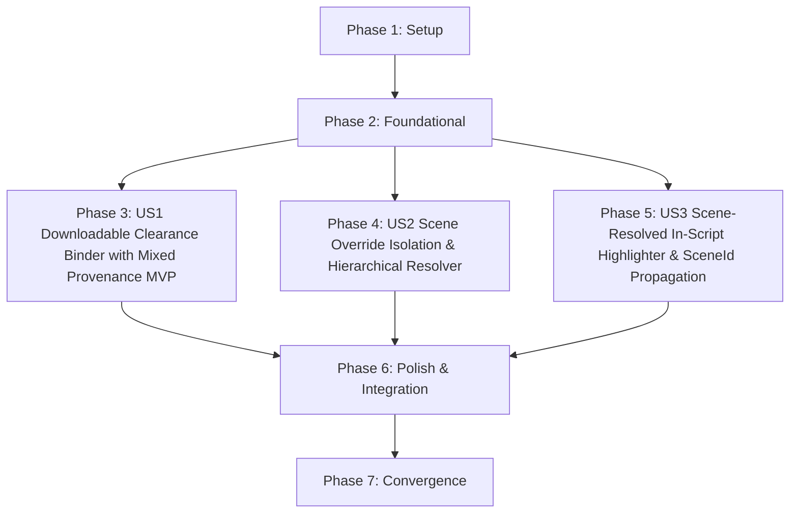

# Tasks: Clearance Binder Export & Studio Counsel Review Module

**Feature**: `specs/003-counsel-review-binder` | **Branch**: `003-counsel-review-binder`  
**Input**: Plan from [`specs/003-counsel-review-binder/plan.md`](plan.md), Spec from [`specs/003-counsel-review-binder/spec.md`](spec.md)

---

## Phase 1: Setup (Shared Infrastructure)

**Purpose**: Project configuration, event broadcasting, and environment setup.

- [x] T001 Verify project structure and test paths for counsel review in `vite.config.ts` and `tsconfig.json`
- [x] T002 Ensure event emitter supports `OVERRIDE_RECORDED` event type in `server/events/timelineEmitter.ts`

---

## Phase 2: Foundational (Blocking Prerequisites)

**Purpose**: Core data models, anti-overwrite invariants, and repositories required before user story implementation.

- [x] T003 [P] Implement `CounselOverrideData` model with `sceneId?: string` and `OverrideRepo` in `server/repositories/OverrideRepo.ts`
- [x] T004 [P] Update `CanonicalEntityData` schema with `isOverridden` and protect overridden entities from automated status overwrite in `server/repositories/EntityRepo.ts`
- [x] T005 [P] Update `ClearanceBinderData` schema with `integrityDigest` (SHA-256) and `provenanceSummary` in `server/repositories/BinderRepo.ts`

**Checkpoint**: Foundation ready - user story implementation can begin in parallel.

---

## Phase 3: User Story 1 - Downloadable Auditable Legal Clearance Binder with Mixed Evidence Provenance (Priority: P1) 🎯 MVP

**Goal**: Generate, download, and verify a complete, timestamped Legal Clearance Binder (JSON & printable PDF format) containing scene breakdowns, risk flags, grounded research citations with accurate aggregated mixed evidence provenance (`liveCount`, `demoCount`, `fallbackCount`, `dominantProvenance`), replacement cards, and SHA-256 integrity digests.

**Independent Test**: Trigger clearance binder export in DEMO and CLOUD modes; verify complete payload with SHA-256 `integrityDigest` and `provenanceSummary`, download JSON, and preview printable layout with accurate mixed evidence indicators.

### Tests for User Story 1

- [x] T006 [P] [US1] Contract test for binder export with `integrityDigest` and `provenanceSummary` in `tests/contract/test_binder_export.test.ts`

### Implementation for User Story 1

- [x] T007 [US1] Update `BinderExportWorkflow` to aggregate citations, compute `provenanceSummary` tally, and compute SHA-256 `integrityDigest` in `server/workflows/binderExportWorkflow.ts`
- [x] T008 [US1] Update binder REST endpoints in `server/api/binderRoutes.ts`
- [x] T009 [P] [US1] Enhance `BinderExportModal` with `@media print` styling, mixed provenance breakdown display, and SHA-256 `integrityDigest` in `src/components/BinderExportModal.tsx`

**Checkpoint**: User Story 1 complete. Clearance binder export, SHA-256 integrity digest, mixed evidence provenance tally, and print-ready layout operational.

---

## Phase 4: User Story 2 - Studio Legal Counsel Decision Override with Scene-Specific Isolation & Hierarchical Resolver (Priority: P2)

**Goal**: Provide REST endpoints and UI controls allowing authorized studio legal counsel to override automated risk tiers project-wide or for specific scene occurrences with authentic counsel identity entry and mandatory legal rationales, guaranteeing that scene-specific overrides never mutate canonical entity override state and automated batch re-evaluations never overwrite human legal decisions.

**Independent Test**: Submit a scene-specific override for an entity without a prior canonical override. Verify that the canonical entity remains `isOverridden: false` and `overallClearanceStatus` unchanged, while the target scene resolves to the overridden status and other scenes retain the automated baseline.

### Tests for User Story 2

- [x] T010 [P] [US2] Contract test for scene override isolation, hierarchical resolution, and anti-overwrite invariant in `tests/contract/test_counsel_override.test.ts`

### Implementation for User Story 2

- [x] T011 [P] [US2] Enforce scene override isolation in `server/api/clearanceRoutes.ts` (skip `entityRepo.updateCanonicalEntityOverride` when `sceneId` is present)
- [x] T012 [US2] Implement deterministic hierarchical resolver `resolveEffectiveClearanceStatus` (`scene override ?? canonical override ?? automated assessment`) in `server/workflows/effectiveStatusResolver.ts` and `server/workflows/clearanceEvaluator.ts`
- [x] T013 [US2] Add Counsel Override form with unpopulated fields, scene scope toggle, and actual provenance headers in `src/components/CitationDrawer.tsx`
- [x] T014 [P] [US2] Update `EntityRegistryTable.tsx` to render "Overridden by Counsel" badges only for canonical overrides

**Checkpoint**: User Stories 1 AND 2 complete. Scene override isolation, hierarchical scoping, anti-overwrite protection, and audit history fully operational.

---

## Phase 5: User Story 3 - Multi-Scene In-Script Visual Highlighter with Scene Context Propagation (Priority: P3)

**Goal**: Highlight entity occurrences directly within screenplay dialogue and action lines using color-coded badges matching their resolved scene-specific effective clearance status, and propagate the active `sceneId` on badge click into the Citation Drawer.

**Independent Test**: Load a parsed screenplay scene with a scene-specific override; verify the in-script badge renders the resolved scene-specific status, clicking the badge passes `(entityId, sceneId)` to open the `CitationDrawer` with that scene context pre-selected.

### Tests for User Story 3

- [x] T015 [P] [US3] Component/contract test for scene-resolved script highlighting and `sceneId` propagation in `tests/contract/test_script_highlighter.test.ts`

### Implementation for User Story 3

- [x] T016 [P] [US3] Update `ScriptViewer.tsx` to calculate badge colors using resolved scene-specific effective status and emit `onEntityClick(entityId, sceneId)`
- [x] T017 [US3] Propagate `selectedSceneId` from `ScriptViewer` through `WorkspacePage.tsx` and `App.tsx` into `CitationDrawer.tsx`

**Checkpoint**: All user stories complete. In-script visual highlighting with scene resolution, scene context propagation, and auditable binder exports unified.

---

## Phase 6: Polish & Cross-Cutting Concerns

**Purpose**: End-to-end integration testing, quickstart scenario validation, and production build verification.

- [x] T018 [P] Implement end-to-end integration test verifying scene override isolation (proving other scenes retain automated status) and mixed binder provenance in `tests/integration/counsel_review_workflow.test.ts`
- [x] T019 Run quickstart validation scenarios defined in `specs/003-counsel-review-binder/quickstart.md`
- [x] T020 Verify production build (`tsc && vite build`) and Vitest test suite (`npm test`)

---

## Phase 7: Convergence

**Purpose**: Close remaining audit history hierarchy gaps and drawer scene-override surfacing.

- [x] T021 Compute `previousStatus` in `server/api/clearanceRoutes.ts` using `resolveEffectiveClearanceStatus` immediately before recording a new override per FR-005, FR-016 (partial)
- [x] T022 [P] Add regression test with two consecutive overrides on the same scene proving the second record's `previousStatus` equals the first override's status in `tests/contract/test_counsel_override.test.ts` per FR-005, SC-002 (missing)
- [x] T023 [P] Surface latest applicable scene-specific override in `src/App.tsx` and `src/components/CitationDrawer.tsx` when opened with `sceneId` per FR-011, FR-016 (partial)
- [x] T024 Run full Vitest test suite and production build verification (`npm test && npm run build`) per SC-001 (partial)

---

## Dependencies & Execution Order

