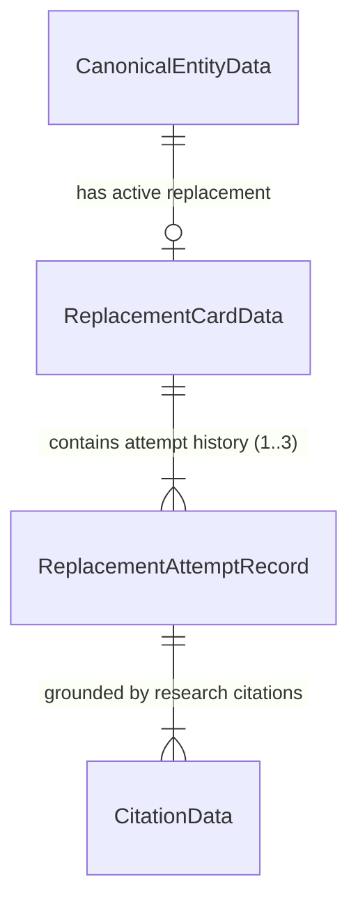

# Data Model: Replacement Self-Clearance Loop

**Feature**: `specs/004-replacement-clearance-loop`  
**Date**: 2026-08-18  

---

## 1. Core Data Structures

### `ReplacementAttemptRecord`
Captures every individual candidate generation and clearance research iteration in the loop.

```typescript
export interface ReplacementAttemptRecord {
  attemptNumber: number;          // 1, 2, or 3 (max 3)
  candidateName: string;          // Generated fictional brand candidate name
  tagline: string;
  eraAesthetic: string;
  visualPrompt: string;
  fictionalBackstory: string;
  clearanceStatus: ClearanceStatus; // 'NO_ISSUE_SURFACED' | 'REVIEW_RECOMMENDED' | 'ACTION_REQUIRED' | 'INSUFFICIENT_EVIDENCE'
  collisionRationale?: string;    // If rejected, specific trademark or commercial collision reason
  citations: CitationData[];       // Research citations grounded via ParallelSearch or fixture
  provenance: ResultProvenance;    // 'PARALLEL_LIVE' | 'DEMO_FIXTURE' | 'FALLBACK_FIXTURE'
  timestamp: string;               // ISO 8601 string
}
```

---

### `ReplacementCardData` (Enhanced)
Represents the final active replacement card for a canonical entity.

```typescript
export interface ReplacementCardData {
  id: string;                      // e.g. 'rep-7b9a-4c2d'
  projectId: string;
  canonicalEntityId: string;
  targetEntityName: string;
  proposedName: string;
  tagline: string;
  eraAesthetic: string;
  visualPrompt: string;
  fictionalBackstory: string;
  clearanceStatus: ClearanceStatus; // 'NO_ISSUE_SURFACED' (accepted) or 'REVIEW_RECOMMENDED' / 'INSUFFICIENT_EVIDENCE' (escalated)
  selfClearanceResult: 'ACCEPTED' | 'ESCALATED_TO_COUNSEL';
  totalAttempts: number;           // 1 to 3
  attemptHistory: ReplacementAttemptRecord[];
  citations: CitationData[];
  provenance: ResultProvenance;
  createdAt: string;
  updatedAt: string;
}
```

---

### `SelfClearanceResult` (Workflow Response)
The structured outcome returned by the generator workflow.

```typescript
export interface SelfClearanceResult {
  status: 'ACCEPTED' | 'ESCALATED_TO_COUNSEL';
  totalAttempts: number;
  selectedCard: ReplacementCardData;
  attemptHistory: ReplacementAttemptRecord[];
  provenanceSummary: {
    liveCount: number;
    demoCount: number;
    fallbackCount: number;
    dominantProvenance: ResultProvenance | 'MIXED';
  };
}
```

---

## 2. Invariants & Validation Rules

1. **Deterministic Attempt Bound**: `attemptNumber` is an integer strictly between `1` and `3`. `totalAttempts <= 3`.
2. **Acceptance Invariant**: `selectedCard.selfClearanceResult === 'ACCEPTED'` if and only if `selectedCard.clearanceStatus === 'NO_ISSUE_SURFACED'`.
3. **Escalation Invariant**: When `totalAttempts === 3` and no candidate cleared, `selfClearanceResult === 'ESCALATED_TO_COUNSEL'`, `selectedCard` is the 3rd attempt, and its status reflects the 3rd attempt's research verdict (`ACTION_REQUIRED`, `REVIEW_RECOMMENDED`, or `INSUFFICIENT_EVIDENCE`). No artificial ranking score is calculated.
4. **Authentic Citations & Provenance**: Every `ReplacementAttemptRecord` contains non-hallucinated citations with authentic provenance (`PARALLEL_LIVE`, `DEMO_FIXTURE`, or `FALLBACK_FIXTURE`).
5. **Timeline Event Invariant**: Emits strictly one of: `REPLACEMENT_ATTEMPT`, `REPLACEMENT_RESEARCH_STARTED`, `REPLACEMENT_REJECTED`, `REPLACEMENT_ACCEPTED`.

---

## 3. Entity Relationships


