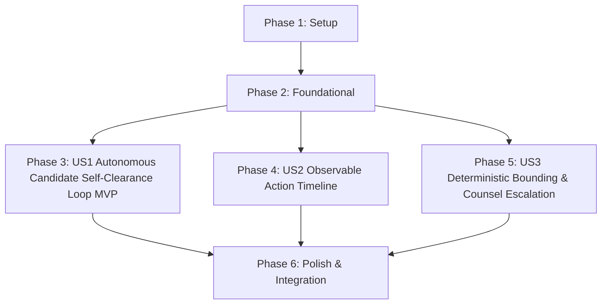

# Tasks: Replacement Self-Clearance Loop

**Feature**: `specs/004-replacement-clearance-loop` | **Branch**: `004-replacement-clearance-loop`  
**Input**: Plan from [`specs/004-replacement-clearance-loop/plan.md`](plan.md), Spec from [`specs/004-replacement-clearance-loop/spec.md`](spec.md)

---

## Phase 1: Setup (Shared Infrastructure)

**Purpose**: Project configuration and event broadcasting setup.

- [X] T001 Verify test setup and endpoint routing for replacement loop in `vite.config.ts` and `server/api/replacementRoutes.ts`
- [X] T002 Ensure event emitter supports strictly the 4 authorized replacement event types (`REPLACEMENT_ATTEMPT`, `REPLACEMENT_RESEARCH_STARTED`, `REPLACEMENT_REJECTED`, `REPLACEMENT_ACCEPTED`) in `server/events/timelineEmitter.ts`

---

## Phase 2: Foundational (Blocking Prerequisites)

**Purpose**: Core data models and repository schemas required before user story implementation.

- [X] T003 [P] Define `ReplacementAttemptRecord` and update `ReplacementCardData` schema in `server/repositories/ReplacementRepo.ts`
- [X] T004 [P] Update `CanonicalEntityData` schema to support enhanced `ReplacementCardData` with `attemptHistory` in `server/repositories/EntityRepo.ts`

**Checkpoint**: Foundation ready - user story implementation can begin in parallel.

---

## Phase 3: User Story 1 - Autonomous Candidate Self-Clearance Verification Loop (Priority: P1) 🎯 MVP

**Goal**: Automatically run every generated replacement candidate through trademark/entertainment clearance research, accept if `NO_ISSUE_SURFACED`, reject if `ACTION_REQUIRED`/`REVIEW_RECOMMENDED`/`INSUFFICIENT_EVIDENCE`, and generate subsequent candidates with negative constraints avoiding previous collisions.

**Independent Test**: Request replacement generation for an entity; verify that candidate 1 is generated and researched, rejected if collision occurs, candidate 2 is generated avoiding collision, and accepted candidate 2 is persisted with research citations.

### Tests for User Story 1

- [X] T005 [P] [US1] Contract test for single-attempt clearance acceptance and multi-attempt loop rejection in `tests/contract/test_replacement_gen.test.ts`

### Implementation for User Story 1

- [X] T006 [US1] Implement candidate research evaluation invocation and acceptance/rejection policy in `server/workflows/replacementGenerator.ts`
- [X] T007 [US1] Implement negative constraint accumulation and candidate retry loop in `server/workflows/replacementGenerator.ts`
- [X] T008 [US1] Wire self-clearance workflow into `server/api/replacementRoutes.ts`
- [X] T009 [P] [US1] Update `ReplacementCardModal.tsx` to render self-clearance verification badge, attempt count, and attached research citations in `src/components/ReplacementCardModal.tsx`

**Checkpoint**: User Story 1 complete. Autonomous candidate generation, trademark search evaluation, collision rejection, and clean candidate acceptance operational.

---

## Phase 4: User Story 2 - Observable Action Timeline of Candidate Attempts & Clearance Decisions (Priority: P2)

**Goal**: Stream strictly the four authorized replacement lifecycle events (`REPLACEMENT_ATTEMPT`, `REPLACEMENT_RESEARCH_STARTED`, `REPLACEMENT_REJECTED`, `REPLACEMENT_ACCEPTED`) via SSE for live observability.

**Independent Test**: Monitor the action timeline drawer during a multi-attempt replacement loop; verify that the 4 discrete events appear in chronological order with human-readable diagnostic metadata.

### Tests for User Story 2

- [X] T010 [P] [US2] Contract test for 4 discrete replacement timeline SSE events in `tests/contract/test_timeline_sse.test.ts`

### Implementation for User Story 2

- [X] T011 [US2] Emit `REPLACEMENT_ATTEMPT`, `REPLACEMENT_RESEARCH_STARTED`, `REPLACEMENT_REJECTED`, and `REPLACEMENT_ACCEPTED` events in `server/workflows/replacementGenerator.ts`
- [X] T012 [P] [US2] Update `TimelineDrawer.tsx` to render icons, status colors, and diagnostic details for the 4 replacement lifecycle events in `src/components/TimelineDrawer.tsx`

**Checkpoint**: User Stories 1 AND 2 complete. Closed-loop replacement clearance and SSE timeline observability operational.

---

## Phase 5: User Story 3 - Deterministic Bounding & Counsel Escalation Fallback (Priority: P3)

**Goal**: Enforce deterministic $\le 3$ attempt ceiling; after 3 failed attempts, present the 3rd candidate with all collision evidence and no invented ranking score, flagging for counsel review; fail-visible `INSUFFICIENT_EVIDENCE` on search outage in `CLOUD_MODE`.

**Independent Test**: Simulate an entity category where all 3 candidates collide; verify that the loop halts strictly after 3 attempts, selects the 3rd candidate with status `ESCALATED_TO_COUNSEL`, and presents collision citations without invented scores.

### Tests for User Story 3

- [X] T013 [P] [US3] Contract test for 3-attempt ceiling and `CLOUD_MODE` fail-visible outage handling in `tests/contract/test_replacement_gen.test.ts`

### Implementation for User Story 3

- [X] T014 [US3] Enforce 3-attempt loop termination, 3rd candidate selection, and counsel escalation formatting in `server/workflows/replacementGenerator.ts`
- [X] T015 [US3] Enforce fail-visible `INSUFFICIENT_EVIDENCE` on search API errors without silent fallback in `server/workflows/replacementGenerator.ts` and `server/tools/ParallelSearchTool.ts`
- [X] T016 [P] [US3] Update `ReplacementCardModal.tsx` to render amber counsel escalation banner and full collision history across attempts in `src/components/ReplacementCardModal.tsx`

**Checkpoint**: All user stories complete. Candidate self-clearance verification, 3-attempt bounding, counsel escalation, and fail-visible outage handling unified.

---

## Phase 6: Polish & Cross-Cutting Concerns

**Purpose**: End-to-end integration testing, clearance binder integration, quickstart scenario validation, and production build verification.

- [X] T017 [P] Implement end-to-end integration test for full self-clearance loop and counsel escalation in `tests/integration/replacement_clearance_workflow.test.ts`
- [X] T018 [P] Update Clearance Binder export to incorporate replacement attempt history in `server/workflows/binderExportWorkflow.ts` and `src/components/BinderExportModal.tsx`
- [X] T019 Run quickstart validation scenarios defined in `specs/004-replacement-clearance-loop/quickstart.md`
- [X] T020 Verify production build (`tsc && vite build`) and Vitest test suite (`npm test`)

---

## Dependencies & Execution Order

---

## Parallel Execution Examples

### User Story 1
- `T005` (contract tests in `tests/contract/test_replacement_gen.test.ts`) can run in parallel with `T009` (UI modal in `src/components/ReplacementCardModal.tsx`).

### User Story 2
- `T010` (SSE contract tests in `tests/contract/test_timeline_sse.test.ts`) can run in parallel with `T012` (UI drawer in `src/components/TimelineDrawer.tsx`).

### User Story 3
- `T013` (3-attempt contract test in `tests/contract/test_replacement_gen.test.ts`) can run in parallel with `T016` (UI modal escalation in `src/components/ReplacementCardModal.tsx`).
