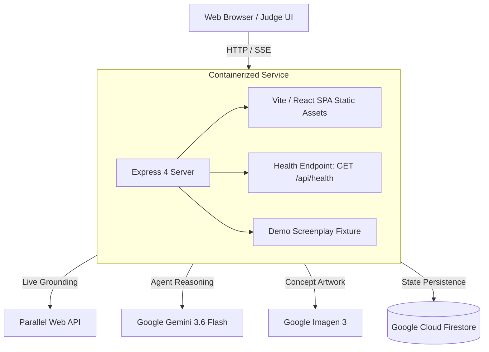

# Implementation Plan: Judge-Ready Demo, Documentation, and Production Deployment

**Feature Branch**: `005-judge-demo-deployment`  
**Specification**: [`specs/005-judge-demo-deployment/spec.md`](spec.md)  
**Status**: In Design  

---

## Technical Context & Overview

This feature establishes judge-ready operational excellence, comprehensive open-source documentation, and containerized cloud deployment for ClearanceScout on Google Cloud Run:
1. **Bundled Fictional Demo Screenplay**: An entrant-authored, fully fictional screenplay ("The Neon Horizon") containing assets across all 5 clearance categories (`BRAND`, `ART_MUSIC`, `PUBLIC_FIGURE`, `PROPRIETARY_LOCATION`, `GRAPHIC_PROP`), accessible via a single-click "Load Sample Screenplay" action in the workspace.
2. **Health / Readiness Endpoint**: `GET /api/health` providing container lifecycle monitoring, execution mode (`TEST_MODE`, `DEMO_MODE`, `CLOUD_MODE`), uptime, and boolean credential presence flags without leaking secret tokens.
3. **Fail-Visible Cloud Mode Invariant**: In `CLOUD_MODE`, missing API credentials (`GEMINI_API_KEY`, `PARALLEL_WEB_API_KEY`) or external provider errors cause immediate, transparent degradation with descriptive diagnostics and never silently substitute demo fixtures.
4. **Professional Open-Source Documentation & Licensing**:
   - Standard MIT `LICENSE` at the repository root.
   - Comprehensive, truthful `README.md` documenting architecture, ADK agents, models (`gemini-3.6-flash`, Imagen 3), `@parallel-web/sdk` research grounding, multi-tier execution modes, quickstart commands, and non-legal-advice disclaimers using strictly fictional entities.
   - Chronological `PROVENANCE.md` recording tooling, architectural milestones, and fictional-content policy.
5. **Single Cloud Run Deployment Topology**: Multi-stage production `Dockerfile` building the unified Express API and compiled Vite/React static bundle, configured for Google Cloud Run deployment.

---

## Constitution Check

*Gates evaluation based on `.specify/memory/constitution.md`*

| Principle | Assessment | Status |
|:---|:---|:---:|
| **I. Agent Framework & Model Standard** | Primary clearance reasoning uses `gemini-3.6-flash`; artwork uses Imagen 3. ADK architecture preserved. | **PASS** |
| **II. Live Grounding & Research Tooling** | Live trademark grounding via `@parallel-web/sdk`; fail-visible in `CLOUD_MODE`; zero invented evidence. | **PASS** |
| **III. Architecture & Cloud Persistence** | Stateless containerized API and React frontend deployed to Cloud Run with Firestore storage; backend/frontend isolation enforced. | **PASS** |
| **IV. Canonical Entity & Clearance Invariant** | 4 standard clearance statuses preserved (`NO ISSUE SURFACED`, `REVIEW RECOMMENDED`, `ACTION REQUIRED`, `INSUFFICIENT EVIDENCE`); non-legal-advice disclaimers displayed. | **PASS** |
| **V. Multi-Tier Execution Modes** | Deterministic `TEST_MODE` and `DEMO_MODE`; fail-visible `CLOUD_MODE` requiring real credentials. | **PASS** |
| **Observable Action Timeline Standard** | All lifecycle events stream via SSE without exposing raw model chain-of-thought. | **PASS** |

**Constitution Evaluation**: **6 / 6 PASS** (0 Violations).

---

## Architecture & Implementation Phases

### Phase 0: Research & Architectural Decisions
- Consolidated in [`research.md`](research.md):
  - Cloud Run single-service containerization pattern.
  - Fail-visible credential verification without secret leakage.
  - Entrant-created fully fictional demo screenplay structure.
  - Documentation and provenance recording standards.

### Phase 1: Data Model, API Contracts & Quickstart
- Schemas defined in [`data-model.md`](data-model.md).
- Endpoints defined in [`contracts/health-api.md`](contracts/health-api.md) and [`contracts/deployment-contract.md`](contracts/deployment-contract.md).
- Verification flows defined in [`quickstart.md`](quickstart.md).
