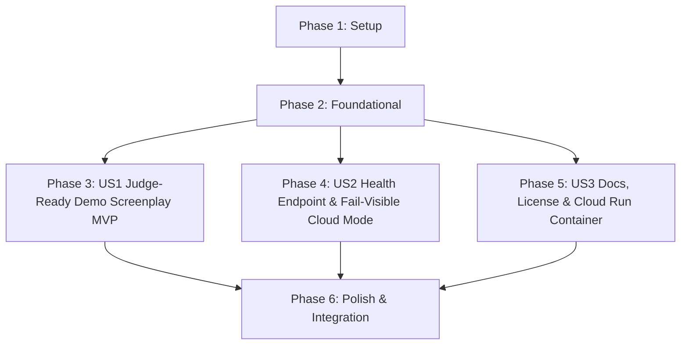

# Tasks: Judge-Ready Demo, Documentation, and Production Deployment

**Feature**: `specs/005-judge-demo-deployment` | **Branch**: `005-judge-demo-deployment`  
**Input**: Plan from [`specs/005-judge-demo-deployment/plan.md`](plan.md), Spec from [`specs/005-judge-demo-deployment/spec.md`](spec.md)

---

## Phase 1: Setup (Shared Infrastructure)

**Purpose**: Project configuration, licensing, and baseline routing setup.

- [ ] T001 Configure health routing and fixture endpoints in `server/index.ts` and `server/api/healthRoutes.ts`
- [ ] T002 [P] Author official standard MIT License in `LICENSE` in the repository root

---

## Phase 2: Foundational (Blocking Prerequisites)

**Purpose**: Core data types, health contracts, and bundled fictional demo screenplay assets.

- [ ] T003 [P] Define `HealthStatusResponse` and `CredentialStatus` data schemas in `server/types/healthTypes.ts`
- [ ] T004 [P] Author the bundled entrant-created fully fictional demo screenplay ("The Neon Horizon") covering all 5 clearance categories in `fixtures/demo_screenplay.txt`

**Checkpoint**: Foundation ready - user story implementation can begin in parallel.

---

## Phase 3: User Story 1 - Judge-Ready Experience & Bundled Fictional Demo Screenplay (Priority: P1) 🎯 MVP

**Goal**: Enable 1-click evaluation of the complete clearance pipeline using a bundled, fully fictional entrant-authored screenplay with assets across all 5 clearance categories.

**Independent Test**: Click "Load Sample Screenplay" in the UI; verify that "The Neon Horizon" loads into the editor and produces clean 5-category entity extraction, risk assessment, self-clearance loop, and binder compilation with zero proprietary trademarks.

### Tests for User Story 1

- [ ] T005 [P] [US1] Contract test for bundled demo screenplay loading and 5-category fictional parsing in `tests/contract/test_demo_fixture.test.ts`

### Implementation for User Story 1

- [ ] T006 [US1] Implement demo fixture loader endpoint `GET /api/fixtures/demo-screenplay` in `server/api/fixtureRoutes.ts`
- [ ] T007 [P] [US1] Add 1-click "Load Sample Screenplay" button to script editor in `src/pages/WorkspacePage.tsx`
- [ ] T008 [US1] Ensure deterministic recognition patterns in `server/agents/ScriptParserAgent.ts` support all fictional entities in "The Neon Horizon" (`Summit Cola`, `AeroTech Prism`, `Veloce GT`, `Midtown Spire Tower`, `Nocturne of the Wild`, `Titan Industrial Hazard Placard`)

**Checkpoint**: User Story 1 complete. 1-click demo screenplay loading and fictional entity clearance operational.

---

## Phase 4: User Story 2 - Health / Readiness Endpoint & Fail-Visible Cloud Mode (Priority: P2)

**Goal**: Expose a secret-safe health endpoint (`GET /api/health`) and enforce transparent, fail-visible behavior in `CLOUD_MODE` when credentials are missing without silent fixture fallback.

**Independent Test**: Query `GET /api/health` in `DEMO_MODE` (verify status `HEALTHY` with boolean flags and 0 secret leakage); verify that in `CLOUD_MODE` without keys it returns `DEGRADED` status and clearance operations fail visibly.

### Tests for User Story 2

- [ ] T009 [P] [US2] Contract test for `GET /api/health` status, secret masking, and `CLOUD_MODE` fail-visible behavior in `tests/contract/test_health_api.test.ts`

### Implementation for User Story 2

- [ ] T010 [US2] Implement `GET /api/health` endpoint with boolean credential flags and uptime reporting in `server/api/healthRoutes.ts`
- [ ] T011 [US2] Enforce fail-visible diagnostic status in `CLOUD_MODE` when credentials are missing or services unreachable in `server/config.ts` and `server/api/healthRoutes.ts`

**Checkpoint**: User Stories 1 AND 2 complete. Health checking and fail-visible cloud mode operational.

---

## Phase 5: User Story 3 - Comprehensive Documentation & Containerized Cloud Run Deployment (Priority: P3)

**Goal**: Provide complete, truthful documentation (`README.md`, `PROVENANCE.md`), multi-stage `Dockerfile`, and Cloud Run single-service production hosting support.

**Independent Test**: Review `README.md` and `PROVENANCE.md` for accuracy and fictional-content adherence; build production Docker image and verify local container execution serving static assets and API routes on specified `PORT`.

### Implementation for User Story 3

- [ ] T012 [P] [US3] Author comprehensive, truthful `README.md` documenting architecture, ADK agents (`gemini-3.6-flash`, Imagen 3), `parallel-web` grounding, execution modes, API endpoints, and legal disclaimers with strictly fictional entities
- [ ] T013 [P] [US3] Author development provenance log `PROVENANCE.md` recording tooling, architectural milestones, model selections, and fictional-content policy
- [ ] T014 [P] [US3] Create multi-stage production `Dockerfile` and `.dockerignore` for single Cloud Run service deployment
- [ ] T015 [US3] Configure Express in `server/index.ts` to serve built Vite/React static assets from `dist/` and handle client SPA routing fallbacks in production

**Checkpoint**: All user stories complete. Judge-ready documentation, provenance logging, containerization, and Cloud Run deployment path unified.

---

## Phase 6: Polish & Cross-Cutting Concerns

**Purpose**: End-to-end integration testing, quickstart scenario validation, and production build verification.

- [ ] T016 [P] Implement end-to-end integration test for 1-click demo screenplay ingestion, health check, and full clearance workflow in `tests/integration/demo_deployment_workflow.test.ts`
- [ ] T017 Run quickstart validation scenarios defined in `specs/005-judge-demo-deployment/quickstart.md`
- [ ] T018 Verify production build (`tsc && vite build`) and Vitest test suite (`npm test`) across all test suites with 0 regressions

---

## Dependencies & Execution Order

---

## Parallel Execution Examples

### User Story 1
- `T005` (contract test in `tests/contract/test_demo_fixture.test.ts`) can run in parallel with `T007` (UI button in `src/pages/WorkspacePage.tsx`).

### User Story 2
- `T009` (contract test in `tests/contract/test_health_api.test.ts`) can run in parallel with `T010` (`server/api/healthRoutes.ts`).

### User Story 3
- `T012` (`README.md`), `T013` (`PROVENANCE.md`), and `T014` (`Dockerfile`) can be written in parallel.
