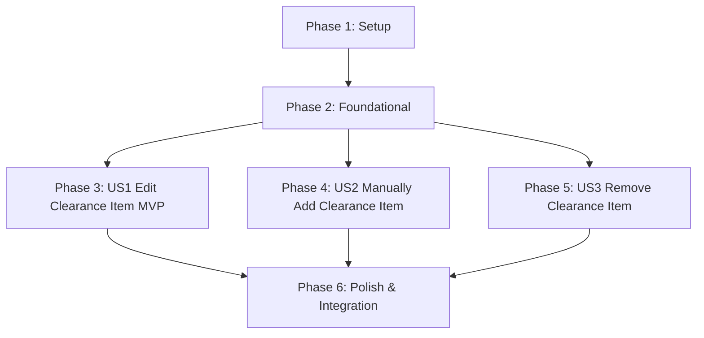

# Tasks: Manual Clearance Item Correction

**Feature**: `specs/006-manual-item-correction` | **Branch**: `006-manual-item-correction`  
**Input**: Plan from [`specs/006-manual-item-correction/plan.md`](plan.md), Spec from [`specs/006-manual-item-correction/spec.md`](spec.md)

---

## Phase 1: Setup (Shared Infrastructure)

**Purpose**: Route configuration and timeline event infrastructure for item mutations.

- [ ] T001 Configure entity mutation routes in `server/api/entityMutationRoutes.ts` and mount in `server/index.ts`
- [ ] T002 [P] Update timeline event types in `server/events/timelineEmitter.ts` to support `ITEM_ADDED`, `ITEM_EDITED`, and `ITEM_REMOVED`

---

## Phase 2: Foundational (Blocking Prerequisites)

**Purpose**: Repository methods for entity updates, deletions, and assessment invalidation with counsel override preservation.

- [ ] T003 [P] Extend `EntityRepo` in `server/repositories/EntityRepo.ts` with `updateCanonicalEntity`, `deleteCanonicalEntity`, `getEntityById`, and `deleteOccurrencesByEntity`
- [ ] T004 [P] Implement assessment invalidation on name/category update while preserving signed counsel overrides in `server/repositories/EntityRepo.ts`

**Checkpoint**: Foundation ready - user story implementation can begin in parallel.

---

## Phase 3: User Story 1 - Edit Extracted Clearance Item Details (Priority: P1) 🎯 MVP

**Goal**: Allow coordinators to edit extracted entity name, category, and scene context prior to or after research, invalidating stale automated assessments and citations while preserving counsel overrides.

**Independent Test**: Edit an entity's name and category in the registry table; verify that prior automated assessments reset, subsequent research uses the updated name/category, counsel overrides remain intact, and an `ITEM_EDITED` event is streamed.

### Tests for User Story 1

- [ ] T005 [P] [US1] Contract test for `PATCH /api/projects/:id/entities/:entityId` and assessment invalidation in `tests/contract/test_item_mutation_api.test.ts`

### Implementation for User Story 1

- [ ] T006 [US1] Implement `PATCH /api/projects/:id/entities/:entityId` endpoint in `server/api/entityMutationRoutes.ts` emitting `ITEM_EDITED` timeline event
- [ ] T007 [P] [US1] Create `ItemEditModal.tsx` in `src/components/ItemEditModal.tsx` supporting name, category (5 choices), context editing, and validation
- [ ] T008 [US1] Wire edit button and modal into `src/components/EntityRegistryTable.tsx` and `src/pages/WorkspacePage.tsx`

**Checkpoint**: User Story 1 complete. In-place entity editing and invalidation operational.

---

## Phase 4: User Story 2 - Manually Add New Clearance Item (Priority: P2)

**Goal**: Allow coordinators to manually create unscripted props, background tracks, or on-set additions and clear them through the pipeline.

**Independent Test**: Click "Add Clearance Item", fill in name, category, and scene context; verify that the entity appears in the registry, streams an `ITEM_ADDED` event, and can be evaluated for clearance.

### Tests for User Story 2

- [ ] T009 [P] [US2] Contract test for `POST /api/projects/:id/entities` manual item creation in `tests/contract/test_item_mutation_api.test.ts`

### Implementation for User Story 2

- [ ] T010 [US2] Implement `POST /api/projects/:id/entities` endpoint in `server/api/entityMutationRoutes.ts` emitting `ITEM_ADDED` timeline event
- [ ] T011 [US2] Add "Add Clearance Item" button and creation modal wiring to `src/components/EntityRegistryTable.tsx` and `src/pages/WorkspacePage.tsx`

**Checkpoint**: User Stories 1 AND 2 complete. Manual entity addition operational.

---

## Phase 5: User Story 3 - Remove Extracted Clearance Item (Priority: P3)

**Goal**: Allow coordinators to permanently delete false positives or irrelevant items from the workspace registry and clearance binder.

**Independent Test**: Delete an entity from the registry; verify that it disappears from the table, streams an `ITEM_REMOVED` event, and is omitted from the compiled clearance binder.

### Tests for User Story 3

- [ ] T012 [P] [US3] Contract test for `DELETE /api/projects/:id/entities/:entityId` in `tests/contract/test_item_mutation_api.test.ts`

### Implementation for User Story 3

- [ ] T013 [US3] Implement `DELETE /api/projects/:id/entities/:entityId` endpoint in `server/api/entityMutationRoutes.ts` emitting `ITEM_REMOVED` timeline event
- [ ] T014 [US3] Add delete confirmation action in `src/components/EntityRegistryTable.tsx` and verify exclusion from `server/workflows/binderExportWorkflow.ts`

**Checkpoint**: All user stories complete. Full item correction, addition, and removal pipeline operational.

---

## Phase 6: Polish & Cross-Cutting Concerns

**Purpose**: Timeline UI styling, end-to-end integration testing, quickstart validation, and full build verification.

- [ ] T015 [P] Update `src/components/TimelineDrawer.tsx` to render `ITEM_ADDED`, `ITEM_EDITED`, and `ITEM_REMOVED` events with appropriate badges
- [ ] T016 [P] Implement end-to-end integration test for item add, edit with invalidation, delete, research, and binder export in `tests/integration/item_correction_workflow.test.ts`
- [ ] T017 Run quickstart validation scenarios defined in `specs/006-manual-item-correction/quickstart.md`
- [ ] T018 Verify production build (`tsc && vite build`) and full Vitest test suite (`npm test`) across all test suites with 0 regressions

---

## Dependencies & Execution Order

---

## Parallel Execution Examples

### User Story 1
- `T005` (contract test in `tests/contract/test_item_mutation_api.test.ts`) can run in parallel with `T007` (`ItemEditModal.tsx`).

### User Story 2
- `T009` (contract test in `tests/contract/test_item_mutation_api.test.ts`) can run in parallel with `T010` (`server/api/entityMutationRoutes.ts`).

### User Story 3
- `T012` (contract test in `tests/contract/test_item_mutation_api.test.ts`) can run in parallel with `T013` (`server/api/entityMutationRoutes.ts`).
