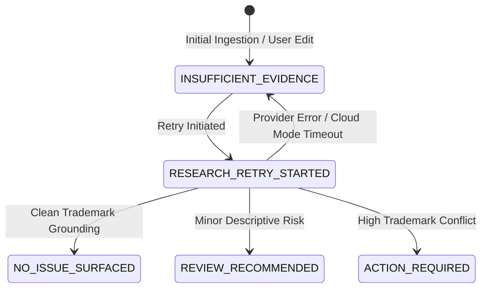

# Data Model: Failed Research Retry

**Feature**: `specs/007-failed-research-retry` | **Date**: 2026-08-18

---

## 1. Timeline Event Payload

### `RESEARCH_RETRY_STARTED`
Emitted over SSE when a research retry is initiated for a single item.

```typescript
export interface ResearchRetryStartedEventPayload {
  entityId: string;
  canonicalName: string;
  previousStatus: ClearanceStatus;
  timestamp: string;
}
```

---

## 2. API Request and Response Types

### Request: `POST /api/projects/:id/entities/:entityId/retry-research`
- Route Parameters:
  - `id`: string (Project ID)
  - `entityId`: string (Target Canonical Entity ID)
- Request Body: `{}` (No body required; entity context is derived from project database)

### Response: `200 OK`
```typescript
export interface ResearchRetryResponse {
  entity: CanonicalEntityData;
  assessment: ClearanceRiskAssessmentData;
  retriedAt: string;
}
```

### Error Responses:
- `400 Bad Request`: When entity's current status is not `INSUFFICIENT_EVIDENCE`.
- `404 Not Found`: When entity or project does not exist.
- `500 Internal Server Error`: When unhandled server error occurs.

---

## 3. Entity Status State Transitions


