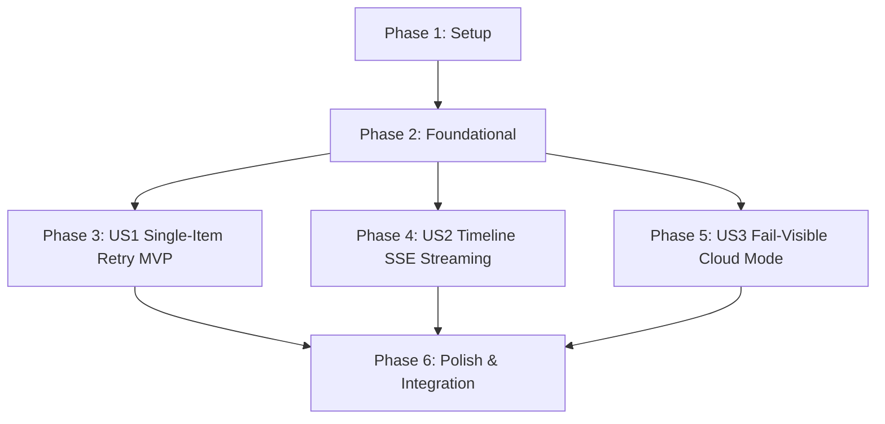

# Tasks: Failed Research Retry

**Feature**: `specs/007-failed-research-retry` | **Branch**: `007-failed-research-retry`  
**Input**: Plan from [`specs/007-failed-research-retry/plan.md`](plan.md), Spec from [`specs/007-failed-research-retry/spec.md`](spec.md)

---

## Phase 1: Setup (Shared Infrastructure)

**Purpose**: Timeline event infrastructure for research retry operations.

- [X] T001 [P] Update timeline event types in `server/events/timelineEmitter.ts` to include `RESEARCH_RETRY_STARTED`
- [X] T002 [P] Update `TimelineDrawer.tsx` in `src/components/TimelineDrawer.tsx` to render the `RESEARCH_RETRY_STARTED` badge (`RETRY SEARCH`)

---

## Phase 2: Foundational (Blocking Prerequisites)

**Purpose**: Core evaluator methods for single-entity research retry, eligibility gating, and counsel override preservation.

- [X] T003 [P] Implement `retryEntityResearch(projectId: string, entityId: string)` in `server/workflows/clearanceEvaluator.ts` emitting `RESEARCH_RETRY_STARTED` and executing single-entity Parallel Search grounding
- [X] T004 [P] Add eligibility check and counsel override preservation invariant to `retryEntityResearch` in `server/workflows/clearanceEvaluator.ts`

**Checkpoint**: Foundation ready - user story implementation can begin in parallel.

---

## Phase 3: User Story 1 - Single-Item Research Retry (Priority: P1) 🎯 MVP

**Goal**: Allow clearance coordinators to retry failed or `INSUFFICIENT_EVIDENCE` clearance research for one specific entity without touching sibling items.

**Independent Test**: Trigger a research retry on an `INSUFFICIENT_EVIDENCE` entity; verify that only the targeted entity's risk status and citations update while sibling entities remain untouched.

### Tests for User Story 1

- [X] T005 [P] [US1] Contract test for `POST /api/projects/:id/entities/:entityId/retry-research` in `tests/contract/test_failed_research_retry.test.ts`

### Implementation for User Story 1

- [X] T006 [US1] Implement `POST /api/projects/:id/entities/:entityId/retry-research` endpoint in `server/api/clearanceRoutes.ts` with eligibility gating (`INSUFFICIENT_EVIDENCE` only)
- [X] T007 [P] [US1] Add "🔁 Retry Research" button and click handler on `INSUFFICIENT_EVIDENCE` entities in `src/components/EntityRegistryTable.tsx`
- [X] T008 [US1] Connect retry research API client handler in `src/pages/WorkspacePage.tsx`

**Checkpoint**: User Story 1 complete. Single-item retry operational and testable independently.

---

## Phase 4: User Story 2 - Observable Action Timeline for Research Retry (Priority: P2)

**Goal**: Stream `RESEARCH_RETRY_STARTED`, `TOOL_CALL`, `CITATION_ADDED`, and `RISK_EVAL` events over SSE into the real-time timeline drawer.

**Independent Test**: Trigger research retry and verify that `RESEARCH_RETRY_STARTED` event payload appears in the timeline drawer alongside subsequent grounding tool calls.

### Tests for User Story 2

- [X] T009 [P] [US2] Contract test for `RESEARCH_RETRY_STARTED` SSE timeline event emission in `tests/contract/test_failed_research_retry.test.ts`

### Implementation for User Story 2

- [X] T010 [US2] Wire real-time retry event streaming in `server/workflows/clearanceEvaluator.ts` and test drawer rendering in `src/components/TimelineDrawer.tsx`

**Checkpoint**: User Stories 1 AND 2 complete. Real-time retry timeline streaming operational.

---

## Phase 5: User Story 3 - Fail-Visible Cloud Mode & Anti-Fabrication Invariant (Priority: P3)

**Goal**: Ensure retry in `CLOUD_MODE` fails visibly with zero synthetic citations or silent mock fallback, and never mutates active counsel overrides.

**Independent Test**: In `CLOUD_MODE` with missing API keys, trigger retry; verify endpoint fails visibly with `INSUFFICIENT_EVIDENCE` and 0 fabricated citations. In overridden entities, verify counsel override remains effective.

### Tests for User Story 3

- [X] T011 [P] [US3] Contract test for `CLOUD_MODE` fail-visible error handling and counsel override preservation upon retry in `tests/contract/test_failed_research_retry.test.ts`

### Implementation for User Story 3

- [X] T012 [US3] Implement fail-visible error diagnostics and verify non-fabrication in `server/workflows/clearanceEvaluator.ts`

**Checkpoint**: All user stories complete. Full single-item retry, timeline streaming, and fail-visible compliance operational.

---

## Phase 6: Polish & Cross-Cutting Concerns

**Purpose**: End-to-end integration testing, quickstart validation, and full build verification.

- [X] T013 [P] Implement end-to-end integration test in `tests/integration/failed_research_retry_workflow.test.ts` verifying retry execution, sibling isolation, override preservation, and binder export
- [X] T014 Run quickstart validation scenarios defined in `specs/007-failed-research-retry/quickstart.md`
- [X] T015 Verify production build (`tsc && vite build`) and full Vitest test suite (`npm test`) across all test suites with 0 regressions

---

## Dependencies & Execution Order

---

## Parallel Execution Examples

### User Story 1
- `T005` (contract test in `tests/contract/test_failed_research_retry.test.ts`) can run in parallel with `T007` (`src/components/EntityRegistryTable.tsx`).

### User Story 2
- `T009` (contract test in `tests/contract/test_failed_research_retry.test.ts`) can run in parallel with `T010` (`server/workflows/clearanceEvaluator.ts`).

### User Story 3
- `T011` (contract test in `tests/contract/test_failed_research_retry.test.ts`) can run in parallel with `T012` (`server/workflows/clearanceEvaluator.ts`).
