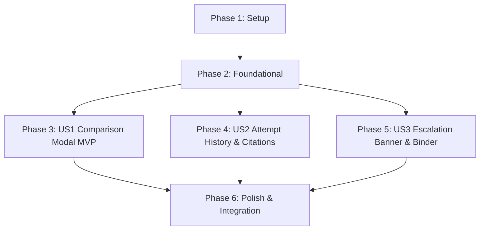

# Tasks: Side-by-Side Original and Replacement Comparison

**Feature**: `specs/008-replacement-comparison` | **Branch**: `008-replacement-comparison`  
**Input**: Plan from [`specs/008-replacement-comparison/plan.md`](plan.md), Spec from [`specs/008-replacement-comparison/spec.md`](spec.md)

---

## Phase 1: Setup (Shared Infrastructure)

**Purpose**: Shared TypeScript interfaces and data model definitions for comparison payloads.

- [ ] T001 [P] Define `ComparisonViewModel`, `OriginalEntitySummary`, `ReplacementSummary`, and `CandidateAttemptSummary` interfaces in `src/components/ComparisonModal.tsx` and `server/api/replacementRoutes.ts`

---

## Phase 2: Foundational (Blocking Prerequisites)

**Purpose**: Core backend data assembly for original entities, assessments, replacement cards, and candidate attempt history.

- [ ] T002 [P] Implement comparison data retrieval method in `server/repositories/ReplacementRepo.ts` assembling original entity metadata, assessments, replacement cards, and candidate attempt history

**Checkpoint**: Foundation ready - user story implementation can begin in parallel.

---

## Phase 3: User Story 1 - Side-by-Side Entity Comparison View (Priority: P1) 🎯 MVP

**Goal**: Allow clearance coordinators and designers to view original entities and fictional replacements side-by-side in a comparative modal.

**Independent Test**: Generate a replacement for a flagged entity, click "🔍 Compare" in the registry table, and verify that the original entity and replacement card render side-by-side with complete attributes.

### Tests for User Story 1

- [ ] T003 [P] [US1] Contract test for `GET /api/projects/:id/entities/:entityId/comparison` in `tests/contract/test_replacement_comparison.test.ts`

### Implementation for User Story 1

- [ ] T004 [US1] Implement `GET /api/projects/:id/entities/:entityId/comparison` endpoint in `server/api/replacementRoutes.ts` with gating (return 400 if no replacement card exists)
- [ ] T005 [P] [US1] Create `ComparisonModal.tsx` component in `src/components/ComparisonModal.tsx` rendering two-column comparison (original entity vs replacement card)
- [ ] T006 [P] [US1] Add "🔍 Compare" button on rows with attached replacement cards in `src/components/EntityRegistryTable.tsx`
- [ ] T007 [US1] Connect comparison modal trigger and data fetching in `src/pages/WorkspacePage.tsx`

**Checkpoint**: User Story 1 complete. Side-by-side modal operational and testable independently.

---

## Phase 4: User Story 2 - Research Citations & Attempt History Breakdown (Priority: P2)

**Goal**: Itemize grounded research citations and candidate self-clearance attempt history with negative constraints.

**Independent Test**: Generate a replacement requiring multiple candidate attempts, open the comparison modal, and verify that sequential candidate attempts, rejection reasons, and authentic citation provenance badges are rendered.

### Tests for User Story 2

- [ ] T008 [P] [US2] Contract test for attempt history breakdown, negative constraints, and citation provenance in `tests/contract/test_replacement_comparison.test.ts`

### Implementation for User Story 2

- [ ] T009 [US2] Add candidate self-clearance attempt history accordion and citation provenance badges in `src/components/ComparisonModal.tsx`

**Checkpoint**: User Stories 1 AND 2 complete. Attempt history breakdown and citation provenance operational.

---

## Phase 5: User Story 3 - Counsel Escalation Banner & Binder Print Integration (Priority: P3)

**Goal**: Render prominent counsel review banner on escalated 3rd attempt candidates and embed side-by-side comparison tables in the binder print view.

**Independent Test**: View an escalated replacement candidate, verify that the "⚖️ Counsel Review Required" banner appears instead of a cleared badge, and verify that exporting the binder includes the side-by-side comparison.

### Tests for User Story 3

- [ ] T010 [P] [US3] Contract test for 3rd attempt escalation banner and binder export comparison data in `tests/contract/test_replacement_comparison.test.ts`

### Implementation for User Story 3

- [ ] T011 [US3] Render "⚖️ Counsel Review Required (Escalated on 3rd Candidate Attempt)" banner in `src/components/ComparisonModal.tsx` for un-cleared 3rd attempt replacements
- [ ] T012 [P] [US3] Embed side-by-side original vs replacement comparison table in `src/components/BinderViewer.tsx`

**Checkpoint**: All user stories complete. Full side-by-side comparison, attempt history, counsel escalation banner, and binder print integration operational.

---

## Phase 6: Polish & Cross-Cutting Concerns

**Purpose**: End-to-end integration testing, quickstart validation, and full build verification.

- [ ] T013 [P] Implement end-to-end integration test in `tests/integration/replacement_comparison_workflow.test.ts` verifying comparison retrieval, attempt history, counsel escalation banner, and binder export
- [ ] T014 Run quickstart validation scenarios defined in `specs/008-replacement-comparison/quickstart.md`
- [ ] T015 Verify production build (`tsc && vite build`) and full Vitest test suite (`npm test`) across all test suites with 0 regressions

---

## Dependencies & Execution Order

---

## Parallel Execution Examples

### User Story 1
- `T003` (contract test in `tests/contract/test_replacement_comparison.test.ts`) can run in parallel with `T005` (`src/components/ComparisonModal.tsx`) and `T006` (`src/components/EntityRegistryTable.tsx`).

### User Story 2
- `T008` (contract test in `tests/contract/test_replacement_comparison.test.ts`) can run in parallel with `T009` (`src/components/ComparisonModal.tsx`).

### User Story 3
- `T010` (contract test in `tests/contract/test_replacement_comparison.test.ts`) can run in parallel with `T012` (`src/components/BinderViewer.tsx`).
