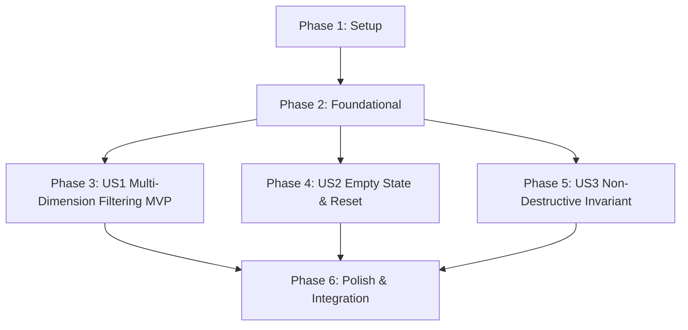

# Tasks: Workspace Registry Multi-Dimension Filters

**Feature**: `specs/009-workspace-registry-filters` | **Branch**: `009-workspace-registry-filters`  
**Input**: Plan from [`specs/009-workspace-registry-filters/plan.md`](plan.md), Spec from [`specs/009-workspace-registry-filters/spec.md`](spec.md)

---

## Phase 1: Setup (Shared Infrastructure)

**Purpose**: Filter state types and interfaces for the entity registry workspace.

- [X] T001 [P] Define `RegistryFilterState` and `SceneFilterOption` interfaces in `src/components/EntityRegistryTable.tsx`

---

## Phase 2: Foundational (Blocking Prerequisites)

**Purpose**: Pure filtering predicate combining Status, Category, and Scene dimensions with logical AND intersection.

- [X] T002 [P] Implement pure multi-dimension filtering predicate helper function supporting Status, Category, and Scene logical AND intersection in `src/components/EntityRegistryTable.tsx`

**Checkpoint**: Foundation ready - user story implementation can begin in parallel.

---

## Phase 3: User Story 1 - Multi-Dimension Entity Registry Filtering (Priority: P1) 🎯 MVP

**Goal**: Allow clearance coordinators to simultaneously filter the entity registry by Clearance Status, Category, and Scene with `ALL` defaults and dynamic counter.

**Independent Test**: Load a screenplay with multiple scenes, select `ACTION_REQUIRED` + `BRAND` + `Scene 1`, verify that only matching entities display and counter reads `X of Y Entities Displayed`.

### Tests for User Story 1

- [X] T003 [P] [US1] Component/contract test for multi-dimension filtering predicate, default `ALL` values, and dynamic count calculation in `tests/contract/test_registry_filters.test.ts`

### Implementation for User Story 1

- [X] T004 [US1] Add Status, Category, and Scene filter select controls with `ALL` defaults and dynamic counter badge (`X of Y Entities Displayed`) in `src/components/EntityRegistryTable.tsx`
- [X] T005 [P] [US1] Update `WorkspacePage.tsx` in `src/pages/WorkspacePage.tsx` to pass scenes and scene occurrences to `EntityRegistryTable`

**Checkpoint**: User Story 1 complete. Multi-dimension filtering operational and testable independently.

---

## Phase 4: User Story 2 - Empty Filter State & Quick Reset (Priority: P2)

**Goal**: Render descriptive empty state when active filter combinations yield 0 matches, with a single-click "Clear Filters" action.

**Independent Test**: Apply a filter with 0 matches; verify active filter parameters are listed in the empty state; click "Clear Filters" and verify all items restore.

### Tests for User Story 2

- [X] T006 [P] [US2] Contract test for zero-match empty state rendering and "Clear Filters" reset in `tests/contract/test_registry_filters.test.ts`

### Implementation for User Story 2

- [X] T007 [US2] Render descriptive zero-match empty state with active filter tags and "🔄 Clear Filters" action in `src/components/EntityRegistryTable.tsx`

**Checkpoint**: User Stories 1 AND 2 complete. Empty state and quick reset operational.

---

## Phase 5: User Story 3 - Read-Only Non-Destructive Filtering Invariant (Priority: P3)

**Goal**: Ensure client-side filtering never mutates stored entity data, occurrences, overrides, or truncated binder export contents.

**Independent Test**: Filter the table to 1 entity, trigger a binder export, and verify that the exported binder contains 100% of canonical entities with full SHA-256 integrity digest.

### Tests for User Story 3

- [X] T008 [P] [US3] Contract test in `tests/contract/test_registry_filters.test.ts` verifying filtering is 100% read-only and leaves entity collections and binder exports unchanged

### Implementation for User Story 3

- [X] T009 [US3] Verify full binder export retention and zero side effects under active UI filters in `src/pages/WorkspacePage.tsx`

**Checkpoint**: All user stories complete. Multi-dimension filtering, empty state recovery, and read-only non-destructive invariant operational.

---

## Phase 6: Polish & Cross-Cutting Concerns

**Purpose**: End-to-end integration testing, quickstart validation, and full build verification.

- [X] T010 [P] Implement end-to-end integration test in `tests/integration/registry_filter_workflow.test.ts` verifying multi-scene filtering, quick reset, and binder export
- [X] T011 Run quickstart validation scenarios defined in `specs/009-workspace-registry-filters/quickstart.md`
- [X] T012 Verify production build (`tsc && vite build`) and full Vitest test suite (`npm test`) across all test suites with 0 regressions

---

## Dependencies & Execution Order

---

## Parallel Execution Examples

### User Story 1
- `T003` (contract test in `tests/contract/test_registry_filters.test.ts`) can run in parallel with `T004` (`src/components/EntityRegistryTable.tsx`) and `T005` (`src/pages/WorkspacePage.tsx`).

### User Story 2
- `T006` (contract test in `tests/contract/test_registry_filters.test.ts`) can run in parallel with `T007` (`src/components/EntityRegistryTable.tsx`).

### User Story 3
- `T008` (contract test in `tests/contract/test_registry_filters.test.ts`) can run in parallel with `T009` (`src/pages/WorkspacePage.tsx`).
