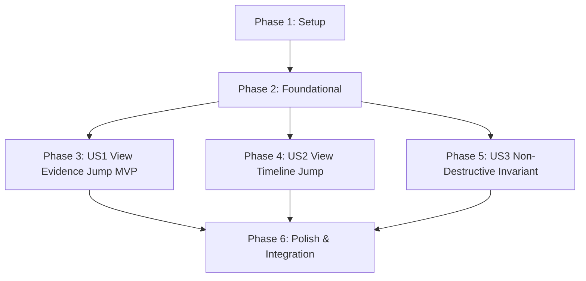

# Tasks: Binder Jump to Evidence & Timeline Context

**Feature**: `specs/010-binder-jump-evidence` | **Branch**: `010-binder-jump-evidence`  
**Input**: Plan from [`specs/010-binder-jump-evidence/plan.md`](plan.md), Spec from [`specs/010-binder-jump-evidence/spec.md`](spec.md)

---

## Phase 1: Setup (Shared Infrastructure)

**Purpose**: Type definitions and interface extensions for binder jump actions.

- [x] T001 [P] Define `BinderJumpTarget` and extend props in `src/components/BinderExportModal.tsx`, `src/components/CitationDrawer.tsx`, and `src/components/TimelineDrawer.tsx`

---

## Phase 2: Foundational (Blocking Prerequisites)

**Purpose**: Empty evidence fallback state in `CitationDrawer.tsx` and entity-focused timeline filtering in `TimelineDrawer.tsx` without chain-of-thought.

- [x] T002 [P] Implement empty evidence fallback state in `src/components/CitationDrawer.tsx` and entity timeline filtering/focus in `src/components/TimelineDrawer.tsx`

**Checkpoint**: Foundation ready - user story implementation can begin in parallel.

---

## Phase 3: User Story 1 - Interactive Evidence & Citation Inspection from Binder Preview (Priority: P1) 🎯 MVP

**Goal**: Allow coordinators and counsel to click "🔍 View Evidence" on entities or replacement cards in the binder preview and open the focused citation drawer.

**Independent Test**: Open the clearance binder preview, click "🔍 View Evidence" on an entity, verify citation drawer opens with grounded sources and risk rationale, and verify closing returns to binder preview.

### Tests for User Story 1

- [x] T003 [P] [US1] Component/contract test for "🔍 View Evidence" triggers on binder canonical entities and replacement cards in `tests/contract/test_binder_jump.test.ts`

### Implementation for User Story 1

- [x] T004 [US1] Add "🔍 View Evidence" action triggers on canonical entity rows and replacement catalog cards in `src/components/BinderExportModal.tsx`
- [x] T005 [P] [US1] Wire `onJumpToEvidence` callback in `src/pages/WorkspacePage.tsx` to populate and open the `CitationDrawer`

**Checkpoint**: User Story 1 complete. Binder evidence jump operational and testable independently.

---

## Phase 4: User Story 2 - Observable Action Timeline Context Focus (Priority: P2)

**Goal**: Allow coordinators and auditors to click "📜 View Timeline" on items in the binder preview and open the timeline drawer focused on that entity's observable events without chain-of-thought.

**Independent Test**: Click "📜 View Timeline" on a binder item, verify timeline drawer opens focused on events for that item, and verify zero chain-of-thought is displayed.

### Tests for User Story 2

- [x] T006 [P] [US2] Contract test for "📜 View Timeline" triggers and entity timeline focus without chain-of-thought in `tests/contract/test_binder_jump.test.ts`

### Implementation for User Story 2

- [x] T007 [US2] Add "📜 View Timeline" action triggers on canonical entity rows and replacement catalog cards in `src/components/BinderExportModal.tsx`
- [x] T008 [P] [US2] Wire `onJumpToTimeline` callback in `src/pages/WorkspacePage.tsx` to focus and open `TimelineDrawer`

**Checkpoint**: User Stories 1 AND 2 complete. Both evidence and timeline jump flows operational.

---

## Phase 5: User Story 3 - Read-Only Non-Destructive Invariant (Priority: P3)

**Goal**: Ensure all jump interactions from the binder preview are strictly read-only, cause 0 database mutations, and leave the SHA-256 digest unchanged.

**Independent Test**: Trigger multiple evidence and timeline jumps from the binder, close drawers, and verify that the binder's SHA-256 digest remains identical.

### Tests for User Story 3

- [x] T009 [P] [US3] Contract test in `tests/contract/test_binder_jump.test.ts` verifying jump navigation causes zero HTTP mutations and leaves the binder SHA-256 digest unchanged

**Checkpoint**: All user stories complete. Jump actions, citation drawers, timeline focus, and read-only non-destructive invariant verified.

---

## Phase 6: Polish & Cross-Cutting Concerns

**Purpose**: End-to-end integration testing, quickstart validation, and full build verification.

- [x] T010 [P] Implement end-to-end integration test in `tests/integration/binder_jump_workflow.test.ts` verifying binder generation, jump to evidence, jump to timeline, and constant SHA-256 digest
- [x] T011 Run quickstart validation scenarios defined in `specs/010-binder-jump-evidence/quickstart.md`
- [x] T012 Verify production build (`tsc && vite build`) and full Vitest test suite (`npm test`) across all test suites with 0 regressions

---

## Dependencies & Execution Order

---

## Parallel Execution Examples

### User Story 1
- `T003` (contract test in `tests/contract/test_binder_jump.test.ts`) can run in parallel with `T004` (`src/components/BinderExportModal.tsx`) and `T005` (`src/pages/WorkspacePage.tsx`).

### User Story 2
- `T006` (contract test in `tests/contract/test_binder_jump.test.ts`) can run in parallel with `T007` (`src/components/BinderExportModal.tsx`) and `T008` (`src/pages/WorkspacePage.tsx`).

### User Story 3
- `T009` (contract test in `tests/contract/test_binder_jump.test.ts`) can run in parallel with `T010` (`tests/integration/binder_jump_workflow.test.ts`).
