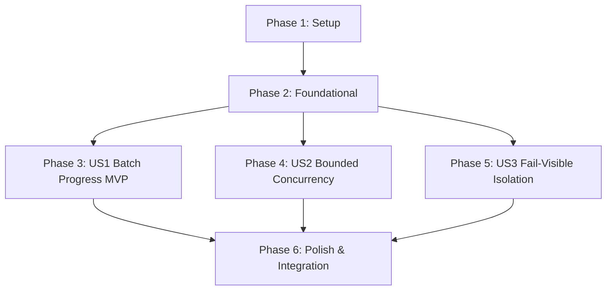

# Tasks: Multi-Item Clearance Research Progress & Concurrency Control

**Feature**: `specs/011-multi-item-research-progress` | **Branch**: `011-multi-item-research-progress`  
**Input**: Plan from [`specs/011-multi-item-research-progress/plan.md`](plan.md), Spec from [`specs/011-multi-item-research-progress/spec.md`](spec.md)

---

## Phase 1: Setup (Shared Infrastructure)

**Purpose**: Type definitions and state interfaces for batch clearance research.

- [x] T001 [P] Define `BatchItemStatus`, `BatchResearchItem`, and `BatchResearchProgress` interfaces in `src/components/EntityRegistryTable.tsx` and `src/hooks/useBatchResearch.ts`

---

## Phase 2: Foundational (Blocking Prerequisites)

**Purpose**: Asynchronous worker pool engine with strict concurrency limit of 2.

- [x] T002 [P] Implement `runBatchClearancePool` worker queue with concurrency limit of 2 in `src/hooks/useBatchResearch.ts`

**Checkpoint**: Foundation ready - user story implementation can begin in parallel.

---

## Phase 3: User Story 1 - Batch Research Execution with Per-Item Progress Tracking (Priority: P1) 🎯 MVP

**Goal**: Provide "🔍 Research All Pending" trigger, batch progress banner, and live per-item badges with incremental table updates.

**Independent Test**: Ingest a script with un-researched entities, click "🔍 Research All Pending", verify per-item badge transitions from `QUEUED` to `RESEARCHING` to `COMPLETED`, and verify table rows update immediately as each item completes.

### Tests for User Story 1

- [x] T003 [P] [US1] Contract test for "🔍 Research All Pending" trigger, eligibility filtering (`INSUFFICIENT_EVIDENCE`), and live status transitions in `tests/contract/test_batch_research.test.ts`

### Implementation for User Story 1

- [x] T004 [US1] Add "🔍 Research All Pending" button, batch progress banner, and per-item badges (`QUEUED`, `RESEARCHING`, `COMPLETED`, `FAILED`) in `src/components/EntityRegistryTable.tsx`
- [x] T005 [P] [US1] Wire `onEvaluateBatch` in `src/pages/WorkspacePage.tsx` to execute batch evaluations and refresh entity table incrementally upon each item completion

**Checkpoint**: User Story 1 complete. Multi-item batch research operational and testable independently.

---

## Phase 4: User Story 2 - Strict Concurrency Limiting (Pool Size = 2) & Zero Work Dropping (Priority: P2)

**Goal**: Enforce strict concurrency bounding ($\le 2$ parallel requests) ensuring zero dropped evaluations or lost citations.

**Independent Test**: Queue 5 entities for batch research; verify at most 2 items execute concurrently and verify 100% of completed evaluations are persisted.

### Tests for User Story 2

- [x] T006 [P] [US2] Contract test verifying parallel request ceiling ($\le 2$) and complete persistence without dropped work in `tests/contract/test_batch_research.test.ts`

### Implementation for User Story 2

- [x] T007 [US2] Enforce strict concurrency bounding ($\le 2$) and zero-drop completion tracking in `src/hooks/useBatchResearch.ts`

**Checkpoint**: User Stories 1 AND 2 complete. Bounded concurrency and live batch tracking fully operational.

---

## Phase 5: User Story 3 - Fail-Visible Error Isolation & Override Protection (Priority: P3)

**Goal**: Guarantee that individual item failures remain fail-visible (`INSUFFICIENT_EVIDENCE`) without canceling remaining batch items, and preserve existing signed counsel overrides.

**Independent Test**: Trigger batch research with a failing item; verify failed item displays `⚠️ Failed` / `INSUFFICIENT_EVIDENCE` while subsequent items complete successfully, and verify counsel overrides remain intact.

### Tests for User Story 3

- [x] T008 [P] [US3] Contract test verifying failed item isolation (`INSUFFICIENT_EVIDENCE`) without aborting batch queue and preserving pre-existing counsel overrides in `tests/contract/test_batch_research.test.ts`

### Implementation for User Story 3

- [x] T009 [US3] Implement try/catch item error isolation and counsel override preservation in `src/hooks/useBatchResearch.ts` and `src/components/EntityRegistryTable.tsx`

**Checkpoint**: All user stories complete. Batch progress, bounded concurrency, fail-visible error handling, and override preservation verified.

---

## Phase 6: Polish & Cross-Cutting Concerns

**Purpose**: End-to-end integration testing, quickstart validation, and full build verification.

- [x] T010 [P] Implement end-to-end integration test in `tests/integration/batch_research_workflow.test.ts` verifying batch script ingestion, concurrent evaluation, live table updates, and complete binder export
- [x] T011 Run quickstart validation scenarios defined in `specs/011-multi-item-research-progress/quickstart.md`
- [x] T012 Verify production build (`tsc && vite build`) and full Vitest test suite (`npm test`) across all test suites with 0 regressions

---

## Dependencies & Execution Order

---

## Parallel Execution Examples

### User Story 1
- `T003` (contract test in `tests/contract/test_batch_research.test.ts`) can run in parallel with `T004` (`src/components/EntityRegistryTable.tsx`) and `T005` (`src/pages/WorkspacePage.tsx`).

### User Story 2
- `T006` (contract test in `tests/contract/test_batch_research.test.ts`) can run in parallel with `T007` (`src/hooks/useBatchResearch.ts`).

### User Story 3
- `T008` (contract test in `tests/contract/test_batch_research.test.ts`) can run in parallel with `T009` (`src/hooks/useBatchResearch.ts`).
