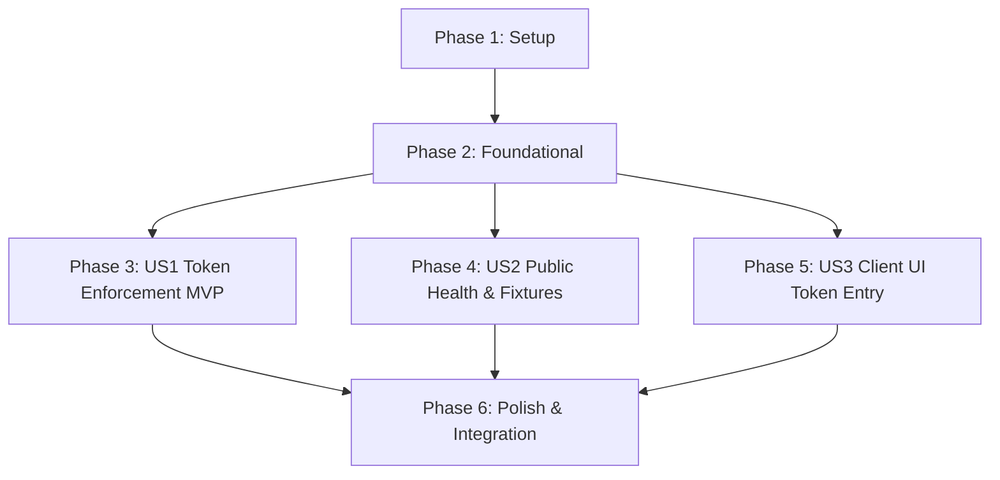

# Tasks: Demo Access Token Protection

**Feature**: `specs/012-demo-access-token` | **Branch**: `012-demo-access-token`  
**Input**: Plan from [`specs/012-demo-access-token/plan.md`](plan.md), Spec from [`specs/012-demo-access-token/spec.md`](spec.md)

---

## Phase 1: Setup (Shared Infrastructure)

**Purpose**: Server configuration property extension for `demoAccessToken`.

- [ ] T001 [P] Extend `AppConfig` and `loadConfig()` with `demoAccessToken` in `server/config.ts`

---

## Phase 2: Foundational (Blocking Prerequisites)

**Purpose**: Shared demo token authentication middleware.

- [ ] T002 [P] Implement `demoAuthMiddleware` supporting `x-demo-token`, Bearer auth, and query parameter validation in `server/middleware/demoAuthMiddleware.ts`

**Checkpoint**: Foundation ready - user story implementation can begin in parallel.

---

## Phase 3: User Story 1 - Optional Shared Demo Token Enforcement on Mutation Endpoints (Priority: P1) 🎯 MVP

**Goal**: Protect all mutating write and research endpoints when `DEMO_ACCESS_TOKEN` is configured, while allowing open access when unset.

**Independent Test**: Configure `DEMO_ACCESS_TOKEN=test-secret`; verify POST `/api/projects` returns 401 without token and 201 with valid token.

### Tests for User Story 1

- [ ] T003 [P] [US1] Contract test for mutation endpoint protection, 401 payload without secret leak, and unset bypass in `tests/contract/test_demo_auth.test.ts`

### Implementation for User Story 1

- [ ] T004 [US1] Apply `demoAuthMiddleware` to protected write and research routers in `server/index.ts`

**Checkpoint**: User Story 1 complete. Server-side token enforcement operational and testable independently.

---

## Phase 4: User Story 2 - Public Health, Fixture Load & Static Asset Access (Priority: P2)

**Goal**: Ensure `GET /api/health`, `GET /api/fixtures/*`, and static frontend assets remain 100% public under all token configurations.

**Independent Test**: With `DEMO_ACCESS_TOKEN` configured, send unauthenticated requests to `/api/health` and `/api/fixtures/demo-screenplay`; verify both respond 200 OK.

### Tests for User Story 2

- [ ] T005 [P] [US2] Contract test verifying `GET /api/health`, `GET /api/fixtures/*`, and static route exemptions in `tests/contract/test_demo_auth.test.ts`

### Implementation for User Story 2

- [ ] T006 [US2] Verify public exemption routing for `healthRouter`, `fixtureRouter`, and static assets in `server/index.ts`

**Checkpoint**: User Stories 1 AND 2 complete. Protected endpoints guarded, public health probes unblocked.

---

## Phase 5: User Story 3 - Client UI Demo Token Entry & Header Attachment (Priority: P3)

**Goal**: Allow coordinators and judges to enter a demo access token in the client UI and automatically attach `x-demo-token` to all API mutation requests.

**Independent Test**: Enter a demo token in the UI settings; verify fetch requests include the token header and persist in browser storage.

### Implementation for User Story 3

- [ ] T007 [P] [US3] Add client demo token storage helpers and header injection in `src/utils/apiClient.ts` / `src/App.tsx`
- [ ] T008 [US3] Add Access Token modal / header control with 401 error feedback in `src/App.tsx` and header components

**Checkpoint**: All user stories complete. Server enforcement, public exemptions, and client UI token management verified.

---

## Phase 6: Polish & Cross-Cutting Concerns

**Purpose**: End-to-end integration testing, quickstart validation, and full build verification.

- [ ] T009 [P] Implement end-to-end integration test in `tests/integration/demo_token_workflow.test.ts` verifying protected project creation, script ingestion, clearance research with token, and 401 rejection without token
- [ ] T010 Run quickstart validation scenarios defined in `specs/012-demo-access-token/quickstart.md`
- [ ] T011 Verify production build (`tsc && vite build`) and full Vitest test suite (`npm test`) across all test suites with 0 regressions

---

## Dependencies & Execution Order

---

## Parallel Execution Examples

### User Story 1
- `T003` (contract test in `tests/contract/test_demo_auth.test.ts`) can run in parallel with `T004` (`server/index.ts`).

### User Story 2
- `T005` (contract test in `tests/contract/test_demo_auth.test.ts`) can run in parallel with `T006` (`server/index.ts`).

### User Story 3
- `T007` (`src/utils/apiClient.ts`) can run in parallel with `T008` (`src/App.tsx`).
