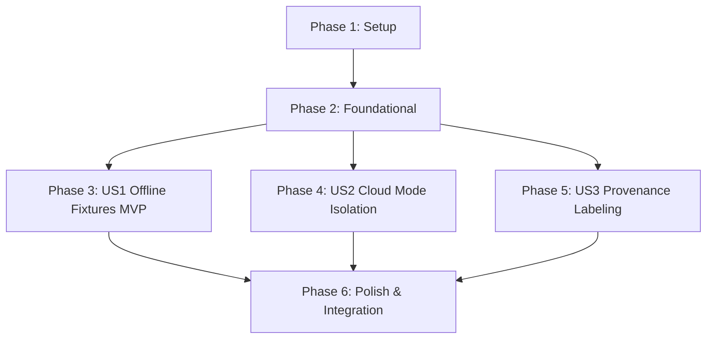

# Tasks: Offline Record Replay Fixtures

**Feature**: `specs/013-offline-record-replay-fixtures` | **Branch**: `013-offline-record-replay-fixtures`  
**Input**: Plan from [`specs/013-offline-record-replay-fixtures/plan.md`](plan.md), Spec from [`specs/013-offline-record-replay-fixtures/spec.md`](spec.md)

---

## Phase 1: Setup (Shared Infrastructure)

**Purpose**: Define newly captured repository record-replay fixtures for Parallel Search and Gemini responses.

- [ ] T001 [P] Create typed record-replay fixtures in `server/fixtures/recordReplayFixtures.ts` for Parallel Search trademark records and Gemini risk/replacement payloads

---

## Phase 2: Foundational (Blocking Prerequisites)

**Purpose**: Core engine wiring for deterministic fixture resolution in `TEST_MODE` and `DEMO_MODE`.

- [ ] T002 [P] Integrate `recordReplayFixtures.ts` into `server/tools/parallelSearchTool.ts` with explicit `DEMO_FIXTURE` and `FALLBACK_FIXTURE` tagging

**Checkpoint**: Foundation ready - user story implementation can begin in parallel.

---

## Phase 3: User Story 1 - Deterministic Offline Contract Test Fixtures for Parallel & Gemini (Priority: P1) 🎯 MVP

**Goal**: Enable 100% deterministic offline contract and integration test execution using newly captured repository fixtures without network calls.

**Independent Test**: Run `EXECUTION_MODE=TEST_MODE npm test`; verify all contract tests pass offline without external network dependencies.

### Tests for User Story 1

- [ ] T003 [P] [US1] Contract test for fixture schema completeness, trademark entity matching, and deterministic offline resolution in `tests/contract/test_offline_fixtures.test.ts`

### Implementation for User Story 1

- [ ] T004 [US1] Connect offline fixture resolution for script parsing and brand replacement in `server/agents/ScriptParserAgent.ts` and `server/agents/ReplacementAgent.ts`

**Checkpoint**: User Story 1 complete. Deterministic offline fixture execution operational and testable independently.

---

## Phase 4: User Story 2 - Strict Mode Enforcement & Production Cloud Isolation (Priority: P2)

**Goal**: Guarantee `CLOUD_MODE` strictly requires live API credentials, fails visibly on missing keys, and prevents client-side replay switching.

**Independent Test**: Verify server throws fatal configuration error when `EXECUTION_MODE=CLOUD_MODE` lacks credentials; verify requests in `CLOUD_MODE` cannot be overridden to mock replay by client parameters.

### Tests for User Story 2

- [ ] T005 [P] [US2] Contract test verifying `CLOUD_MODE` startup credential enforcement, live API routing, and anti-replay guard in `tests/contract/test_offline_fixtures.test.ts`

### Implementation for User Story 2

- [ ] T006 [US2] Enforce fatal startup checks and live-only routing in `server/config.ts` and `server/tools/parallelSearchTool.ts`

**Checkpoint**: User Stories 1 AND 2 complete. Offline testing deterministic, production cloud mode strictly live.

---

## Phase 5: User Story 3 - Visible Provenance Labeling for Fixtures vs. Live Searches (Priority: P3)

**Goal**: Ensure every citation clearly displays its provenance badge (`PARALLEL_LIVE`, `DEMO_FIXTURE`, or `FALLBACK_FIXTURE`) across workspace views and binder exports.

**Independent Test**: Run clearance research in `DEMO_MODE` and `CLOUD_MODE`; verify Citation Drawer and Binder Export display the respective provenance badges.

### Tests for User Story 3

- [ ] T007 [P] [US3] Contract test verifying `PARALLEL_LIVE`, `DEMO_FIXTURE`, and `FALLBACK_FIXTURE` provenance metadata propagation in `tests/contract/test_offline_fixtures.test.ts`

### Implementation for User Story 3

- [ ] T008 [US3] Ensure consistent provenance metadata propagation across `server/workflows/clearanceWorkflow.ts` and `src/components/CitationDrawer.tsx`

**Checkpoint**: All user stories complete. Offline fixtures, cloud isolation, and visible provenance verified.

---

## Phase 6: Polish & Cross-Cutting Concerns

**Purpose**: End-to-end integration testing, quickstart validation, and full build verification.

- [ ] T009 [P] Implement end-to-end integration test in `tests/integration/offline_replay_workflow.test.ts` verifying zero-network screenplay ingestion, clearance research, replacement generation, and binder compilation
- [ ] T010 Run quickstart validation scenarios defined in `specs/013-offline-record-replay-fixtures/quickstart.md`
- [ ] T011 Verify production build (`tsc && vite build`) and full Vitest test suite (`npm test`) across all test suites with 0 regressions

---

## Dependencies & Execution Order

---

## Parallel Execution Examples

### User Story 1
- `T003` (contract test in `tests/contract/test_offline_fixtures.test.ts`) can run in parallel with `T004` (`server/agents/ScriptParserAgent.ts`).

### User Story 2
- `T005` (contract test in `tests/contract/test_offline_fixtures.test.ts`) can run in parallel with `T006` (`server/tools/parallelSearchTool.ts`).

### User Story 3
- `T007` (contract test in `tests/contract/test_offline_fixtures.test.ts`) can run in parallel with `T008` (`server/workflows/clearanceWorkflow.ts`).
