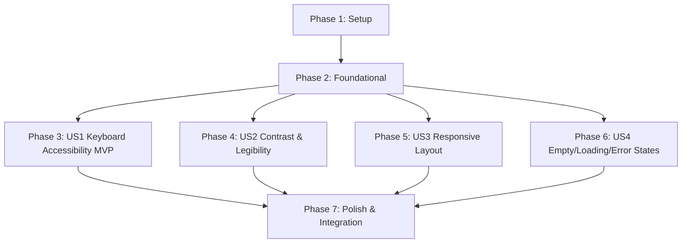

# Tasks: Accessible Responsive Workspace

**Feature**: `specs/014-accessible-responsive-workspace` | **Branch**: `014-accessible-responsive-workspace`  
**Input**: Plan from [`specs/014-accessible-responsive-workspace/plan.md`](plan.md), Spec from [`specs/014-accessible-responsive-workspace/spec.md`](spec.md)

---

## Phase 1: Setup (Shared Infrastructure)

**Purpose**: Define accessible styling tokens, visible focus utilities, and responsive breakpoints.

- [x] T001 [P] Extend CSS variables and utility classes in `src/index.css` for high-contrast visible focus rings (`:focus-visible`), WCAG AA colors, and responsive layout breakpoints

---

## Phase 2: Foundational (Blocking Prerequisites)

**Purpose**: Core overlay stack management and keyboard `Escape` dismissal infrastructure.

- [x] T002 [P] Implement global overlay stack management and `Escape` key event handling in `src/App.tsx`

**Checkpoint**: Foundation ready - user story implementation can begin in parallel.

---

## Phase 3: User Story 1 - Keyboard Navigation & Screen-Reader Accessible Controls (Priority: P1) 🎯 MVP

**Goal**: Ensure all primary workspace actions, table rows, filter dropdowns, and modals are operable via keyboard with visible focus and ARIA labels.

**Independent Test**: Navigate through the workspace using only keyboard (`Tab`, `Enter`, `Escape`, `Space`); verify focus rings are highlighted and `Escape` closes the topmost active modal or drawer.

### Tests for User Story 1

- [x] T003 [P] [US1] Contract test for keyboard operability, ARIA attributes, and `Escape` overlay dismissal in `tests/contract/test_workspace_accessibility.test.ts`

### Implementation for User Story 1

- [x] T004 [US1] Add accessible keyboard controls, ARIA labels, and focus rings to `src/components/EntityRegistryTable.tsx`, `src/components/CitationDrawer.tsx`, and `src/components/ReplacementComparisonModal.tsx`

**Checkpoint**: User Story 1 complete. Keyboard navigation and modal dismissal functional and testable independently.

---

## Phase 4: User Story 2 - High-Contrast Visible Legibility & States (Priority: P2)

**Goal**: Guarantee all text, status badges, buttons, and form labels meet WCAG AA contrast standards ($\ge 4.5:1$).

**Independent Test**: Inspect color contrast ratios across dark theme surfaces, status chips, drawer text, and buttons; verify all contrast ratios meet or exceed 4.5:1.

### Tests for User Story 2

- [x] T005 [P] [US2] Contract test verifying WCAG AA contrast ratios and explicit visible labels in `tests/contract/test_workspace_accessibility.test.ts`

### Implementation for User Story 2

- [x] T006 [US2] Refine typography, status chip colors, and form control labels across `src/pages/WorkspacePage.tsx` and `src/components/CitationDrawer.tsx`

**Checkpoint**: User Stories 1 AND 2 complete. Fully keyboard accessible with high-contrast legibility.

---

## Phase 5: User Story 3 - Fluid Mobile & Desktop Responsive Layout Below 768px (Priority: P3)

**Goal**: Adapt workspace layout below 768px to stack panels cleanly without horizontal clipping or broken tables.

**Independent Test**: Resize viewport to 375px; verify script workspace, stats bar, and entity table stack cleanly with smooth horizontal scrolling.

### Implementation for User Story 3

- [x] T007 [P] [US3] Add responsive mobile stacking and horizontal table overflow handling in `src/pages/WorkspacePage.tsx` and `src/components/EntityRegistryTable.tsx`
- [x] T008 [US3] Make slide-over drawers and modals adapt to 100% width on mobile screens with touch-friendly close targets in `src/components/CitationDrawer.tsx` and `src/components/ReplacementComparisonModal.tsx`

**Checkpoint**: User Stories 1, 2, AND 3 complete. Desktop, tablet, and mobile layouts verified.

---

## Phase 6: User Story 4 - Resilient Empty, Loading & Fail-Visible Error Feedback (Priority: P4)

**Goal**: Maintain explicit, human-readable empty states, loading skeletons, and fail-visible error banners.

**Independent Test**: Apply a zero-match filter; verify empty state displays `"No entities match the selected filter criteria"` with `"🔄 Reset All Filters"`. Trigger auth failure; verify fail-visible banner.

### Implementation for User Story 4

- [x] T009 [P] [US4] Verify explicit empty states with `"🔄 Reset All Filters"` action, loading skeletons, and fail-visible error banners in `src/components/EntityRegistryTable.tsx` and `src/App.tsx`

**Checkpoint**: All user stories complete. Accessible, responsive, and resilient system feedback verified.

---

## Phase 7: Polish & Cross-Cutting Concerns

**Purpose**: End-to-end integration testing, quickstart validation, and full build verification.

- [x] T010 [P] Implement end-to-end integration test in `tests/integration/accessible_workspace_workflow.test.ts` verifying complete keyboard navigation, drawer open/dismiss, and responsive layout state transitions
- [x] T011 Run quickstart validation scenarios defined in `specs/014-accessible-responsive-workspace/quickstart.md`
- [x] T012 Verify production build (`tsc && vite build`) and full Vitest test suite (`npm test`) across all test suites with 0 regressions

---

## Dependencies & Execution Order

---

## Parallel Execution Examples

### User Story 1
- `T003` (contract test in `tests/contract/test_workspace_accessibility.test.ts`) can run in parallel with `T004` (`src/components/EntityRegistryTable.tsx`).

### User Story 2
- `T005` (contract test in `tests/contract/test_workspace_accessibility.test.ts`) can run in parallel with `T006` (`src/pages/WorkspacePage.tsx`).

### User Story 3
- `T007` (`src/pages/WorkspacePage.tsx`) can run in parallel with `T008` (`src/components/CitationDrawer.tsx`).
