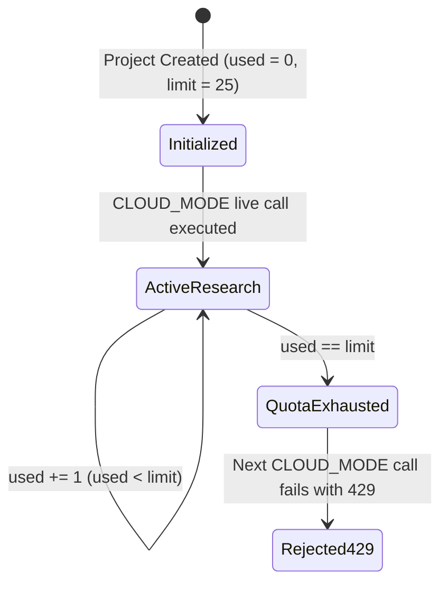

# Data Model: Per-Project Research Limits

**Feature**: `specs/015-project-research-limits` | **Date**: 2026-08-18

---

## 1. Project Schema Extensions

```typescript
export interface ProjectData {
  id: string;
  title: string;
  productionCompany: string;
  scriptVersion: string;
  executionMode: 'TEST_MODE' | 'DEMO_MODE' | 'CLOUD_MODE';
  liveQuotaLimit: number; // Default: 25
  liveQuotaUsed: number;  // Default: 0
  createdAt: string;
  updatedAt: string;
}

export interface ProjectQuotaSummary {
  limit: number;
  used: number;
  remaining: number;
}
```

---

## 2. Quota State Lifecycle


