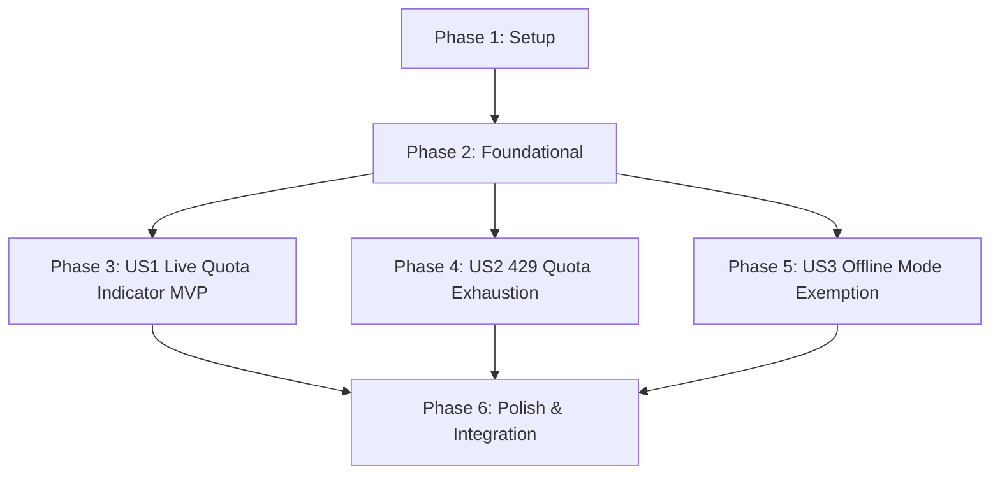

# Tasks: Per-Project Research Limits

**Feature**: `specs/015-project-research-limits` | **Branch**: `015-project-research-limits`  
**Input**: Plan from [`specs/015-project-research-limits/plan.md`](plan.md), Spec from [`specs/015-project-research-limits/spec.md`](spec.md)

---

## Phase 1: Setup (Shared Infrastructure)

**Purpose**: Extend Project repository data structures and quota persistence methods.

- [ ] T001 [P] Extend `ProjectData` schema and methods in `server/repositories/ProjectRepo.ts` with `liveQuotaLimit` (default 25), `liveQuotaUsed` (default 0), and `consumeLiveQuota(projectId, count)`

---

## Phase 2: Foundational (Blocking Prerequisites)

**Purpose**: Expose quota metadata through project API endpoints.

- [ ] T002 [P] Update `server/api/projectRoutes.ts` to return quota metadata (`liveQuotaLimit`, `liveQuotaUsed`, `liveQuotaRemaining`) in `POST /api/projects` and `GET /api/projects/:id`

**Checkpoint**: Foundation ready - user story implementation can begin in parallel.

---

## Phase 3: User Story 1 - Live Quota Tracking & Real-Time Remaining Indicator (Priority: P1) 🎯 MVP

**Goal**: Ensure live quota is tracked per project and displayed in the workspace header.

**Independent Test**: Create a project; verify initial quota is 25/25 and header displays `⚡ Live Quota: 25 / 25`.

### Tests for User Story 1

- [ ] T003 [P] [US1] Contract test for quota initialization, consumption, and metadata retrieval in `tests/contract/test_project_research_limits.test.ts`

### Implementation for User Story 1

- [ ] T004 [US1] Update `src/App.tsx` to fetch, track, and render the remaining-of-total quota indicator in the header (`⚡ Live Quota: X / 25`)

**Checkpoint**: User Story 1 complete. Quota tracking and header badge functional and testable independently.

---

## Phase 4: User Story 2 - Fail-Visible Rejection on Quota Exhaustion (Priority: P2)

**Goal**: Enforce strict 429 rejection and visible error alert when live quota is exhausted in `CLOUD_MODE`.

**Independent Test**: Exhaust quota in `CLOUD_MODE`; trigger evaluation; verify 429 response and visible error banner.

### Tests for User Story 2

- [ ] T005 [P] [US2] Contract test for 429 quota exhaustion rejection in `tests/contract/test_project_research_limits.test.ts`

### Implementation for User Story 2

- [ ] T006 [US2] Implement quota checking and 429 rejection in `server/workflows/clearanceEvaluator.ts` and `server/workflows/replacementGenerator.ts` for `CLOUD_MODE`
- [ ] T007 [US2] Add fail-visible quota exhaustion error banner handling in `src/App.tsx`

**Checkpoint**: User Stories 1 AND 2 complete. Quota tracking and exhaustion enforcement operational.

---

## Phase 5: User Story 3 - Offline TEST_MODE & DEMO_MODE Exemption (Priority: P3)

**Goal**: Guarantee `TEST_MODE` and `DEMO_MODE` fixture evaluations never consume live quota.

**Independent Test**: Run evaluations in `TEST_MODE` and `DEMO_MODE`; verify `liveQuotaUsed` remains 0.

### Tests for User Story 3

- [ ] T008 [P] [US3] Contract test verifying `TEST_MODE` and `DEMO_MODE` fixture evaluations never consume live quota in `tests/contract/test_project_research_limits.test.ts`

**Checkpoint**: All user stories complete. Mode-isolated quota accounting verified.

---

## Phase 6: Polish & Cross-Cutting Concerns

**Purpose**: End-to-end integration testing, quickstart validation, and full build verification.

- [ ] T009 [P] Implement end-to-end integration test in `tests/integration/project_quota_workflow.test.ts` verifying complete quota lifecycle, 429 rejection, and UI banner
- [ ] T010 Run quickstart validation scenarios defined in `specs/015-project-research-limits/quickstart.md`
- [ ] T011 Verify production build (`tsc && vite build`) and full Vitest test suite (`npm test`) across all test suites with 0 regressions

---

## Dependencies & Execution Order

---

## Parallel Execution Examples

### User Story 1
- `T003` (contract test in `tests/contract/test_project_research_limits.test.ts`) can run in parallel with `T004` (`src/App.tsx`).

### User Story 2
- `T005` (contract test in `tests/contract/test_project_research_limits.test.ts`) can run in parallel with `T006` (`server/workflows/clearanceEvaluator.ts`).

### Polish Phase
- `T009` (integration test in `tests/integration/project_quota_workflow.test.ts`) can run in parallel with `T010` (`quickstart.md`).
