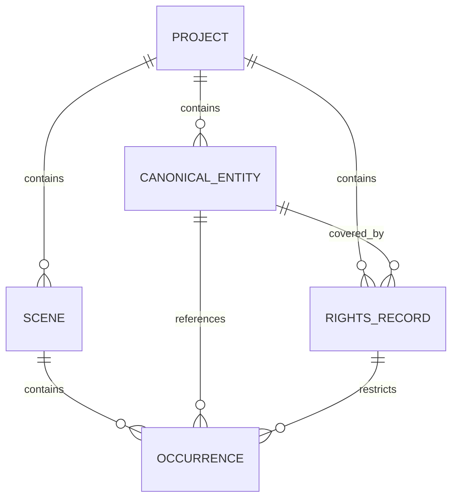

# Data Model: Production Clearance Operating Model (Phase 4)

**Feature**: `specs/016-production-clearance-model` (Phase 4 Focus)  
**Date**: 2026-08-19  
**Status**: Completed  

---

## 1. Rights & Restrictions Entity

### `RightsRecordData`
Stored in Firestore at `projects/{projectId}/rights/{rightsId}`.

```typescript
export type GrantType =
  | 'EXCLUSIVE'
  | 'NON_EXCLUSIVE'
  | 'FAIR_USE'
  | 'PUBLIC_DOMAIN'
  | 'PROD_MADE';

export type TerritoryType =
  | 'WORLDWIDE'
  | 'NORTH_AMERICA'
  | 'EUROPE'
  | 'US_ONLY'
  | 'SPECIFIED_COUNTRIES';

export type MediaWindowType =
  | 'ALL_MEDIA_IN_PERPETUITY'
  | 'THEATRICAL_SVOD'
  | 'THEATRICAL_ONLY'
  | 'LINEAR_TV'
  | 'FESTIVAL_ONLY'
  | 'DIGITAL_PROMO';

export type RightsStatus =
  | 'ACTIVE'
  | 'PENDING_SIGNATURE'
  | 'EXPIRED'
  | 'REVOKED';

export interface RightsRecordData {
  id: string;
  projectId: string;
  canonicalEntityId: string;
  canonicalEntityName?: string;
  occurrenceIds?: string[]; // Empty or omitted = applies to all occurrences of this entity
  licensorName: string;
  grantType: GrantType;
  territory: TerritoryType;
  territoryDetails?: string;
  mediaWindow: MediaWindowType;
  effectiveDate: string; // ISO date string YYYY-MM-DD
  expirationDate?: string; // ISO date string YYYY-MM-DD, null if isPerpetual
  isPerpetual: boolean;
  covenants?: string[];
  feeAmount?: number;
  currency?: string;
  documentReferenceUrl?: string;
  status: RightsStatus;
  createdAt: string;
  updatedAt: string;
}
```

---

## 2. Coverage Evaluation Model

### `RightsCoverageResult`
Returned by `RightsRepo.evaluateRightsCoverage`.

```typescript
export interface RightsCoverageResult {
  isCovered: boolean;
  activeRights: RightsRecordData[];
  covenants: string[];
  hasExpiringSoon: boolean;
  expirationWarning?: string;
  summaryText: string;
}
```

---

## 3. Relationships to Existing Entities


