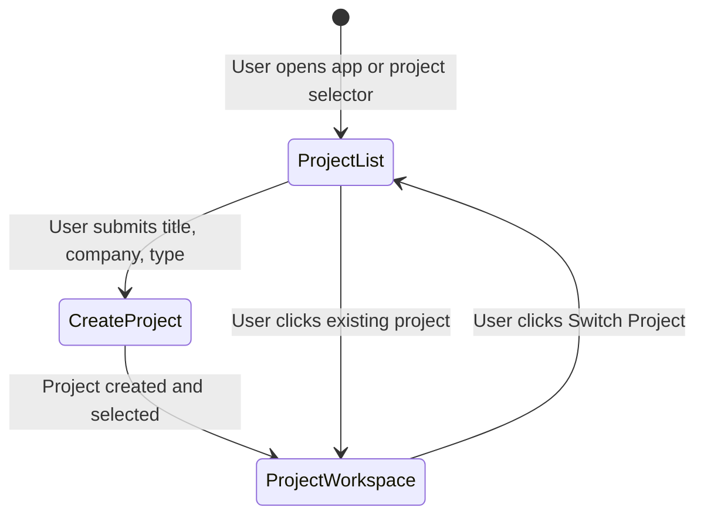

# Data Model: Production Clearance Operating Model (Phase 1)

**Feature**: `specs/016-production-clearance-model` | **Date**: 2026-08-19

---

## 1. Project Schema Extensions (Phase 1)

```typescript
export type ProductionProjectType = 'Movie' | 'TV Show' | 'Commercial';

export interface ProjectData {
  id: string;
  title: string;
  productionCompany: string;
  scriptVersion: string;
  projectType: ProductionProjectType; // Default: 'Movie'
  executionMode: 'TEST_MODE' | 'DEMO_MODE' | 'CLOUD_MODE';
  liveQuotaLimit?: number;            // Default: 25
  liveQuotaUsed?: number;             // Default: 0
  createdAt: string;
  updatedAt: string;
}

export interface ProjectListItem extends ProjectData {
  liveQuotaRemaining: number;
  entityCount?: number;
  clearedCount?: number;
  actionRequiredCount?: number;
}
```

---

## 2. Project Selection & Landing Lifecycle


