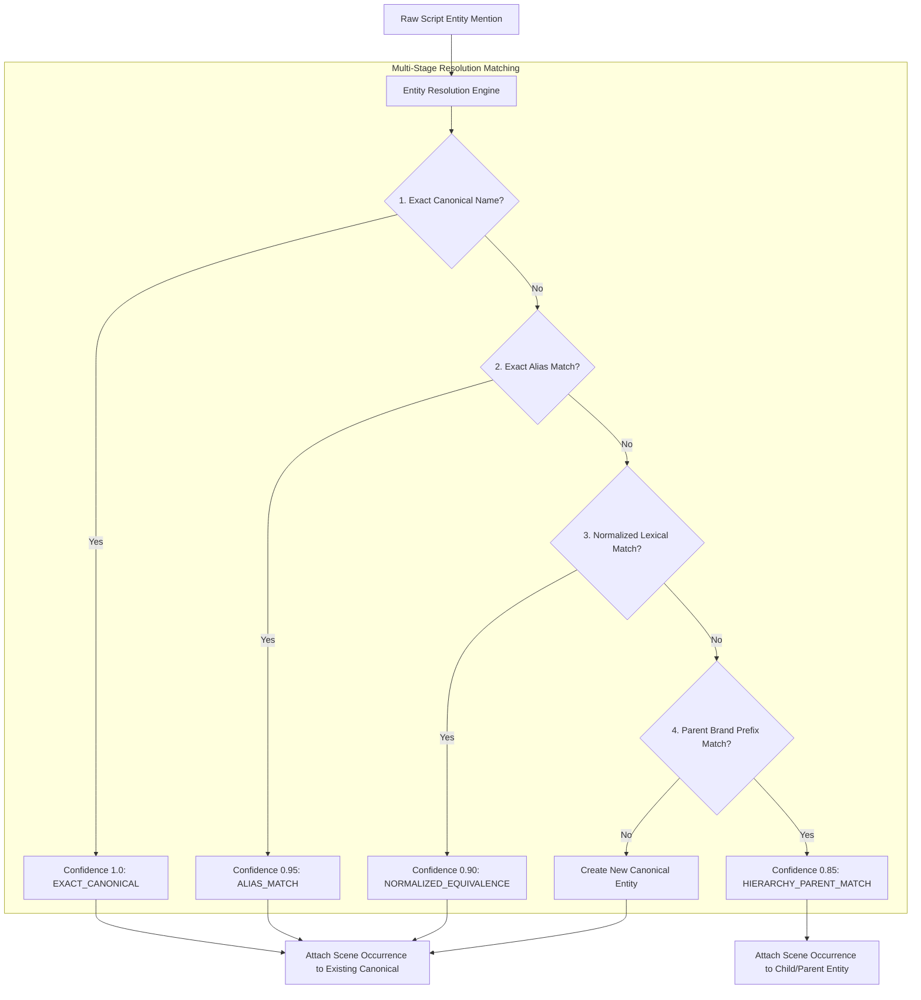

# Data Model: Production Clearance Operating Model (Phases 2 & 3)

**Feature**: `specs/016-production-clearance-model` | **Date**: 2026-08-19

---

## 1. Canonical Entity & Occurrence Schemas

```typescript
export type EntityRelationshipType =
  | 'BRAND_PRODUCT'
  | 'SUBSIDIARY'
  | 'PARENT_COMPANY'
  | 'PRODUCT_LINE'
  | 'VARIATION';

export interface CanonicalEntityData {
  id: string;
  projectId: string;
  canonicalName: string;
  entityCategory: EntityCategory;
  description: string;
  overallClearanceStatus: ClearanceStatus; // Deterministically derived from occurrences
  origin?: EntityOrigin;
  
  // Phase 3 Entity Resolution & Hierarchy Extensions
  aliases?: string[];
  parentEntityId?: string;
  parentEntityName?: string;
  relationshipType?: EntityRelationshipType;

  // Counsel Overrides & Assets
  isOverridden?: boolean;
  latestOverride?: {
    overrideId: string;
    overrideStatus: ClearanceStatus;
    rationale: string;
    counselName: string;
    timestamp: string;
  };
  replacementCard?: any;
  createdAt: string;
  updatedAt: string;
}

export interface SceneEntityOccurrenceData {
  id: string;
  sceneId: string;
  canonicalEntityId: string;
  scriptLineNumber: number;
  excerptText: string;
  usageContext: string;
  sentimentScore?: number;
  exposureDurationSeconds?: number;
  
  // Phase 2 Occurrence-Level Evaluation Fields
  clearanceStatus?: ClearanceStatus;
  riskScore?: number;
  riskRationale?: string;
  contextFlags?: string[];
  citations?: any[];
  evaluatedAt?: string;

  // Phase 3 Surface Mention Provenance
  surfaceMention?: string;
  matchedVia?: 'EXACT_CANONICAL' | 'ALIAS_MATCH' | 'NORMALIZED_EQUIVALENCE' | 'HIERARCHY_PARENT_MATCH' | 'MANUAL_ENTRY';
}
```

---

## 2. Entity Resolution & Merge Contracts Data Structures

```typescript
export type MatchRule =
  | 'EXACT_CANONICAL'
  | 'ALIAS_MATCH'
  | 'NORMALIZED_EQUIVALENCE'
  | 'HIERARCHY_PARENT_MATCH'
  | 'NONE';

export interface EntityResolutionResult {
  matched: boolean;
  canonicalEntityId?: string;
  canonicalName?: string;
  entityCategory?: EntityCategory;
  confidence: number;
  matchRule: MatchRule;
  matchedAlias?: string;
  parentEntity?: {
    id: string;
    name: string;
    relationshipType: EntityRelationshipType;
  };
}

export interface MergeEntitiesResult {
  success: boolean;
  targetEntity: CanonicalEntityData;
  sourceEntityId: string;
  transferredOccurrencesCount: number;
  combinedAliases: string[];
  derivedCanonicalStatus: ClearanceStatus;
  mergedAt: string;
}
```

---

## 3. Entity Resolution & Hierarchy Architecture


