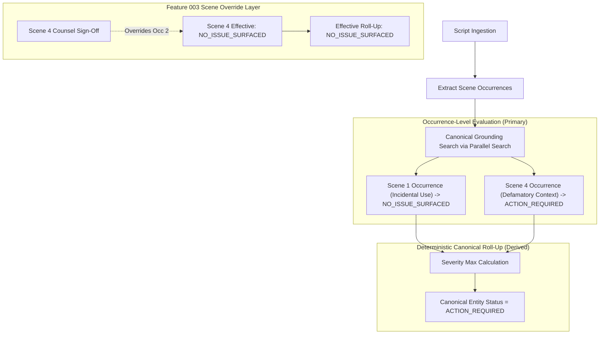

# Data Model: Production Clearance Operating Model (Phase 2)

**Feature**: `specs/016-production-clearance-model` | **Date**: 2026-08-19

---

## 1. Scene Entity Occurrence Schema Extension

```typescript
export interface SceneEntityOccurrenceData {
  id: string;
  sceneId: string;
  canonicalEntityId: string;
  scriptLineNumber: number;
  excerptText: string;
  usageContext: string;
  sentimentScore?: number;
  exposureDurationSeconds?: number;
  
  // Phase 2 Occurrence-Level Evaluation Fields
  clearanceStatus?: ClearanceStatus;
  riskScore?: number;
  riskRationale?: string;
  contextFlags?: string[];
  citations?: any[];
  evaluatedAt?: string;
}

export interface CanonicalEntityData {
  id: string;
  projectId: string;
  canonicalName: string;
  entityCategory: EntityCategory;
  description: string;
  overallClearanceStatus: ClearanceStatus; // Deterministically derived from occurrences
  origin?: EntityOrigin;
  isOverridden?: boolean;
  latestOverride?: {
    overrideId: string;
    overrideStatus: ClearanceStatus;
    rationale: string;
    counselName: string;
    timestamp: string;
  };
  replacementCard?: any;
  createdAt: string;
  updatedAt: string;
}
```

---

## 2. Occurrence Evaluation & Canonical Roll-up Lifecycle


