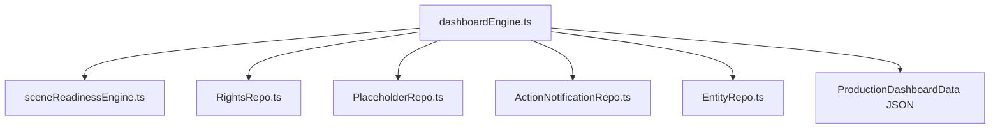

# Research & Architectural Decisions: Production Clearance Operating Model (Phase 9)

**Feature**: `specs/016-production-clearance-model` (Phase 9 Focus)  
**Date**: 2026-08-19  
**Status**: Completed  

---

## 1. Production Dashboard Aggregation Architecture

### Context & Problem
Clearance supervision across film and television projects requires visibility across distinct domain systems:
1. **Shooting Blockers**: Occurrences with `ACTION_REQUIRED` or `INSUFFICIENT_EVIDENCE` lacking an executed override or replacement card.
2. **Scene Readiness**: Deterministic scene tiers (`FINAL_CLEAR`, `WORKING_CLEAR`, `RED`).
3. **Rights & Restrictions Expirations**: Contracts expiring within 30, 60, or 90 days.
4. **Active Placeholders**: Fictional replacement assets by department (`Art Dept`, `Music`, `Dialogue`, `Props`).
5. **Department Work Queues**: Pending action items routed to specific teams.

### Architecture:

---

## 2. Deterministic KPI Calculation Rules

1. **Shooting Readiness Index (%)**:
   $$\text{Readiness \%} = \text{round}\left(\frac{\text{Final Clear Scenes} + 0.5 \times \text{Working Clear Scenes}}{\text{Total Scenes}} \times 100\right)$$
   *(Note: Clean scenes count as 100%, Working Clear counts as 50% progress, Red counts as 0% progress).*

2. **Critical Blocker Item Extraction**:
   - Every occurrence in a `RED` scene where `readinessTier === 'BLOCKER'`.
   - Returns occurrence ID, canonical entity ID, canonical name, scene number, heading, and risk rationale.

3. **Expiring Rights Filtering**:
   - Filter all agreements in `RightsRepo` where `expirationDate` is within 90 days of `now`.
   - Calculate exact `daysRemaining = Math.ceil((new Date(expirationDate).getTime() - Date.now()) / (1000 * 60 * 60 * 24))`.

---

## 3. Mitigation Action Shortcuts

From the Dashboard UI, users can take immediate resolution actions on any blocker item:
- **`📜 Add Rights`**: Opens RightsModal with entity pre-selected.
- **`🎨 Attach Placeholder`**: Opens PlaceholderManagerModal with entity pre-selected.
- **`⚖️ Counsel Override`**: Opens Counsel Review flow to execute a signed legal approval.
