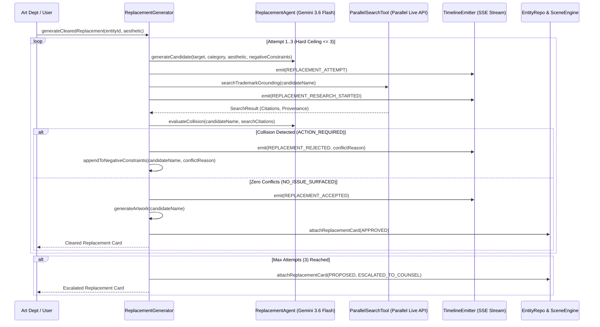

# Research & Architectural Decisions: Production Clearance Operating Model (Phase 8)

**Feature**: `specs/016-production-clearance-model` (Phase 8 Focus)  
**Date**: 2026-08-19  
**Status**: Completed  

---

## 1. Evidence-Driven Live Self-Clearance Architecture

### Context & Problem
In Feature 004, the replacement generator tested loop termination and multi-attempt logic using synthetic keyword collision arrays (e.g. `[collision]`, `atomic cola`, `radiant pop`). In live production (`CLOUD_MODE`), candidates must be evaluated against real-world trademark and brand evidence retrieved via live Parallel Search.

### Architecture:

---

## 2. Collision Evaluation Logic (Live vs Fixture Modes)

### 1. `CLOUD_MODE` / Live Grounding:
- **Search Execution**: Runs live Parallel Search with query: `${candidateName} registered trademark commercial brand status`.
- **Reasoning**: Gemini 3.6 Flash analyzes the search citations:
  - If citations show an active company, product trademark, registered service mark, or famous character $\to$ `ACTION_REQUIRED` with conflict summary.
  - If search citations show only generic dictionary definitions or unrelated terms $\to$ `NO_ISSUE_SURFACED`.
- **Fail-Visible**: If live search fails or API key is missing in `CLOUD_MODE`, flags `INSUFFICIENT_EVIDENCE` visibly without hiding failure.

### 2. `TEST_MODE` / `DEMO_MODE`:
- Deterministic simulation using record-replay fixture mappings and simulated collision tokens (`[collision]`, `atomic cola`, etc.) to guarantee 100% predictable, reproducible test suites.

---

## 3. Negative Constraint Accumulation Matrix

| Attempt # | Input Negative Constraints | Output Candidate | Search Verdict | Action |
|:---:|:---|:---|:---:|:---|
| 1 | None | `Candidate 1` | Collision (`ACTION_REQUIRED`) | Emit `REPLACEMENT_REJECTED`; Add `Candidate 1` + conflict to negative constraints. |
| 2 | `Avoid Candidate 1 and related phonetics/branding` | `Candidate 2` | Clean (`NO_ISSUE_SURFACED`) | Emit `REPLACEMENT_ACCEPTED`; Generate artwork; Terminate loop early. |
| 3 (if needed) | `Avoid Candidate 1, Candidate 2` | `Candidate 3` | Clean or Escalate | If clean $\to$ Accept; If collision $\to$ `ESCALATED_TO_COUNSEL`. |
