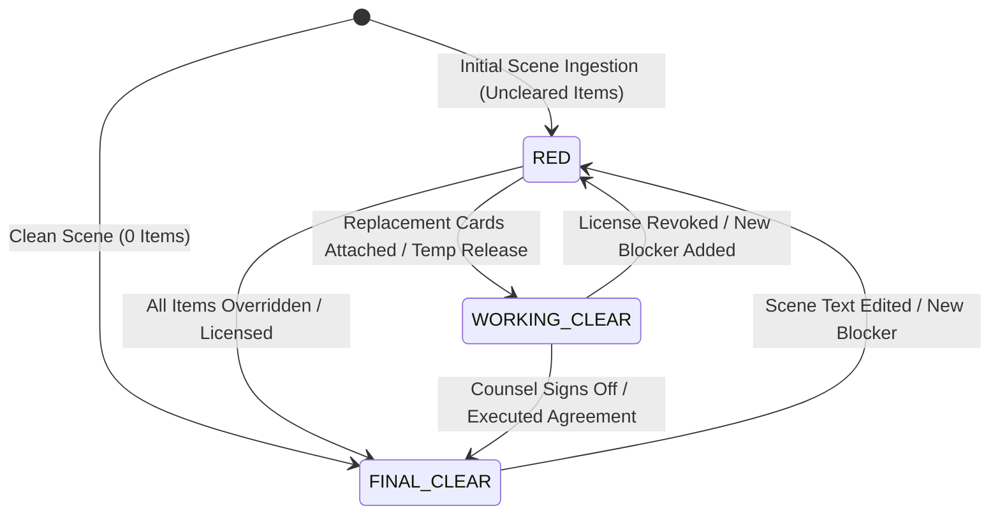

# Research & Architectural Decisions: Production Clearance Operating Model (Phase 5)

**Feature**: `specs/016-production-clearance-model` (Phase 5 Focus)  
**Date**: 2026-08-19  
**Status**: Completed  

---

## 1. Deterministic Scene Readiness State Machine

### Context & Problem
Film and television production schedules (1st AD call sheets, line producer budgeting, daily shooting schedules) are organized by **Scene**. Production crews need to know immediately whether a scene is legally greenlit to shoot without cross-referencing dozens of individual trademark or copyright reports.

A deterministic, three-tier state machine is standard in studio clearance workflows:
- **`RED`**: Critical clearance blocker. The scene cannot be shot as written without legal risk.
- **`WORKING CLEAR`**: Pre-production or shoot permitted with interim assets (approved replacement card, temp clearance release, or minor covenants under active review).
- **`FINAL CLEAR`**: 100% legally cleared for shooting, post-production, and worldwide distribution.

### Decision
Implement `SceneReadinessEngine` in `server/workflows/sceneReadinessEngine.ts` utilizing deterministic boolean logic over occurrence clearance states, counsel overrides (Feature 003), contractual rights licenses (Phase 4), and fictional replacement cards (Feature 002).

### Deterministic Rule Table:

| Item Clearance Status | Counsel Override | Contractual Rights | Replacement Card | Item Tier | Scene Readiness Impact |
|:---|:---|:---|:---|:---:|:---:|
| `ACTION_REQUIRED` | None | None / Expired | None | **BLOCKER** | Scene becomes **`RED`** |
| `INSUFFICIENT_EVIDENCE` | None | None | None | **BLOCKER** | Scene becomes **`RED`** |
| `ACTION_REQUIRED` | None | None | Approved Card Attached | **WORKING_CLEAR** | Contributes to **`WORKING CLEAR`** |
| `REVIEW_RECOMMENDED` | None | None | None | **WORKING_CLEAR** | Contributes to **`WORKING CLEAR`** |
| `ACTION_REQUIRED` | Signed Override (`NO_ISSUE_SURFACED`) | Any | Any | **FINAL_CLEAR** | Contributes to **`FINAL CLEAR`** |
| Any | None | Active Perpetual (`NO_ISSUE_SURFACED`) | Any | **FINAL_CLEAR** | Contributes to **`FINAL CLEAR`** |
| `NO_ISSUE_SURFACED` | None | Any | Any | **FINAL_CLEAR** | Contributes to **`FINAL CLEAR`** |

---

## 2. Occurrence-Level & Scene-Override Precedence

In accordance with Feature 003 and Phase 2, overrides operate hierarchically:
1. **Scene-Specific Occurrence Override** (Highest precedence)
2. **Canonical Entity Override**
3. **Contractual Rights License Coverage**
4. **Automated Baseline Occurrence Clearance Assessment** (Lowest precedence)

This ensures counsel decisions for a specific scene (e.g. allowing an incidental prop in Scene 2 while blocking Scene 4) directly inform that scene's readiness without polluting other scenes.

---

## 3. Alternatives Considered

| Approach | Assessment | Decision |
|:---|:---|:---|
| **LLM-generated Scene Status** | Non-deterministic, risking shooting halts due to LLM variance. | **Rejected**: Must follow the constitution's **Deterministic Calculation Pattern** in TypeScript code. |
| **Binary (Clear / Uncleared)** | Too coarse; productions routinely shoot on "Working Clear" with temp replacement props while contracts are finalized. | **Rejected**: 3-state (`RED`, `WORKING CLEAR`, `FINAL CLEAR`) matches industry operating reality. |
| **Compute On-the-Fly Only** | High latency when rendering call sheets and script views with hundreds of scenes. | **Rejected**: Store computed status on `SceneData` with on-demand and post-evaluation recalculation. |
