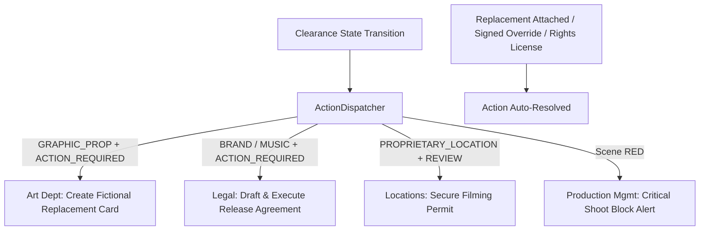

# Research & Architectural Decisions: Production Clearance Operating Model (Phase 6)

**Feature**: `specs/016-production-clearance-model` (Phase 6 Focus)  
**Date**: 2026-08-19  
**Status**: Completed  

---

## 1. Automated Department Action Dispatching

### Context & Problem
In film and TV production, clearance issue spotting is useless unless routed to the specific department responsible for resolving it:
- **Art Department (Prop Masters, Graphic Designers)**: Needs immediate notice when a graphic prop, label, or packaging needs a fictional replacement design card.
- **Legal Counsel / Clearance Coordinators**: Needs to draft and execute releases for trademarked marks, sync licenses for copyrighted songs, and review rights of publicity.
- **Locations Department**: Needs to secure filming permits or location agreements when private/proprietary buildings or landmarks appear in scene action.
- **Production Management (Line Producers, 1st ADs)**: Needs instant alerts when a scene is `RED` (blocked from shooting) so call sheets and shooting schedules can be adjusted.

### Decision
Implement `ActionDispatcher` in `server/workflows/actionDispatcher.ts` with deterministic rule-based routing:

### Department Action Mapping Matrix:

| Trigger Event | Entity Category / State | Target Department | Action Type | Default Priority | Auto-Resolution Trigger |
|:---|:---|:---|:---|:---:|:---|
| Occurrence evaluated | `GRAPHIC_PROP` (`ACTION_REQUIRED`) | `ART_DEPT` | `ART_DEPT_REPLACEMENT` | `HIGH` | `REPLACEMENT_CARD_ATTACHED` |
| Occurrence evaluated | `ART_MUSIC` (`ACTION_REQUIRED`) | `LEGAL_COUNSEL` | `LEGAL_COUNSEL_RELEASE` | `HIGH` | `RIGHTS_LICENSE_ATTACHED` or `COUNSEL_OVERRIDE` |
| Occurrence evaluated | `BRAND` (`ACTION_REQUIRED`) | `LEGAL_COUNSEL` | `LEGAL_COUNSEL_RELEASE` | `HIGH` | `RIGHTS_LICENSE_ATTACHED` or `COUNSEL_OVERRIDE` |
| Occurrence evaluated | `PROPRIETARY_LOCATION` (`REVIEW_RECOMMENDED`) | `LOCATIONS` | `LOCATIONS_PERMIT` | `MEDIUM` | `COUNSEL_OVERRIDE` |
| Occurrence evaluated | `PUBLIC_FIGURE` (`REVIEW_RECOMMENDED`) | `LEGAL_COUNSEL` | `COUNSEL_OVERRIDE_REVIEW` | `MEDIUM` | `COUNSEL_OVERRIDE` |
| Scene evaluated | `RED` | `PRODUCTION_MGMT` | `PRODUCTION_REVIEW` | `CRITICAL` | Scene becomes `WORKING_CLEAR` or `FINAL_CLEAR` |

---

## 2. Auto-Resolution Lifecycle

When an action item's underlying blocker is addressed, the system automatically marks the action item as `RESOLVED`:
1. If a replacement card is attached (`attachReplacementCard`), all open `ART_DEPT_REPLACEMENT` actions for that entity become `RESOLVED`.
2. If a rights license is attached (`createRightsRecord`), all open `LEGAL_COUNSEL_RELEASE` actions for that entity become `RESOLVED`.
3. If a signed counsel override is recorded (`recordOverride`), all open actions for that entity and scene become `RESOLVED`.
4. If a scene transitions to `WORKING_CLEAR` or `FINAL_CLEAR`, all open `PRODUCTION_REVIEW` actions for that scene become `RESOLVED`.

---

## 3. Alternatives Considered

| Approach | Assessment | Decision |
|:---|:---|:---|
| **Manual Action Creation Only** | High risk of coordinators missing critical prop or legal releases in busy production schedules. | **Rejected**: State transitions must automatically generate actions. |
| **Email / Slack Webhooks Only** | External dependencies fail in offline/test modes and create noise without in-app tracking. | **Rejected**: Implement robust in-app action repository and modal first, with notification log. |
