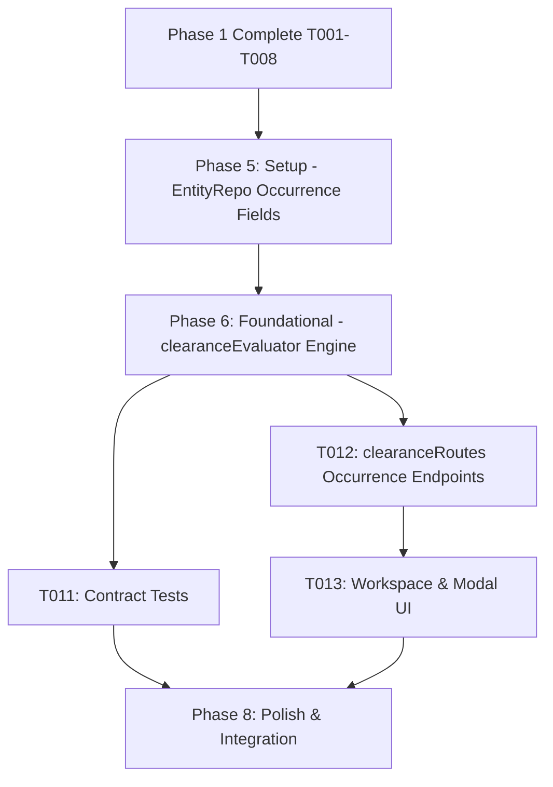

# Tasks: Production Clearance Operating Model (Phases 1 & 2)

**Feature**: `specs/016-production-clearance-model` | **Branch**: `016-production-clearance-model`  
**Input**: Plan from [`specs/016-production-clearance-model/plan.md`](plan.md), Spec from [`specs/016-production-clearance-model/spec.md`](spec.md)  
**Scope**: Phase 1 (Completed) & Phase 2 (Active Target). Phases 3 through 10 are deliberately excluded from this task list.

---

## Phase 1: Setup (Phase 1 Shared Infrastructure - Completed)

**Purpose**: Extend Project repository data structures with `projectType` and list query method.

- [X] T001 [P] Extend `ProjectData` schema and methods in `server/repositories/ProjectRepo.ts` with `projectType` (`'Movie' | 'TV Show' | 'Commercial'`, default `'Movie'`) and implement `listProjects()`

---

## Phase 2: Foundational (Phase 1 Prerequisites - Completed)

**Purpose**: Implement project listing endpoint and type validation.

- [X] T002 [P] Implement `GET /api/projects` endpoint and update `POST /api/projects` in `server/api/projectRoutes.ts` to validate and return `projectType` and clearance summaries

---

## Phase 3: User Story 1 - Project Type & Production Projects UX (Priority: P1 - Completed) 🎯 MVP

**Goal**: Enable creating projects of type `Movie`, `TV Show`, and `Commercial`, listing projects, and displaying project type and clearance summary in the workspace header.

- [X] T003 [P] [US1] Contract test for project creation with type (`Movie`, `TV Show`, `Commercial`) and project listing in `tests/contract/test_project_types.test.ts`
- [X] T004 [P] [US1] Create project selector and creation modal in `src/components/ProjectListModal.tsx` allowing project switching and new production creation
- [X] T005 [US1] Update `src/App.tsx` to integrate `ProjectListModal`, display `projectType` badge in header, and render landing clearance summary

---

## Phase 4: Polish & Integration (Phase 1 Polish - Completed)

**Purpose**: Phase 1 integration testing, quickstart validation, and build verification.

- [X] T006 [P] Implement end-to-end integration test in `tests/integration/production_projects_workflow.test.ts` verifying project type creation, project list retrieval, switching, and landing workspace summary
- [X] T007 Run quickstart validation scenarios defined in `specs/016-production-clearance-model/quickstart.md`
- [X] T008 Verify production build (`tsc && vite build`) and full Vitest test suite (`npm test`) across all test suites with 0 regressions

---

## Phase 5: Phase 2 Setup (Occurrence Data Structures)

**Purpose**: Extend `SceneEntityOccurrenceData` with evaluation metrics and roll-up methods.

- [X] T009 [P] Extend `SceneEntityOccurrenceData` with evaluation fields (`clearanceStatus`, `riskScore`, `riskRationale`, `citations`, `contextFlags`, `evaluatedAt`) and implement `updateOccurrenceEvaluation` and `computeDerivedCanonicalStatus` in `server/repositories/EntityRepo.ts`

---

## Phase 6: Phase 2 Foundational (Occurrence Evaluator Engine)

**Purpose**: Implement occurrence-level evaluation workflow with scene context analysis and canonical roll-up calculation.

- [X] T010 [P] Implement `evaluateOccurrenceClearance` and update `evaluateEntityClearance` in `server/workflows/clearanceEvaluator.ts` to evaluate scene context and deterministically update canonical roll-up status

**Checkpoint**: Occurrence evaluation engine ready - API and UI integration can proceed in parallel.

---

## Phase 7: User Story 2 - Occurrence-Level Evaluation as Fundamental Unit (Priority: P2) 🎯 Phase 2 Target

**Goal**: Evaluate clearance risk per scene occurrence using specific scene action context rather than solely evaluating abstract global entities, and derive canonical entity status from occurrences.

**Independent Test**: Ingest a script with the same entity occurring in two distinct scenes (one incidental, one defamatory); verify each occurrence receives an independent evaluation status and the canonical status is derived from occurrences.

### Tests for User Story 2

- [X] T011 [P] [US2] Contract test for occurrence evaluation and derived canonical status roll-up in `tests/contract/test_occurrence_evaluation.test.ts`

### Implementation for User Story 2

- [X] T012 [P] [US2] Implement `POST /api/projects/:id/occurrences/:occurrenceId/evaluate` and `GET /api/projects/:id/entities/:entityId/occurrences` in `server/api/clearanceRoutes.ts`
- [X] T013 [US2] Update scene occurrence rendering in `src/pages/WorkspacePage.tsx` and `src/components/EntityDetailModal.tsx` to display occurrence-level clearance badges and scene context details

**Checkpoint**: Phase 2 core functionality complete. Occurrence evaluations, canonical roll-up, and UI badges operate independently.

---

## Phase 8: Phase 2 Polish & Cross-Cutting Concerns

**Purpose**: End-to-end multi-scene integration test, quickstart validation, and full regression test.

- [X] T014 [P] Implement end-to-end integration test in `tests/integration/occurrence_clearance_workflow.test.ts` verifying multi-scene occurrence isolation, differential risk scores, canonical roll-up, and 003 override preservation
- [X] T015 Run quickstart validation scenarios defined in `specs/016-production-clearance-model/quickstart.md`
- [X] T016 Verify production build (`tsc && vite build`) and full Vitest test suite (`npm test`) across all test suites with 0 regressions

---

## Dependencies & Execution Order

---

## Parallel Execution Examples

### User Story 2
- `T011` (contract tests in `tests/contract/test_occurrence_evaluation.test.ts`) can run in parallel with `T012` (`server/api/clearanceRoutes.ts`).

### Polish Phase
- `T014` (integration test in `tests/integration/occurrence_clearance_workflow.test.ts`) can run in parallel with `T015` (`quickstart.md`).
