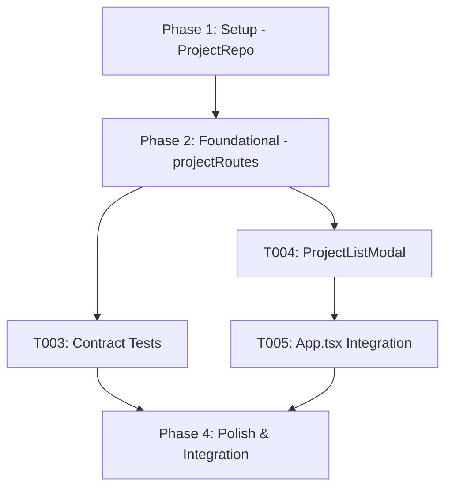

# Tasks: Production Clearance Operating Model (Phase 1)

**Feature**: `specs/016-production-clearance-model` | **Branch**: `016-production-clearance-model`  
**Input**: Plan from [`specs/016-production-clearance-model/plan.md`](plan.md), Spec from [`specs/016-production-clearance-model/spec.md`](spec.md)  
**Scope**: Phase 1 Only (`Movie` / `TV Show` / `Commercial` project types, project listing, and landing workspace entry). Phases 2 through 10 are deliberately excluded from this task phase.

---

## Phase 1: Setup (Shared Infrastructure)

**Purpose**: Extend Project repository data structures with `projectType` and list query method.

- [X] T001 [P] Extend `ProjectData` schema and methods in `server/repositories/ProjectRepo.ts` with `projectType` (`'Movie' | 'TV Show' | 'Commercial'`, default `'Movie'`) and implement `listProjects()`

---

## Phase 2: Foundational (Blocking Prerequisites)

**Purpose**: Implement project listing endpoint and type validation.

- [X] T002 [P] Implement `GET /api/projects` endpoint and update `POST /api/projects` in `server/api/projectRoutes.ts` to validate and return `projectType` and clearance summaries

**Checkpoint**: Foundation ready - UI and contract tests can now proceed in parallel.

---

## Phase 3: User Story 1 - Project Type & Production Projects UX (Priority: P1) 🎯 MVP Phase 1 Focus

**Goal**: Enable creating projects of type `Movie`, `TV Show`, and `Commercial`, listing projects, and displaying project type and clearance summary in the workspace header.

**Independent Test**: Create projects of each type; verify `GET /api/projects` returns all projects and the workspace header reflects the selected project's type badge and clearance summary.

### Tests for User Story 1

- [X] T003 [P] [US1] Contract test for project creation with type (`Movie`, `TV Show`, `Commercial`) and project listing in `tests/contract/test_project_types.test.ts`

### Implementation for User Story 1

- [X] T004 [P] [US1] Create project selector and creation modal in `src/components/ProjectListModal.tsx` allowing project switching and new production creation
- [X] T005 [US1] Update `src/App.tsx` to integrate `ProjectListModal`, display `projectType` badge in header, and render landing clearance summary

**Checkpoint**: Phase 1 complete. Project types, project listing, and landing workspace summary are functional and testable independently.

---

## Phase 4: Polish & Cross-Cutting Concerns

**Purpose**: End-to-end integration testing, quickstart validation, and full build verification.

- [X] T006 [P] Implement end-to-end integration test in `tests/integration/production_projects_workflow.test.ts` verifying project type creation, project list retrieval, switching, and landing workspace summary
- [X] T007 Run quickstart validation scenarios defined in `specs/016-production-clearance-model/quickstart.md`
- [X] T008 Verify production build (`tsc && vite build`) and full Vitest test suite (`npm test`) across all test suites with 0 regressions

---

## Dependencies & Execution Order

---

## Parallel Execution Examples

### User Story 1
- `T003` (contract tests in `tests/contract/test_project_types.test.ts`) can run in parallel with `T004` (`src/components/ProjectListModal.tsx`).

### Polish Phase
- `T006` (integration test in `tests/integration/production_projects_workflow.test.ts`) can run in parallel with `T007` (`quickstart.md`).
