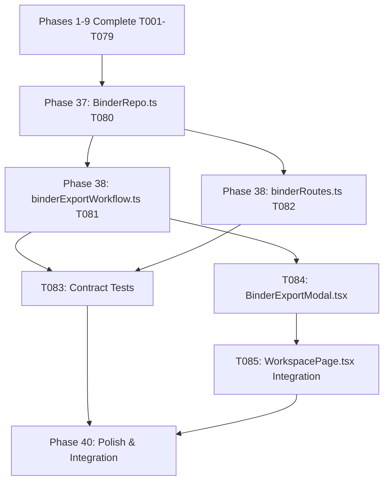

# Tasks: Production Clearance Operating Model (Phases 1 through 10)

**Feature**: `specs/016-production-clearance-model` | **Branch**: `016-production-clearance-model`  
**Input**: Plan from [`specs/016-production-clearance-model/plan.md`](plan.md), Spec from [`specs/016-production-clearance-model/spec.md`](spec.md)  
**Scope**: Phase 1 (Completed), Phase 2 (Completed), Phase 3 (Completed), Phase 4 (Completed), Phase 5 (Completed), Phase 6 (Completed), Phase 7 (Completed), Phase 8 (Completed), Phase 9 (Completed) & Phase 10 (Active Target).

---

## Phase 1: Setup (Phase 1 Shared Infrastructure - Completed)

**Purpose**: Extend Project repository data structures with `projectType` and list query method.

- [X] T001 [P] Extend `ProjectData` schema and methods in `server/repositories/ProjectRepo.ts` with `projectType` (`'Movie' | 'TV Show' | 'Commercial'`, default `'Movie'`) and implement `listProjects()`

---

## Phase 2: Foundational (Phase 1 Prerequisites - Completed)

**Purpose**: Implement project listing endpoint and type validation.

- [X] T002 [P] Implement `GET /api/projects` endpoint and update `POST /api/projects` in `server/api/projectRoutes.ts` to validate and return `projectType` and clearance summaries

---

## Phase 3: User Story 1 - Project Type & Production Projects UX (Priority: P1 - Completed) 🎯 MVP

**Goal**: Enable creating projects of type `Movie`, `TV Show`, and `Commercial`, listing projects, and displaying project type and clearance summary in the workspace header.

- [X] T003 [P] [US1] Contract test for project creation with type (`Movie`, `TV Show`, `Commercial`) and project listing in `tests/contract/test_project_types.test.ts`
- [X] T004 [P] [US1] Create project selector and creation modal in `src/components/ProjectListModal.tsx` allowing project switching and new production creation
- [X] T005 [US1] Update `src/App.tsx` to integrate `ProjectListModal`, display `projectType` badge in header, and render landing clearance summary

---

## Phase 4: Polish & Integration (Phase 1 Polish - Completed)

**Purpose**: Phase 1 integration testing, quickstart validation, and build verification.

- [X] T006 [P] Implement end-to-end integration test in `tests/integration/production_projects_workflow.test.ts` verifying project type creation, project list retrieval, switching, and landing workspace summary
- [X] T007 Run quickstart validation scenarios defined in `specs/016-production-clearance-model/quickstart.md`
- [X] T008 Verify production build (`tsc && vite build`) and full Vitest test suite (`npm test`) across all test suites with 0 regressions

---

## Phase 5: Phase 2 Setup (Occurrence Data Structures - Completed)

**Purpose**: Extend `SceneEntityOccurrenceData` with evaluation metrics and roll-up methods.

- [X] T009 [P] Extend `SceneEntityOccurrenceData` with evaluation fields (`clearanceStatus`, `riskScore`, `riskRationale`, `citations`, `contextFlags`, `evaluatedAt`) and implement `updateOccurrenceEvaluation` and `computeDerivedCanonicalStatus` in `server/repositories/EntityRepo.ts`

---

## Phase 6: Phase 2 Foundational (Occurrence Evaluator Engine - Completed)

**Purpose**: Implement occurrence-level evaluation workflow with scene context analysis and canonical roll-up calculation.

- [X] T010 [P] Implement `evaluateOccurrenceClearance` and update `evaluateEntityClearance` in `server/workflows/clearanceEvaluator.ts` to evaluate scene context and deterministically update canonical roll-up status

---

## Phase 7: User Story 2 - Occurrence-Level Evaluation as Fundamental Unit (Priority: P2 - Completed) 🎯 Phase 2 Target

**Goal**: Evaluate clearance risk per scene occurrence using specific scene action context rather than solely evaluating abstract global entities, and derive canonical entity status from occurrences.

- [X] T011 [P] [US2] Contract test for occurrence evaluation and derived canonical status roll-up in `tests/contract/test_occurrence_evaluation.test.ts`
- [X] T012 [P] [US2] Implement `POST /api/projects/:id/occurrences/:occurrenceId/evaluate` and `GET /api/projects/:id/entities/:entityId/occurrences` in `server/api/clearanceRoutes.ts`
- [X] T013 [US2] Update scene occurrence rendering in `src/pages/WorkspacePage.tsx` and `src/components/EntityDetailModal.tsx` to display occurrence-level clearance badges and scene context details

---

## Phase 8: Phase 2 Polish & Cross-Cutting Concerns (Completed)

**Purpose**: End-to-end multi-scene integration test, quickstart validation, and full regression test.

- [X] T014 [P] Implement end-to-end integration test in `tests/integration/occurrence_clearance_workflow.test.ts` verifying multi-scene occurrence isolation, differential risk scores, canonical roll-up, and 003 override preservation
- [X] T015 Run quickstart validation scenarios defined in `specs/016-production-clearance-model/quickstart.md`
- [X] T016 Verify production build (`tsc && vite build`) and full Vitest test suite (`npm test`) across all test suites with 0 regressions

---

## Phase 9: Phase 3 Setup (Entity Resolution & Hierarchy Repositories - Completed)

**Purpose**: Extend `CanonicalEntityData` schema with aliases, hierarchy relations, and merge methods in repository layer.

- [X] T017 [P] Extend `CanonicalEntityData` schema in `server/repositories/EntityRepo.ts` with `aliases?: string[]`, `parentEntityId?: string`, `parentEntityName?: string`, and `relationshipType?: EntityRelationshipType`, and implement repository methods `addAlias`, `removeAlias`, `setEntityRelationship`, and `mergeEntities(projectId, targetId, sourceId)`

---

## Phase 10: Phase 3 Foundational (Multi-Stage Entity Resolution Engine - Completed)

**Purpose**: Implement deterministic multi-stage entity resolution algorithm and integrate with script parser ingestion workflow.

- [X] T018 [P] Implement `EntityResolutionEngine` in `server/workflows/entityResolutionEngine.ts` providing deterministic multi-stage mention resolution (`EXACT_CANONICAL`, `ALIAS_MATCH`, `NORMALIZED_EQUIVALENCE`, `HIERARCHY_PARENT_MATCH`)
- [X] T019 [P] Integrate `EntityResolutionEngine` into `CanonicalRegistryWorkflow.ts` in `server/workflows/canonicalRegistryWorkflow.ts` to deduplicate entity mentions and map aliases during script parsing

---

## Phase 11: User Story 3 - Upgraded Entity Resolution, Aliases & Hierarchy (Priority: P3 - Completed) 🎯 Phase 3 Target

**Goal**: Support alias management, parent brand / product relationships, candidate mention resolution, and transactional entity merging.

- [X] T020 [P] [US3] Contract tests for alias management, entity resolution, hierarchy configuration, and entity merging in `tests/contract/test_entity_resolution.test.ts`
- [X] T021 [P] [US3] Implement `POST /api/projects/:id/entities/:entityId/aliases`, `DELETE /api/projects/:id/entities/:entityId/aliases/:alias`, `POST /api/projects/:id/entities/resolve`, `PATCH /api/projects/:id/entities/:entityId/relationship`, and `POST /api/projects/:id/entities/merge` in `server/api/entityMutationRoutes.ts`
- [X] T022 [US3] Update `src/components/ItemEditModal.tsx` to add alias management and parent brand / relationship selection
- [X] T023 [US3] Update `src/components/EntityRegistryTable.tsx` and `src/components/EntityDetailModal.tsx` to display aliases, parent brand badges, and entity merge action

---

## Phase 12: Phase 3 Polish & Cross-Cutting Concerns (Completed)

**Purpose**: End-to-end integration testing, quickstart validation, and full regression verification.

- [X] T024 [P] Implement end-to-end integration test in `tests/integration/entity_resolution_workflow.test.ts` verifying multi-scene alias deduplication, parent-child relationship inheritance, and occurrence re-linking upon merge
- [X] T025 Run quickstart validation scenarios defined in `specs/016-production-clearance-model/quickstart.md`
- [X] T026 Verify production build (`tsc && vite build`) and full Vitest test suite (`npm test`) across all test suites with 0 regressions

---

## Phase 13: Phase 4 Setup (Rights & Restrictions Repository - Completed)

**Purpose**: Create `RightsRecordData` domain models and `RightsRepo` for contractual rights persistence, occurrence linking, and coverage evaluation.

- [X] T027 [P] Create `RightsRecordData` schema, enums (`GrantType`, `TerritoryType`, `MediaWindowType`, `RightsStatus`), and `RightsRepo` in `server/repositories/RightsRepo.ts` with CRUD methods, occurrence linking, and `evaluateRightsCoverage(projectId, canonicalEntityId, occurrenceId, queryDate)`

---

## Phase 14: Phase 4 Foundational (Evaluator Integration & REST Endpoints - Completed)

**Purpose**: Integrate rights coverage evaluation into `clearanceEvaluator.ts` and implement rights REST API endpoints.

- [X] T028 [P] Integrate `rightsRepo.evaluateRightsCoverage` into `evaluateOccurrenceClearance` and `evaluateEntityClearance` in `server/workflows/clearanceEvaluator.ts` to factor active licenses into risk scoring and flag covenants in `contextFlags`
- [X] T029 [P] Implement Express router in `server/api/rightsRoutes.ts` (`POST /projects/:id/rights`, `GET /projects/:id/rights`, `GET /projects/:id/entities/:entityId/rights`, `GET /projects/:id/rights/:rightsId`, `PATCH /projects/:id/rights/:rightsId`, `DELETE /projects/:id/rights/:rightsId`) and mount router in `server/index.ts`

**Checkpoint**: Rights repository and API ready - UI integration and test suites can proceed in parallel.

---

## Phase 15: User Story 4 - Rights & Restrictions as First-Class Domain Objects (Priority: P4 - Completed) 🎯 Phase 4 Target

**Goal**: Record and query contractual rights, licensed territories, media windows, expiration dates, and covenants linked to entities and occurrences.

- [X] T030 [P] [US4] Contract tests for rights creation, entity/occurrence linking, listing, update, delete, and coverage queries in `tests/contract/test_rights_management.test.ts`
- [X] T031 [P] [US4] Create `src/components/RightsModal.tsx` for creating, viewing, and editing rights licenses, territorial grants, media windows, and contractual covenants
- [X] T032 [US4] Update `src/components/EntityRegistryTable.tsx`, `src/components/EntityDetailModal.tsx`, and `src/pages/WorkspacePage.tsx` to render rights badges and trigger `RightsModal`

---

## Phase 16: Phase 4 Polish & Cross-Cutting Concerns (Completed)

**Purpose**: End-to-end integration testing, quickstart validation, and full regression verification.

- [X] T033 [P] Implement end-to-end integration test in `tests/integration/rights_clearance_workflow.test.ts` verifying that attaching an active license clears clearance risk, enforces covenants in `contextFlags`, and detects expired licenses
- [X] T034 Run quickstart validation scenarios defined in `specs/016-production-clearance-model/quickstart.md`
- [X] T035 Verify production build (`tsc && vite build`) and full Vitest test suite (`npm test`) across all test suites with 0 regressions

---

## Phase 17: Phase 5 Setup (Scene Readiness Models & SceneRepo Extensions - Completed)

**Purpose**: Extend `SceneData` schema and `SceneRepo` with readiness fields and update methods.

- [X] T036 [P] Extend `SceneData` schema in `server/repositories/SceneRepo.ts` with `readinessStatus` (`'RED' | 'WORKING_CLEAR' | 'FINAL_CLEAR'`), `readinessEvaluatedAt`, `readinessDetails`, and add `updateSceneReadiness(projectId, sceneId, assessment)` and `getSceneReadiness(projectId, sceneId)`

---

## Phase 18: Phase 5 Foundational (Deterministic State Machine Engine & API Endpoints - Completed)

**Purpose**: Implement deterministic scene readiness evaluation and REST endpoints.

- [X] T037 [P] Implement `server/workflows/sceneReadinessEngine.ts` with `evaluateSceneReadiness(projectId, sceneId)` and `evaluateAllScenesReadiness(projectId)` computing `RED`, `WORKING CLEAR`, and `FINAL CLEAR` deterministically across occurrences, counsel overrides, rights coverage, and replacement cards
- [X] T038 [P] Implement Express router in `server/api/sceneRoutes.ts` (`GET /projects/:id/scenes/readiness`, `GET /projects/:id/scenes/:sceneId/readiness`, `POST /projects/:id/scenes/:sceneId/readiness/evaluate`, `POST /projects/:id/scenes/readiness/evaluate-all`) and mount in `server/index.ts`

**Checkpoint**: Scene readiness engine and API ready - UI integration and test suites can proceed in parallel.

---

## Phase 19: User Story 5 - Deterministic Scene Readiness State Machine (Priority: P5 - Completed) 🎯 Phase 5 Target

**Goal**: Evaluate each scene to determine shooting readiness (`RED`, `WORKING CLEAR`, or `FINAL CLEAR`) derived from occurrence verdicts, contractual rights, and replacement cards.

- [X] T039 [P] [US5] Contract tests for scene readiness queries, evaluations, and state transitions in `tests/contract/test_scene_readiness.test.ts`
- [X] T040 [P] [US5] Update `src/components/ScriptViewer.tsx` to render scene readiness badges (`🔴 RED`, `🟡 WORKING CLEAR`, `🟢 FINAL CLEAR`) on scene headers with breakdown popover/tooltips
- [X] T041 [US5] Update `src/pages/WorkspacePage.tsx` to render a top-level Scene Readiness summary banner (`Final Clear`, `Working Clear`, `Red` counts) and refresh scene readiness on occurrence/rights/override changes

---

## Phase 20: Phase 5 Polish & Cross-Cutting Concerns (Completed)

**Purpose**: End-to-end integration testing, quickstart validation, and full regression verification.

- [X] T042 [P] Implement end-to-end integration test in `tests/integration/scene_readiness_workflow.test.ts` verifying full multi-scene script ingestion, initial `RED` blocking, replacement card transition to `WORKING CLEAR`, signed override transition to `FINAL CLEAR`, and clean scene automatic `FINAL CLEAR`
- [X] T043 Run quickstart validation scenarios defined in `specs/016-production-clearance-model/quickstart.md`
- [X] T044 Verify production build (`tsc && vite build`) and full Vitest test suite (`npm test`) across all test suites with 0 regressions

---

## Phase 21: Phase 6 Setup (Action & Notification Repository - Completed)

**Purpose**: Create `ClearanceActionItem`, `ClearanceNotification` schemas and `ActionNotificationRepo` for persistence and auto-resolution.

- [X] T045 [P] Create `ClearanceActionItem`, `ClearanceNotification` domain models, enums (`ClearanceActionType`, `DepartmentTarget`, `ActionPriority`, `ActionStatus`), and `ActionNotificationRepo` in `server/repositories/ActionNotificationRepo.ts` with CRUD, department filtering, and auto-resolution methods

---

## Phase 22: Phase 6 Foundational (Automated Action Dispatcher & REST Endpoints - Completed)

**Purpose**: Implement automated department action routing, auto-resolution triggers, and REST endpoints.

- [X] T046 [P] Implement `server/workflows/actionDispatcher.ts` with automated department routing (`ART_DEPT`, `LEGAL_COUNSEL`, `LOCATIONS`, `PRODUCTION_MGMT`), state transition event listeners, and auto-resolution triggers
- [X] T047 [P] Implement Express router in `server/api/actionRoutes.ts` (`GET /projects/:id/actions`, `PATCH /projects/:id/actions/:actionId`, `GET /projects/:id/notifications`, `PATCH /projects/:id/notifications/:notifId/read`, `POST /projects/:id/actions/sync`) and mount in `server/index.ts`

**Checkpoint**: Action dispatcher and API ready - UI integration and test suites can proceed in parallel.

---

## Phase 23: User Story 6 - Action & Notification Lists Derived from State Transitions (Priority: P6 - Completed) 🎯 Phase 6 Target

**Goal**: Automatically generate department-routed to-do action items and high-priority shoot block alerts upon clearance state transitions, and auto-resolve them upon mitigation.

- [X] T048 [P] [US6] Contract tests for action dispatch, department filtering, status updates, and auto-resolution in `tests/contract/test_action_notifications.test.ts`
- [X] T049 [P] [US6] Create `src/components/ActionListModal.tsx` allowing department-filtered viewing (`Art Dept`, `Legal`, `Locations`, `Production Management`), status updates, and manual resolution
- [X] T050 [US6] Update `src/pages/WorkspacePage.tsx` to render an `📋 Actions (${count})` header trigger with active blocker badge and wire up action list modal and auto-refresh

---

## Phase 24: Phase 6 Polish & Cross-Cutting Concerns (Completed)

**Purpose**: End-to-end integration testing, quickstart validation, and full regression verification.

- [X] T051 [P] Implement end-to-end integration test in `tests/integration/action_workflow.test.ts` verifying script ingestion action generation, scene `RED` alert broadcasting, and multi-department auto-resolution
- [X] T052 Run quickstart validation scenarios defined in `specs/016-production-clearance-model/quickstart.md`
- [X] T053 Verify production build (`tsc && vite build`) and full Vitest test suite (`npm test`) across all test suites with 0 regressions

---

## Phase 25: Phase 7 Setup (Placeholder Data Models & PlaceholderRepo - Completed)

**Purpose**: Create `ReplacementPlaceholderData` schemas, enums, and `PlaceholderRepo` for multi-category placeholder persistence.

- [X] T054 [P] Create `ReplacementPlaceholderData` domain model, enums (`PlaceholderAssetCategory`, `PlaceholderClearanceTier`), category details map, and `PlaceholderRepo` in `server/repositories/PlaceholderRepo.ts` with CRUD, category filtering, and tier update methods

---

## Phase 26: Phase 7 Foundational (Scene Readiness Integration & REST Endpoints - Completed)

**Purpose**: Integrate placeholders with scene readiness state machine and implement REST endpoints.

- [X] T055 [P] Update `server/workflows/sceneReadinessEngine.ts` to evaluate `TEMP_APPROVED` placeholders (yielding `WORKING CLEAR`) and `FINAL_CLEARED` placeholders (yielding `FINAL CLEAR`)
- [X] T056 [P] Implement Express router in `server/api/placeholderRoutes.ts` (`GET /projects/:id/placeholders`, `GET /projects/:id/entities/:entityId/placeholder`, `POST /projects/:id/placeholders`, `PATCH /projects/:id/placeholders/:placeholderId/tier`, `DELETE /projects/:id/placeholders/:placeholderId`) and mount in `server/index.ts`

**Checkpoint**: Placeholder engine and API ready - UI integration and test suites can proceed in parallel.

---

## Phase 27: User Story 7 - Generalized Replacement & Placeholder Management (Priority: P7 - Completed) 🎯 Phase 7 Target

**Goal**: Manage fictional replacements and temporary production placeholders across brands, music, artwork, dialogue, and props, distinguishing between `TEMP_APPROVED` and `FINAL_CLEARED` tiers.

**Independent Test**: Attach music/dialogue/artwork placeholder with `TEMP_APPROVED`; verify scene is `WORKING CLEAR`. Promote placeholder to `FINAL_CLEARED`; verify scene upgrades to `FINAL CLEAR`.

### Tests for User Story 7

- [X] T057 [P] [US7] Contract tests for placeholder CRUD, category-specific payload retention, tier transitions, and scene readiness impact in `tests/contract/test_placeholder_management.test.ts`

### Implementation for User Story 7

- [X] T058 [P] [US7] Create `src/components/PlaceholderManagerModal.tsx` allowing users to configure domain-specific replacement assets (Music BPM/key, Dialogue alternatives, Artwork prompt/specs, Prop details) and promote/demote clearance tiers (`TEMP_APPROVED` $\leftrightarrow$ `FINAL_CLEARED`)
- [X] T059 [US7] Update `src/components/EntityRegistryTable.tsx` and `src/components/EntityDetailModal.tsx` to display placeholder badges (`TEMP APPROVED`, `FINAL CLEARED`) and wire up `PlaceholderManagerModal`

**Checkpoint**: Phase 7 core functionality complete. Generalized placeholders operate across all 5 asset categories.

---

## Phase 28: Phase 7 Polish & Cross-Cutting Concerns (Completed)

**Purpose**: End-to-end integration testing, quickstart validation, and full regression verification.

- [X] T060 [P] Implement end-to-end integration test in `tests/integration/placeholder_clearance_workflow.test.ts` verifying brand, music, artwork, dialogue, and prop placeholders across script ingestion, on-set `TEMP_APPROVED` shooting, and legal `FINAL_CLEARED` delivery
- [X] T061 Run quickstart validation scenarios defined in `specs/016-production-clearance-model/quickstart.md`
- [X] T062 Verify production build (`tsc && vite build`) and full Vitest test suite (`npm test`) across all test suites with 0 regressions

---

## Phase 29: Phase 8 Setup (Live Collision Evaluator & Negative Constraint Context - Completed)

**Purpose**: Upgrade `ReplacementAttemptRecord` and `ReplacementAgent.ts` with live collision evaluation against Parallel Search citations and negative constraint context prompting.

- [X] T063 [P] Update `ReplacementAttemptRecord` schema in `server/repositories/ReplacementRepo.ts` with negative constraints applied and enhance `server/agents/ReplacementAgent.ts` with live search collision reasoning and negative constraint context prompting

---

## Phase 30: Phase 8 Foundational (Evidence-Driven Self-Clearance Loop & 4-Event SSE - Completed)

**Purpose**: Update `replacementGenerator.ts` and `parallelSearchTool.ts` to ground candidates with live Parallel Search, evaluate real-world collision evidence, enforce $\le 3$ loop ceiling, emit 4-event SSE timeline, and escalate to legal counsel.

- [X] T064 [P] Update `server/workflows/replacementGenerator.ts` to ground candidates with live Parallel Search (`PARALLEL_LIVE`), evaluate real-world collision evidence, maintain negative constraints, enforce $\le 3$ loop ceiling, emit 4-event SSE timeline (`REPLACEMENT_ATTEMPT`, `REPLACEMENT_RESEARCH_STARTED`, `REPLACEMENT_REJECTED`, `REPLACEMENT_ACCEPTED`), and escalate to legal counsel on 3 consecutive failures
- [X] T065 [P] Update `server/tools/parallelSearchTool.ts` to support live trademark and web conflict queries with citation provenance in `CLOUD_MODE` / live mode

**Checkpoint**: Evidence-driven self-clearance engine and API ready - UI integration and test suites can proceed in parallel.

---

## Phase 31: User Story 8 - Evidence-Driven Live Self-Clearance Loop (Priority: P8 - Completed) 🎯 Phase 8 Target

**Goal**: Autonomously iterate on candidate fictional replacements by conducting live web/trademark searches, checking for real-world collisions with citation provenance, and applying negative constraints, with a hard ceiling of 3 iterations.

**Independent Test**: Trigger candidate generation in `CLOUD_MODE`/`DEMO_MODE`; verify live search grounding, 4-event SSE emissions, negative constraint accumulation on collision, early termination on clean clearance, and counsel escalation at attempt 3.

### Tests for User Story 8

- [X] T066 [P] [US8] Contract tests for evidence-driven candidate generation, live search collision analysis, negative constraint accumulation, and 3-attempt loop ceiling in `tests/contract/test_evidence_self_clearance.test.ts`

### Implementation for User Story 8

- [X] T067 [P] [US8] Update `src/components/TimelineDrawer.tsx` to render multi-attempt self-clearance timeline badges (`ATTEMPT #`, `SEARCHING`, `REJECTED (COLLISION)`, `ACCEPTED`) with live search citation popovers
- [X] T068 [US8] Update `src/components/ComparisonModal.tsx` to display multi-attempt replacement history with collision rationales, negative constraints, and live citation provenance links

**Checkpoint**: Phase 8 core functionality complete. Self-clearance operates autonomously with real-world trademark grounding.

---

## Phase 32: Phase 8 Polish & Cross-Cutting Concerns (Completed)

**Purpose**: End-to-end integration testing, quickstart validation, and full regression verification.

- [X] T069 [P] Implement end-to-end integration test in `tests/integration/evidence_self_clearance_workflow.test.ts` verifying attempt 1 clean clearance, attempt 2 negative constraint progression, and attempt 3 counsel escalation with live citation provenance
- [X] T070 Run quickstart validation scenarios defined in `specs/016-production-clearance-model/quickstart.md`
- [X] T071 Verify production build (`tsc && vite build`) and full Vitest test suite (`npm test`) across all test suites with 0 regressions

---

## Phase 33: Phase 9 Setup (Production Operations Dashboard Aggregation Service - Completed)

**Purpose**: Implement `dashboardEngine.ts` to aggregate cross-repository metrics into `ProductionDashboardData`.

- [X] T072 [P] Create `ProductionDashboardData`, `ProductionDashboardKPIs`, `BlockerItemDetail`, `ExpiringRightsDetail`, `ActivePlaceholderDetail` schemas and `dashboardEngine.ts` in `server/workflows/dashboardEngine.ts` aggregating metrics across `sceneReadinessEngine`, `rightsRepo`, `placeholderRepo`, `actionNotificationRepo`, and `entityRepo`

---

## Phase 34: Phase 9 Foundational (Dashboard REST API Endpoints - Completed)

**Purpose**: Implement Express endpoints for dashboard summary querying.

- [X] T073 [P] Implement Express router in `server/api/dashboardRoutes.ts` (`GET /projects/:id/dashboard`) and mount in `server/index.ts`

**Checkpoint**: Dashboard engine and REST API ready - UI integration and test suites can proceed in parallel.

---

## Phase 35: User Story 9 - Production Clearance Operations Dashboard (Priority: P9 - Completed) 🎯 Phase 9 Target

**Goal**: Provide a single centralized operational dashboard displaying active shooting blockers, scene readiness distribution (`FINAL CLEAR`, `WORKING CLEAR`, `RED`), upcoming rights expirations ($\le 90$ days), active placeholders, pending department actions, and recent activity feed with direct mitigation shortcuts.

**Independent Test**: Query `GET /api/projects/:id/dashboard`; verify consolidated KPIs, scene distribution, blocker triage list, expiring rights, and department work queue.

### Tests for User Story 9

- [X] T074 [P] [US9] Contract tests for dashboard KPI calculations, scene distribution, blocker extraction, and rights expiration filtering in `tests/contract/test_production_dashboard.test.ts`

### Implementation for User Story 9

- [X] T075 [P] [US9] Create `src/components/ProductionDashboardModal.tsx` displaying executive KPI cards, scene readiness distribution graphs, blocker triage table with direct mitigation triggers (`Add Rights`, `Attach Placeholder`, `Counsel Override`), expiring rights alerts, and department queues
- [X] T076 [US9] Update `src/pages/WorkspacePage.tsx` to add `📊 Operations Dashboard` navigation trigger and wire up `ProductionDashboardModal`

**Checkpoint**: Phase 9 core functionality complete. Production leadership has centralized visibility over shoot readiness and blockers.

---

## Phase 36: Phase 9 Polish & Cross-Cutting Concerns (Completed)

**Purpose**: End-to-end integration testing, quickstart validation, and full regression verification.

- [X] T077 [P] Implement end-to-end integration test in `tests/integration/production_dashboard_workflow.test.ts` verifying multi-scene project dashboard aggregation, blocker triage, and live mitigation state refresh
- [X] T078 Run quickstart validation scenarios defined in `specs/016-production-clearance-model/quickstart.md`
- [X] T079 Verify production build (`tsc && vite build`) and full Vitest test suite (`npm test`) across all test suites with 0 regressions

---

## Phase 37: Phase 10 Setup (Clearance Binder Domain Extension & SHA-256 Digest - Completed)

**Purpose**: Extend `ClearanceBinderData` schema in `server/repositories/BinderRepo.ts` with `rightsAgreements`, `placeholders`, `sceneReadinessSchedule`, and `unresolvedActions`, and update `generateIntegrityDigest` to compute SHA-256 over all canonical data fields.

- [X] T080 [P] Extend `ClearanceBinderData` and `BinderProjectSummary` schemas in `server/repositories/BinderRepo.ts` with `rightsAgreements`, `placeholders`, `sceneReadinessSchedule`, and `unresolvedActions`, and update `generateIntegrityDigest` to compute SHA-256 over all canonical data fields

---

## Phase 38: Phase 10 Foundational (Binder Compilation Workflow & REST API Endpoints - Completed)

**Purpose**: Update `server/workflows/binderExportWorkflow.ts` and `server/api/binderRoutes.ts` to aggregate cross-domain data from all 8 clearance modules, compute SHA-256 digest, and emit `BINDER_EXPORT` SSE timeline events.

- [X] T081 [P] Update `server/workflows/binderExportWorkflow.ts` to aggregate cross-domain data from `rightsRepo`, `placeholderRepo`, `sceneReadinessEngine`, and `actionNotificationRepo`, compute SHA-256 digest, and emit `BINDER_EXPORT` SSE timeline events
- [X] T082 [P] Update `server/api/binderRoutes.ts` to support `GET /projects/:id/binder`, `POST /projects/:id/binder/export`, and `GET /projects/:id/binder/markdown` with formatted Markdown tables and SHA-256 seal

**Checkpoint**: Extended binder engine and REST APIs ready - UI integration and test suites can proceed in parallel.

---

## Phase 39: User Story 10 - Production Legal Clearance Binder (Priority: P10 - Completed) 🎯 Phase 10 Target

**Goal**: Deliver an audit-grade, immutable Legal Clearance Binder containing executive summary, rights catalog, fictional placeholders, scene readiness schedule, unresolved actions, and cryptographic SHA-256 integrity seal with JSON and Markdown export formats.

**Independent Test**: Execute `POST /api/projects/:id/binder/export`; verify complete JSON structure, valid SHA-256 digest, rights agreements catalog, active placeholders, and formatted Markdown generation.

### Tests for User Story 10

- [X] T083 [P] [US10] Contract tests for extended binder export payload, Markdown generation, and SHA-256 checksum verification in `tests/contract/test_binder_export.test.ts`

### Implementation for User Story 10

- [X] T084 [P] [US10] Update `src/components/BinderExportModal.tsx` to render multi-tab sections (Executive Summary, Scene Readiness Schedule, Rights Catalog, Placeholders Table, Unresolved Actions, and SHA-256 Checksum Badge) with JSON and Markdown download actions
- [X] T085 [US10] Update `src/pages/WorkspacePage.tsx` to ensure `📁 Clearance Binder` export trigger opens extended `BinderExportModal`

**Checkpoint**: Phase 10 complete. Full production clearance operating model is operational across all 10 phases.

---

## Phase 40: Phase 10 Polish & Cross-Cutting Concerns (Completed)

**Purpose**: End-to-end integration testing, quickstart validation, and full regression verification.

- [X] T086 [P] Implement end-to-end integration test in `tests/integration/binder_export_workflow.test.ts` verifying complete multi-domain binder compilation with rights, placeholders, scene readiness, and open actions
- [X] T087 Run quickstart validation scenarios defined in `specs/016-production-clearance-model/quickstart.md`
- [X] T088 Verify production build (`tsc && vite build`) and full Vitest test suite (`npm test`) across all test suites with 0 regressions

---

## Dependencies & Execution Order

---

## Parallel Execution Examples

### User Story 10
- `T081` (`binderExportWorkflow.ts`) can run in parallel with `T082` (`binderRoutes.ts`).
- `T083` (`tests/contract/test_binder_export.test.ts`) can run in parallel with `T084` (`src/components/BinderExportModal.tsx`).

### Polish Phase
- `T086` (integration test in `tests/integration/binder_export_workflow.test.ts`) can run in parallel with `T087` (`quickstart.md`).

