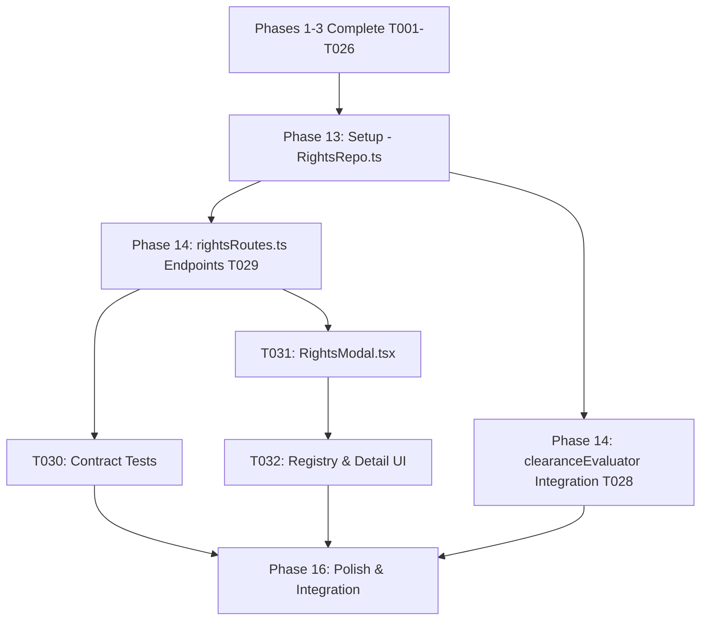

# Tasks: Production Clearance Operating Model (Phases 1, 2, 3 & 4)

**Feature**: `specs/016-production-clearance-model` | **Branch**: `016-production-clearance-model`  
**Input**: Plan from [`specs/016-production-clearance-model/plan.md`](plan.md), Spec from [`specs/016-production-clearance-model/spec.md`](spec.md)  
**Scope**: Phase 1 (Completed), Phase 2 (Completed), Phase 3 (Completed) & Phase 4 (Active Target). Phases 5 through 10 are deliberately excluded from this task list.

---

## Phase 1: Setup (Phase 1 Shared Infrastructure - Completed)

**Purpose**: Extend Project repository data structures with `projectType` and list query method.

- [X] T001 [P] Extend `ProjectData` schema and methods in `server/repositories/ProjectRepo.ts` with `projectType` (`'Movie' | 'TV Show' | 'Commercial'`, default `'Movie'`) and implement `listProjects()`

---

## Phase 2: Foundational (Phase 1 Prerequisites - Completed)

**Purpose**: Implement project listing endpoint and type validation.

- [X] T002 [P] Implement `GET /api/projects` endpoint and update `POST /api/projects` in `server/api/projectRoutes.ts` to validate and return `projectType` and clearance summaries

---

## Phase 3: User Story 1 - Project Type & Production Projects UX (Priority: P1 - Completed) 🎯 MVP

**Goal**: Enable creating projects of type `Movie`, `TV Show`, and `Commercial`, listing projects, and displaying project type and clearance summary in the workspace header.

- [X] T003 [P] [US1] Contract test for project creation with type (`Movie`, `TV Show`, `Commercial`) and project listing in `tests/contract/test_project_types.test.ts`
- [X] T004 [P] [US1] Create project selector and creation modal in `src/components/ProjectListModal.tsx` allowing project switching and new production creation
- [X] T005 [US1] Update `src/App.tsx` to integrate `ProjectListModal`, display `projectType` badge in header, and render landing clearance summary

---

## Phase 4: Polish & Integration (Phase 1 Polish - Completed)

**Purpose**: Phase 1 integration testing, quickstart validation, and build verification.

- [X] T006 [P] Implement end-to-end integration test in `tests/integration/production_projects_workflow.test.ts` verifying project type creation, project list retrieval, switching, and landing workspace summary
- [X] T007 Run quickstart validation scenarios defined in `specs/016-production-clearance-model/quickstart.md`
- [X] T008 Verify production build (`tsc && vite build`) and full Vitest test suite (`npm test`) across all test suites with 0 regressions

---

## Phase 5: Phase 2 Setup (Occurrence Data Structures - Completed)

**Purpose**: Extend `SceneEntityOccurrenceData` with evaluation metrics and roll-up methods.

- [X] T009 [P] Extend `SceneEntityOccurrenceData` with evaluation fields (`clearanceStatus`, `riskScore`, `riskRationale`, `citations`, `contextFlags`, `evaluatedAt`) and implement `updateOccurrenceEvaluation` and `computeDerivedCanonicalStatus` in `server/repositories/EntityRepo.ts`

---

## Phase 6: Phase 2 Foundational (Occurrence Evaluator Engine - Completed)

**Purpose**: Implement occurrence-level evaluation workflow with scene context analysis and canonical roll-up calculation.

- [X] T010 [P] Implement `evaluateOccurrenceClearance` and update `evaluateEntityClearance` in `server/workflows/clearanceEvaluator.ts` to evaluate scene context and deterministically update canonical roll-up status

---

## Phase 7: User Story 2 - Occurrence-Level Evaluation as Fundamental Unit (Priority: P2 - Completed) 🎯 Phase 2 Target

**Goal**: Evaluate clearance risk per scene occurrence using specific scene action context rather than solely evaluating abstract global entities, and derive canonical entity status from occurrences.

- [X] T011 [P] [US2] Contract test for occurrence evaluation and derived canonical status roll-up in `tests/contract/test_occurrence_evaluation.test.ts`
- [X] T012 [P] [US2] Implement `POST /api/projects/:id/occurrences/:occurrenceId/evaluate` and `GET /api/projects/:id/entities/:entityId/occurrences` in `server/api/clearanceRoutes.ts`
- [X] T013 [US2] Update scene occurrence rendering in `src/pages/WorkspacePage.tsx` and `src/components/EntityDetailModal.tsx` to display occurrence-level clearance badges and scene context details

---

## Phase 8: Phase 2 Polish & Cross-Cutting Concerns (Completed)

**Purpose**: End-to-end multi-scene integration test, quickstart validation, and full regression test.

- [X] T014 [P] Implement end-to-end integration test in `tests/integration/occurrence_clearance_workflow.test.ts` verifying multi-scene occurrence isolation, differential risk scores, canonical roll-up, and 003 override preservation
- [X] T015 Run quickstart validation scenarios defined in `specs/016-production-clearance-model/quickstart.md`
- [X] T016 Verify production build (`tsc && vite build`) and full Vitest test suite (`npm test`) across all test suites with 0 regressions

---

## Phase 9: Phase 3 Setup (Entity Resolution & Hierarchy Repositories - Completed)

**Purpose**: Extend `CanonicalEntityData` schema with aliases, hierarchy relations, and merge methods in repository layer.

- [X] T017 [P] Extend `CanonicalEntityData` schema in `server/repositories/EntityRepo.ts` with `aliases?: string[]`, `parentEntityId?: string`, `parentEntityName?: string`, and `relationshipType?: EntityRelationshipType`, and implement repository methods `addAlias`, `removeAlias`, `setEntityRelationship`, and `mergeEntities(projectId, targetId, sourceId)`

---

## Phase 10: Phase 3 Foundational (Multi-Stage Entity Resolution Engine - Completed)

**Purpose**: Implement deterministic multi-stage entity resolution algorithm and integrate with script parser ingestion workflow.

- [X] T018 [P] Implement `EntityResolutionEngine` in `server/workflows/entityResolutionEngine.ts` providing deterministic multi-stage mention resolution (`EXACT_CANONICAL`, `ALIAS_MATCH`, `NORMALIZED_EQUIVALENCE`, `HIERARCHY_PARENT_MATCH`)
- [X] T019 [P] Integrate `EntityResolutionEngine` into `CanonicalRegistryWorkflow.ts` in `server/workflows/canonicalRegistryWorkflow.ts` to deduplicate entity mentions and map aliases during script parsing

---

## Phase 11: User Story 3 - Upgraded Entity Resolution, Aliases & Hierarchy (Priority: P3 - Completed) 🎯 Phase 3 Target

**Goal**: Support alias management, parent brand / product relationships, candidate mention resolution, and transactional entity merging.

- [X] T020 [P] [US3] Contract tests for alias management, entity resolution, hierarchy configuration, and entity merging in `tests/contract/test_entity_resolution.test.ts`
- [X] T021 [P] [US3] Implement `POST /api/projects/:id/entities/:entityId/aliases`, `DELETE /api/projects/:id/entities/:entityId/aliases/:alias`, `POST /api/projects/:id/entities/resolve`, `PATCH /api/projects/:id/entities/:entityId/relationship`, and `POST /api/projects/:id/entities/merge` in `server/api/entityMutationRoutes.ts`
- [X] T022 [US3] Update `src/components/ItemEditModal.tsx` to add alias management and parent brand / relationship selection
- [X] T023 [US3] Update `src/components/EntityRegistryTable.tsx` and `src/components/EntityDetailModal.tsx` to display aliases, parent brand badges, and entity merge action

---

## Phase 12: Phase 3 Polish & Cross-Cutting Concerns (Completed)

**Purpose**: End-to-end integration testing, quickstart validation, and full regression verification.

- [X] T024 [P] Implement end-to-end integration test in `tests/integration/entity_resolution_workflow.test.ts` verifying multi-scene alias deduplication, parent-child relationship inheritance, and occurrence re-linking upon merge
- [X] T025 Run quickstart validation scenarios defined in `specs/016-production-clearance-model/quickstart.md`
- [X] T026 Verify production build (`tsc && vite build`) and full Vitest test suite (`npm test`) across all test suites with 0 regressions

---

## Phase 13: Phase 4 Setup (Rights & Restrictions Repository - Completed)

**Purpose**: Create `RightsRecordData` domain models and `RightsRepo` for contractual rights persistence, occurrence linking, and coverage evaluation.

- [X] T027 [P] Create `RightsRecordData` schema, enums (`GrantType`, `TerritoryType`, `MediaWindowType`, `RightsStatus`), and `RightsRepo` in `server/repositories/RightsRepo.ts` with CRUD methods, occurrence linking, and `evaluateRightsCoverage(projectId, canonicalEntityId, occurrenceId, queryDate)`

---

## Phase 14: Phase 4 Foundational (Evaluator Integration & REST Endpoints - Completed)

**Purpose**: Integrate rights coverage evaluation into `clearanceEvaluator.ts` and implement rights REST API endpoints.

- [X] T028 [P] Integrate `rightsRepo.evaluateRightsCoverage` into `evaluateOccurrenceClearance` and `evaluateEntityClearance` in `server/workflows/clearanceEvaluator.ts` to factor active licenses into risk scoring and flag covenants in `contextFlags`
- [X] T029 [P] Implement Express router in `server/api/rightsRoutes.ts` (`POST /projects/:id/rights`, `GET /projects/:id/rights`, `GET /projects/:id/entities/:entityId/rights`, `GET /projects/:id/rights/:rightsId`, `PATCH /projects/:id/rights/:rightsId`, `DELETE /projects/:id/rights/:rightsId`) and mount router in `server/index.ts`

**Checkpoint**: Rights repository and API ready - UI integration and test suites can proceed in parallel.

---

## Phase 15: User Story 4 - Rights & Restrictions as First-Class Domain Objects (Priority: P4 - Completed) 🎯 Phase 4 Target

**Goal**: Record and query contractual rights, licensed territories, media windows, expiration dates, and covenants linked to entities and occurrences.

- [X] T030 [P] [US4] Contract tests for rights creation, entity/occurrence linking, listing, update, delete, and coverage queries in `tests/contract/test_rights_management.test.ts`
- [X] T031 [P] [US4] Create `src/components/RightsModal.tsx` for creating, viewing, and editing rights licenses, territorial grants, media windows, and contractual covenants
- [X] T032 [US4] Update `src/components/EntityRegistryTable.tsx`, `src/components/EntityDetailModal.tsx`, and `src/pages/WorkspacePage.tsx` to render rights badges and trigger `RightsModal`

---

## Phase 16: Phase 4 Polish & Cross-Cutting Concerns (Completed)

**Purpose**: End-to-end integration testing, quickstart validation, and full regression verification.

- [X] T033 [P] Implement end-to-end integration test in `tests/integration/rights_clearance_workflow.test.ts` verifying that attaching an active license clears clearance risk, enforces covenants in `contextFlags`, and detects expired licenses
- [X] T034 Run quickstart validation scenarios defined in `specs/016-production-clearance-model/quickstart.md`
- [X] T035 Verify production build (`tsc && vite build`) and full Vitest test suite (`npm test`) across all test suites with 0 regressions

---

## Dependencies & Execution Order

---

## Parallel Execution Examples

### User Story 4
- `T028` (`clearanceEvaluator.ts` integration) can run in parallel with `T029` (`server/api/rightsRoutes.ts`).
- `T030` (`tests/contract/test_rights_management.test.ts`) can run in parallel with `T031` (`src/components/RightsModal.tsx`).

### Polish Phase
- `T033` (integration test in `tests/integration/rights_clearance_workflow.test.ts`) can run in parallel with `T034` (`quickstart.md`).
