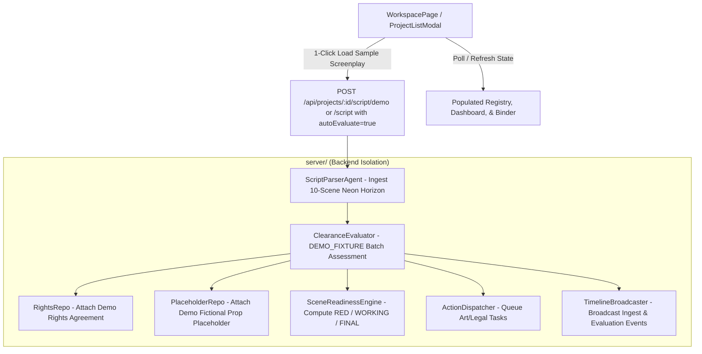

# Implementation Plan: Judge-Ready 1-Click Demo & Production Workspace Rebrand

**Feature Branch**: `017-judge-ready-demo`  
**Created**: 2026-08-19  
**Status**: Planned  
**Feature Spec**: [`spec.md`](./spec.md)

---

## 1. Technical Context

- **Current Architecture**: Express 4 REST API with Firestore state repositories (`server/repositories/`) and Vite React 18 frontend (`src/`).
- **Execution Modes**:
  - `TEST_MODE`: Deterministic local mocks for automated tests.
  - `DEMO_MODE`: Synthetic/cached fixture datasets without requiring external Google Gemini or Parallel Search API keys.
  - `CLOUD_MODE`: Live production runtime using `@google/genai` (`gemini-3.6-flash`) and `@parallel-web/sdk`.
- **Existing Demo Assets**:
  - Screenplay: *"The Neon Horizon"* (`fixtures/demo_screenplay.txt` / `server/api/fixtureRoutes.ts`).
  - Recorded Fixtures: `server/repositories/fixtures/entityResolutionFixtures.ts`, `server/fixtures/recordReplayFixtures.ts`.
  - Production Operating Modules (Phases 1–10 of Feature 016): `projectRepo`, `occurrenceRepo`, `entityRepo`, `rightsRepo`, `placeholderRepo`, `sceneReadinessEngine`, `actionNotificationRepo`, `dashboardEngine`, `binderExportWorkflow`.
- **Goal for 017**:
  - Provide a 1-click judge-ready demo workflow in `DEMO_MODE` where loading the sample screenplay automatically ingests *"The Neon Horizon"* AND evaluates all extracted entities using deterministic `DEMO_FIXTURE` records.
  - Populate the Entity Registry, Scene Readiness State Machine, Operations Dashboard, and Legal Clearance Binder immediately with `DEMO_FIXTURE` (📦) provenance badges.
  - Rebrand all remaining user-facing references from "MVP Workspace" / "ClearanceScout MVP" to "Production Clearance Workspace" / "ClearanceScout Production Clearance Studio".
  - Strictly preserve all 003–016 invariants.

---

## 2. Constitution Check

| Principle | Assessment | Status |
|:---|:---|:---:|
| **I. Agent Framework & Model Standard** | Only Google ADK agents & Gemini 3.6 Flash used in live mode; no external agent frameworks. | **COMPLIANT** |
| **II. Live Grounding & Provenance** | `DEMO_FIXTURE` provenance explicitly tagged; no fabricated evidence; `CLOUD_MODE` remains fail-visible. | **COMPLIANT** |
| **III. Backend Isolation & Persistence** | All demo automation logic placed in `server/` (e.g. `server/workflows/demoAutomationWorkflow.ts` or `server/api/scriptRoutes.ts`); UI in `src/`. | **COMPLIANT** |
| **IV. Canonical Entity & Invariants** | 4 standard clearance statuses retained; deterministic scene readiness and hierarchical override math preserved. | **COMPLIANT** |
| **V. Multi-Tier Execution Modes** | `DEMO_MODE` runs 100% offline without API keys; `CLOUD_MODE` requires valid credentials and fails visibly if missing. | **COMPLIANT** |
| **VI. Observable Action Timeline & Privacy** | CoT reasoning is strictly sanitized; SSE events broadcast demo loading progress cleanly. | **COMPLIANT** |

---

## 3. Architecture & Touchpoints

### Affected Components & Touchpoints:
1. **Backend Workflows & Routes**:
   - `server/api/scriptRoutes.ts`: Support `POST /projects/:id/script/demo` or `autoEvaluate: true` in `POST /projects/:id/script` to ingest and auto-evaluate demo script in `DEMO_MODE`.
   - `server/workflows/demoAutomationWorkflow.ts`: Coordinates deterministic ingestion, evaluation, rights attachment, and placeholder creation for the judge demo.
   - `server/repositories/fixtures/entityResolutionFixtures.ts` & `recordReplayFixtures.ts`: Ensure comprehensive fixture coverage for all *"The Neon Horizon"* entities.
2. **Frontend UI & Rebranding**:
   - `src/pages/WorkspacePage.tsx`: Wire 1-click demo load button to trigger auto-evaluation in `DEMO_MODE`, update status indicators, and display progress.
   - `src/App.tsx`: Rebrand default project title from `'ClearanceScout MVP Workspace'` to `'ClearanceScout Production Clearance Workspace'`.
   - `src/components/ProjectListModal.tsx`: Rebrand demo project card copy to highlight the Production Clearance Operating Model.
3. **Tests**:
   - `tests/contract/test_judge_demo_automation.test.ts`: Contract test verifying 1-click demo ingestion, auto-evaluation, populated dashboard, and binder snapshot in `DEMO_MODE`.
   - `tests/integration/judge_demo_workflow.test.ts`: End-to-end integration test verifying judge 1-click loading without API keys.

---

## 4. Phase Breakdown & Execution Sequence

- **Phase 0: Research & Consolidations**: [`research.md`](./research.md) (evaluating 1-click ingestion patterns, fixture completeness, and rebranding touchpoints).
- **Phase 1: Design Artifacts**:
  - Data Model: [`data-model.md`](./data-model.md) (demo project initial state, auto-evaluation trigger payload, populated entity graph).
  - API Contracts: [`contracts/demo-automation-contract.md`](./contracts/demo-automation-contract.md) (REST endpoints for demo ingestion and populated state retrieval).
  - Quickstart: [`quickstart.md`](./quickstart.md) (step-by-step judge demonstration scenario).
