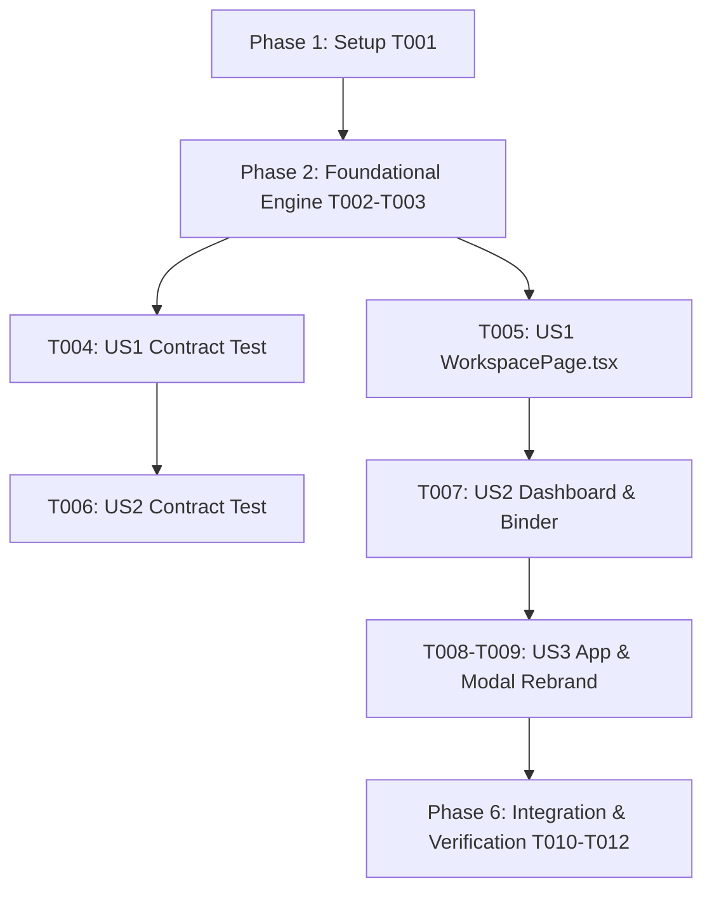

# Tasks: Feature 017 Judge-Ready 1-Click Demo & Production Workspace Rebrand

**Feature Branch**: `017-judge-ready-demo`  
**Specification**: [`spec.md`](./spec.md)  
**Implementation Plan**: [`plan.md`](./plan.md)  
**Status**: Ready for Implementation

---

## Phase 1: Setup (Demo Ingestion & Fixture Infrastructure)

**Purpose**: Verify and prepare deterministic demo fixtures and data infrastructure.

- [X] T001 [P] Ensure `fixtures/demo_screenplay.txt` and `server/repositories/fixtures/entityResolutionFixtures.ts` have complete 10-scene coverage with deterministic clearance records and `DEMO_FIXTURE` provenance

---

## Phase 2: Foundational (Backend Demo Automation Engine)

**Purpose**: Core backend workflow coordinating 1-click demo ingestion, auto-evaluation, rights attachment, and placeholder setup.

**⚠️ CRITICAL**: Foundational engine MUST be complete before UI integration.

- [X] T002 [P] Implement `demoAutomationWorkflow.ts` in `server/workflows/demoAutomationWorkflow.ts` coordinating script parsing, batch entity evaluation, demo rights attachment, and placeholder creation with `DEMO_FIXTURE` provenance
- [X] T003 [P] Add `POST /projects/:id/script/demo` route in `server/api/scriptRoutes.ts` supporting `autoEvaluate` in `DEMO_MODE`

**Checkpoint**: Backend demo automation workflow and REST endpoints ready.

---

## Phase 3: User Story 1 - 1-Click Sample Screenplay Ingestion & Auto-Evaluation (Priority: P1) 🎯 MVP

**Goal**: When a user or judge clicks "Load Sample Screenplay" in `DEMO_MODE`, the system ingests *"The Neon Horizon"* and automatically executes fixture-backed clearance evaluations across all entities and occurrences without requiring external API keys.

**Independent Test**: Call `POST /api/projects/:id/script/demo`; verify that scenes, entities, and evaluations are created with `DEMO_FIXTURE` provenance badges.

### Tests for User Story 1

- [X] T004 [P] [US1] Contract test for `POST /api/projects/:id/script/demo` verifying auto-evaluated entities with `DEMO_FIXTURE` provenance in `tests/contract/test_judge_demo_automation.test.ts`

### Implementation for User Story 1

- [X] T005 [US1] Update `src/pages/WorkspacePage.tsx` to call `POST /api/projects/:id/script/demo` when clicking "Load Sample Screenplay" in `DEMO_MODE` and automatically refresh workspace state

**Checkpoint**: User Story 1 complete. 1-click demo screenplay ingestion and auto-evaluation functional.

---

## Phase 4: User Story 2 - Populated Operations Dashboard & Extended Legal Binder (Priority: P2)

**Goal**: Ensure the Production Operations Dashboard (`📊`) and Legal Clearance Binder (`📁`) are immediately populated with non-zero Shoot Readiness %, scene breakdown (`FINAL CLEAR`, `WORKING CLEAR`, `RED`), active blockers, upcoming rights expirations, active placeholders, and SHA-256 integrity digest upon demo load.

**Independent Test**: Load demo script; query `GET /api/projects/:id/dashboard` and `POST /api/projects/:id/binder/export`; verify populated metrics and valid SHA-256 seal.

### Tests for User Story 2

- [X] T006 [P] [US2] Contract test verifying populated dashboard metrics and extended clearance binder export with SHA-256 digest in `tests/contract/test_judge_demo_dashboard_binder.test.ts`

### Implementation for User Story 2

- [X] T007 [US2] Verify and refine `server/workflows/dashboardEngine.ts` and `server/workflows/binderExportWorkflow.ts` to aggregate demo rights, placeholders, scene readiness, and unresolved actions seamlessly in `DEMO_MODE`

**Checkpoint**: User Stories 1 and 2 functional. Dashboard and binder reflect full operating model.

---

## Phase 5: User Story 3 - UI Rebranding to Production Clearance Workspace (Priority: P3)

**Goal**: Rebrand all remaining user-facing references from "MVP Workspace" / "ClearanceScout MVP" to "Production Clearance Workspace" / "ClearanceScout Production Clearance Studio".

**Independent Test**: Inspect UI headers, project cards, and meta tags; verify zero occurrences of "MVP Workspace" remain.

### Implementation for User Story 3

- [X] T008 [P] [US3] Update `src/App.tsx` default project title from `'ClearanceScout MVP Workspace'` to `'ClearanceScout Production Clearance Workspace'`
- [X] T009 [P] [US3] Update `src/components/ProjectListModal.tsx` and `index.html` copy to reflect "Production Clearance Workspace" and "Production Clearance Studio"

**Checkpoint**: User Stories 1, 2, and 3 complete. Branding is unified.

---

## Phase 6: Polish, Integration Testing & Invariant Verification (Priority: P4)

**Purpose**: End-to-end integration testing, quickstart validation, and full regression verification preserving 003–016 invariants.

- [X] T010 [P] Implement end-to-end integration test in `tests/integration/judge_demo_workflow.test.ts` verifying 1-click demo load, populated dashboard, binder export with SHA-256, and 003–016 invariant preservation
- [X] T011 Run quickstart validation scenarios defined in `specs/017-judge-ready-demo/quickstart.md`
- [X] T012 Verify production build (`npm run build`) and full Vitest test suite (`npm test`) across all test suites with 0 regressions

---

## Dependencies & Execution Order

### Implementation Strategy
1. **MVP First**: Complete T001 through T005 to achieve a functional 1-click demo ingestion and evaluation loop.
2. **Operations & Binder Verification**: Complete T006 and T007 to ensure the dashboard and binder reflect populated multi-scene clearance data.
3. **Rebranding**: Complete T008 and T009 to unify UI terminology.
4. **Full Regression Verification**: Run T010–T012 to ensure 100% test pass rate across all 57+ test suites.
