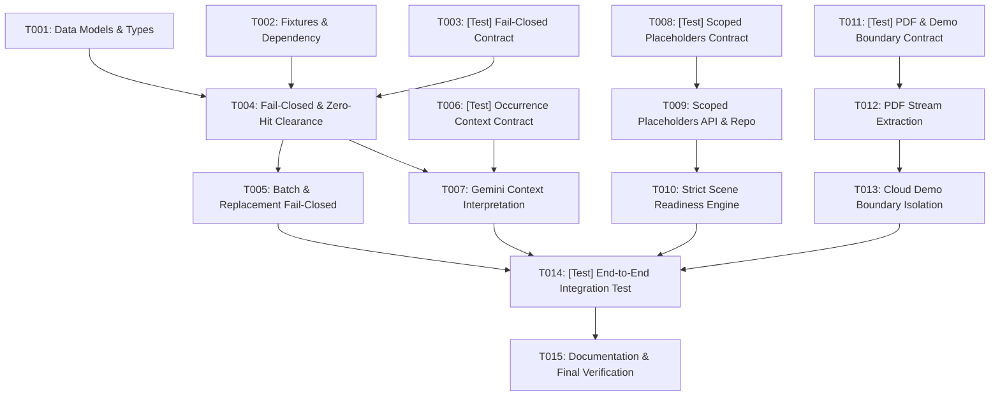

# Tasks: Feature 018 Production Hardening & Live Evidence Integrity

**Branch**: `018-production-hardening` | **Date**: 2026-08-20 | **Spec**: [`specs/018-production-hardening/spec.md`](spec.md) | **Plan**: [`specs/018-production-hardening/plan.md`](plan.md)

---

## Phase 1: Setup & Foundational (Prerequisites)

**Purpose**: Core data model and repository infrastructure required across all user stories.

- [X] T001 Update data models with `OccurrenceContextInterpretation` and scoped `ReplacementPlaceholderData` in `server/repositories/PlaceholderRepo.ts` and `server/workflows/clearanceEvaluator.ts`
- [X] T002 [P] Verify `parallel-web` dependency and ensure deterministic fixture support in `server/fixtures/recordReplayFixtures.ts`

---

## Phase 2: User Story 1 - Fail-Closed Cloud Evidence & Clean Zero-Hit Grounding (Priority: P1) 🎯 MVP

**Goal**: In `CLOUD_MODE`, any search failure or unmitigated fallback fixture fails closed to `INSUFFICIENT_EVIDENCE`. `PARALLEL_LIVE` zero-hit searches record clean completed research without inventing fake facts.

**Independent Test**:
- Missing search keys or fallback fixtures in `CLOUD_MODE` evaluate to `INSUFFICIENT_EVIDENCE` and scene status evaluates to `RED`.
- Live searches returning zero hits are cited as `PARALLEL_LIVE` with zero fabricated registrant facts.

### Tests for User Story 1
- [X] T003 [P] [US1] Create contract test `tests/contract/test_cloud_fail_closed.test.ts` verifying fail-closed `INSUFFICIENT_EVIDENCE` for failed searches and clean zero-hit handling in `PARALLEL_LIVE`

### Implementation for User Story 1
- [X] T004 [US1] Implement fail-closed `INSUFFICIENT_EVIDENCE` gating and clean zero-hit handling in `server/tools/parallelSearchTool.ts` and `server/workflows/clearanceEvaluator.ts`
- [X] T005 [US1] Propagate fail-closed rules to `server/workflows/batchResearchEngine.ts` and `server/workflows/replacementGenerator.ts` for candidate self-clearance

**Checkpoint**: User Story 1 complete. In `CLOUD_MODE`, unmitigated search failures and fallback fixtures fail closed, and zero-hit searches record authentic research without hallucinations.

---

## Phase 3: User Story 2 - Structured Contextual Occurrence Interpretation via Gemini (Priority: P1)

**Goal**: Gemini 3.6 Flash semantically interprets scene occurrence context while deterministic TypeScript logic computes risk scores and clearance states, reusing canonical research across scenes.

**Independent Test**:
- Evaluate an entity featured prominently in a dangerous/disparaging scene vs an incidental neutral scene; verify structured Gemini context output and differing deterministic clearance verdicts.

### Tests for User Story 2
- [X] T006 [P] [US2] Create contract test `tests/contract/test_occurrence_context_eval.test.ts` testing Gemini structured context interpretation and deterministic risk score / status calculation

### Implementation for User Story 2
- [X] T007 [US2] Implement structured Gemini 3.6 Flash context interpretation (`prominence`, `modality`, `tone`, `endorsementImplication`, `safetyHazardDepiction`, `defamationRisk`) and canonical grounding reuse in `server/workflows/clearanceEvaluator.ts`

**Checkpoint**: User Story 2 complete. Gemini provides structured contextual analysis while deterministic TypeScript code strictly controls state transitions.

---

## Phase 4: User Story 3 - Granular Scoped Placeholders & Tight `WORKING_CLEAR` Readiness (Priority: P2)

**Goal**: Support scoped replacement placeholders (`SINGLE_OCCURRENCE`, `SELECTED_OCCURRENCES`, `SELECTED_SCENES`, `PROJECT_WIDE`) and enforce that `WORKING_CLEAR` requires affirmative interim mitigations.

**Independent Test**:
- Create a `TEMP_APPROVED` placeholder scoped to Scene 1: Scene 1 transitions to `WORKING_CLEAR`, while Scene 4 with the same brand remains `RED`.
- Verify a scene with unmitigated `REVIEW_RECOMMENDED` items evaluates to `RED` (blocker).

### Tests for User Story 3
- [X] T008 [P] [US3] Create contract test `tests/contract/test_scoped_placeholders_readiness.test.ts` testing granular placeholder scoping and strict `WORKING_CLEAR` requirements

### Implementation for User Story 3
- [X] T009 [US3] Implement scoped placeholder creation and retrieval in `server/repositories/PlaceholderRepo.ts` and `server/api/placeholderRoutes.ts`
- [X] T010 [US3] Implement strict `WORKING_CLEAR` requirement in `server/workflows/sceneReadinessEngine.ts` requiring affirmative interim mitigations (`TEMP_APPROVED` placeholder in scope, temp rights, signed override) and treating unmitigated `REVIEW_RECOMMENDED` as `RED`

**Checkpoint**: User Story 3 complete. Placeholders only mitigate occurrences within their explicit scope, and scene readiness requires auditable interim basis.

---

## Phase 5: User Story 4 - Ingestion Extraction Integrity & Cloud Demo Boundaries (Priority: P2)

**Goal**: Genuine PDF text extraction with visible `400` failure diagnostics, and `CLOUD_MODE` demo script load boundary creating un-assessed scenes/entities without fake fixture seeding.

**Independent Test**:
- Upload a text-based PDF script: verify scenes parsed; upload a corrupt/scanned binary: verify visible `400 Bad Request`.
- Load sample script in `CLOUD_MODE`: verify entities created in un-evaluated state with 0 synthetic rights or fake assessments.

### Tests for User Story 4
- [X] T011 [P] [US4] Create contract test `tests/contract/test_pdf_extraction_cloud_demo.test.ts` testing PDF text extraction with visible `400` failure and `CLOUD_MODE` demo boundary isolation

### Implementation for User Story 4
- [X] T012 [US4] Implement genuine text extraction and visible `400` error diagnostics in `server/agents/ScriptParserAgent.ts` and `server/api/projectRoutes.ts`
- [X] T013 [US4] Implement `CLOUD_MODE` sample script loading in `server/workflows/demoAutomationWorkflow.ts` creating un-assessed scenes and canonical entities without synthetic fixture seeding

**Checkpoint**: User Story 4 complete. PDF uploads fail visibly on bad input, and `CLOUD_MODE` sample loading preserves real cloud operational boundaries.

---

## Phase 6: User Story 5 - Packaging Verification, Documentation & Invariant Regressions (Priority: P3)

**Goal**: Full system regression verification, `parallel-web` npm verification, removal of unused MCP server claims, and documentation reconciliation.

- [X] T014 [P] [US5] Implement end-to-end integration test `tests/integration/production_hardening_workflow.test.ts` validating all 018 integrity guarantees end-to-end
- [X] T015 [US5] Reconcile `README.md` and `PROVENANCE.md` with `parallel-web`, remove any MCP server claims, update verified test counts, and verify full build (`npm run build`) and test suite (`npm test`) passing 100%

---

## Dependencies & Execution Order

---

## Parallel Opportunities

- **Test creation**: `T003`, `T006`, `T008`, `T011`, `T014` can be authored in parallel.
- **Repositories & Tools**: `T001`, `T002`, `T009`, `T012` operate on distinct files and can proceed in parallel once their respective tests are in place.

---

## Implementation Strategy

### MVP Scope (Phase 1 + Phase 2)
1. Complete `T001`–`T002` (Foundational data models and fixtures).
2. Complete `T003`–`T005` (Fail-closed cloud clearance and clean zero-hit handling).
3. Validate with `npx vitest run tests/contract/test_cloud_fail_closed.test.ts`.

### Full Incremental Delivery
1. Add Phase 3 (`T006`–`T007`): Gemini structured context interpretation.
2. Add Phase 4 (`T008`–`T010`): Scoped placeholders & tight `WORKING_CLEAR`.
3. Add Phase 5 (`T011`–`T013`): PDF extraction diagnostics & cloud demo boundaries.
4. Finalize Phase 6 (`T014`–`T015`): End-to-end integration test, docs reconciliation, and 100% passing test baseline.

---

## Phase 7: Convergence

- [X] T017 [CRITICAL] [US1] Ensure live Parallel Search citations are never populated with synthetic fixture owners, statuses, or precedent data in `server/tools/parallelSearchTool.ts` per Constitution II and FR-003 (contradicts)
- [X] T016 [HIGH] [US1] Enforce that PARALLEL_LIVE zero-hit completed research does not independently assign NO_ISSUE_SURFACED and evaluates category/context rules per FR-003 and US1/AC2 (partial)
- [X] T018 [HIGH] [US2] Implement canonical research caching and single quota consumption per entity across multiple scene occurrences in `server/workflows/clearanceEvaluator.ts` per FR-006, US2/AC3, and Constitution V (partial)
- [X] T019 [HIGH] [US3] Enhance `PlaceholderRepo.ts`, `sceneReadinessEngine.ts`, and `PlaceholderManagerModal.tsx` to support multiple scoped placeholders per entity and scoped-by-default creation per FR-007, FR-008, and US3/AC1 (partial)
- [X] T020 [MEDIUM] [US4] Implement genuine PDF text stream extraction with an authentic binary PDF test fixture in `server/agents/ScriptParserAgent.ts` or cleanly remove PDF support across API/UI/README per FR-011 and US4/AC1 (partial)
- [X] T021 [MEDIUM] [US5] Upgrade test suites to rigorously validate citation purity, multi-occurrence quota reuse, multi-placeholder scoping, and PDF boundaries, and finalize README reconciliation per FR-014, FR-015, and SC-006 (partial)

---

## Phase 8: Convergence

- [X] T022 [HIGH] [US1] Ensure risk rationales and context flags accurately reflect live registration status without asserting TRADEMARK_ACTIVE when registration is unknown in `server/workflows/clearanceEvaluator.ts` per Constitution II, FR-003, and US1/AC2 (partial)
- [X] T023 [HIGH] [US1] Enforce that explicit research retry bypasses all in-memory cache and persisted grounding records to perform fresh live research in `server/workflows/clearanceEvaluator.ts` per FR-005, FR-006, and US1/AC3 (partial)
- [X] T024 [HIGH] [US3] Update `PlaceholderManagerModal.tsx` to load and submit real scene IDs (`scene.id`) and occurrence IDs rather than only scene numbers per FR-007 and US3/AC1 (partial)
- [X] T025 [HIGH] [US3] Enforce non-global / scoped-by-default behavior in `server/api/placeholderRoutes.ts` and `PlaceholderRepo.ts` when scope parameters are omitted per FR-007 and US3/AC1 (partial)
- [X] T026 [HIGH] [US3] Refactor action item resolution in `server/workflows/actionDispatcher.ts` to resolve tasks strictly within the created placeholder's explicit scope per FR-008 and US3/AC2 (partial)
- [X] T027 [HIGH] [US2] Explicitly define Gemini-failure behavior (fail closed or deterministic fallback without fabricating evidence; never leak CoT) in `server/workflows/clearanceEvaluator.ts` and `server/agents/ScriptParserAgent.ts` per Constitution I, Constitution V, FR-004, and US2/AC2 (partial)
- [X] T028 [MEDIUM] [US5] Add boundary regression tests covering T022-T027 and reconcile `README.md` and `PROVENANCE.md` per FR-014, FR-015, and SC-006 (partial)

---

## Phase 9: Convergence

- [ ] T029 [HIGH] [US1] Distinguish live hits with unknown registration status from true zero-hit live searches in `server/workflows/clearanceEvaluator.ts` and `server/tools/parallelSearchTool.ts` per Constitution II, FR-003, and US1/AC2 (partial)
- [ ] T030 [HIGH] [US1] Ensure explicit entity research retry forces exactly one fresh canonical search, bypasses cache, and cascades the fresh assessment across all scene occurrences of that entity in `server/workflows/clearanceEvaluator.ts` per FR-005, FR-006, and US1/AC3 (partial)
- [ ] T031 [HIGH] [US3] Refactor `syncProjectActions` in `server/workflows/actionDispatcher.ts` to strictly enforce occurrence/scene boundaries for contractual rights and counsel overrides per FR-008, Constitution III, and US3/AC2 (partial)
- [ ] T032 [HIGH] [US2] Visibly tag deterministic context fallback (`CONTEXT_DETERMINISTIC_FALLBACK`) in occurrence assessments when Gemini API invocation fails, without fabricating evidence or leaking raw chain-of-thought per Constitution I, Constitution V, FR-004, and US2/AC2 (partial)
- [ ] T033 [MEDIUM] [US5] Reconcile and synchronize documentation in `README.md` and `PROVENANCE.md` with complete runtime invariants, search citation types, and exact test metrics per FR-014, FR-015, and SC-006 (partial)
- [ ] T034 [MEDIUM] [US5] Add rigorous contract regression tests specifically exercising the four runtime cases (unknown vs zero-hit citations, multi-occurrence retry cascade, scoped action sync for rights/overrides, and tagged Gemini fallback) per FR-014, FR-015, and SC-006 (partial)
