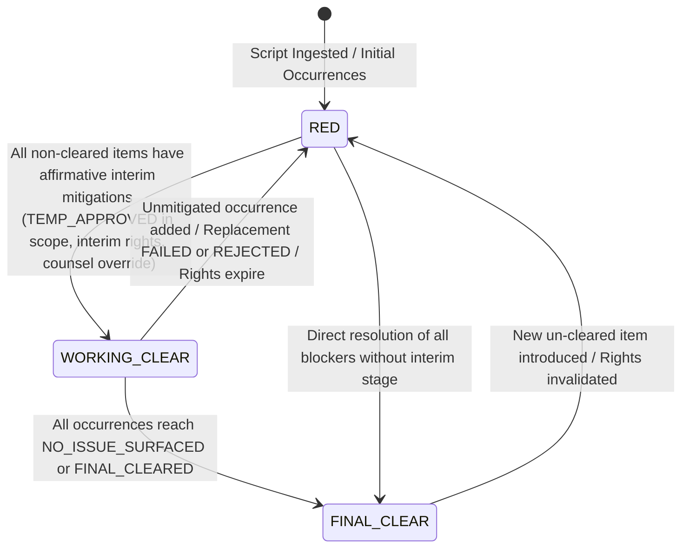
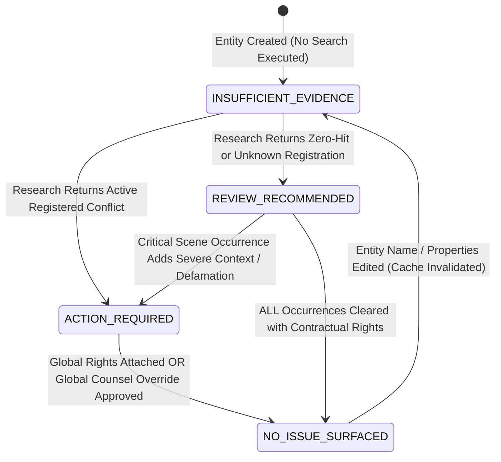

# Data Model: Feature 019 - Live Runtime and Real-Script Integrity

**Feature Branch**: `019-live-runtime-integrity`  
**Created**: 2026-08-21  
**Status**: Completed  
**Spec**: [spec.md](./spec.md) | **Research**: [research.md](./research.md)

---

## 1. Domain Entities & Schemas

### 1.1 Screenplay Upload & Chunk Ingestion

```typescript
export type ScreenplayFormat = 'FOUNTAIN' | 'TEXT' | 'PDF';

export interface ScreenplayUploadInput {
  fileBuffer: Buffer;
  filename: string;
  mimeType: string;
  sizeBytes: number;
}

export interface IngestionChunkJob {
  chunkIndex: number;
  totalChunks: number;
  sceneStartNumber: number;
  sceneEndNumber: number;
  rawTextLength: number;
  tokenEstimate: number;
  extractedCandidateCount: number;
  status: 'PENDING' | 'PROCESSING' | 'COMPLETED' | 'FAILED';
  errorMessage?: string;
}

export interface ScreenplayDraftMetadata {
  draftVersion: number;
  filename: string;
  format: ScreenplayFormat;
  uploadedAt: string;
  characterCount: number;
  sceneCount: number;
  totalEntitiesDetected: number;
  checksumSha256: string;
}
```

---

### 1.2 Canonical Entity Registry Record

**Firestore Path**: `projects/{projectId}/entities/{entityId}`

```typescript
export interface CanonicalEntityData {
  id: string;                                // e.g. "ent-a1b2c3d4"
  projectId: string;
  canonicalName: string;                     // Primary normalized name
  entityCategory: EntityCategory;            // 'BRAND' | 'ART_MUSIC' | 'PUBLIC_FIGURE' | 'PROPRIETARY_LOCATION' | 'GRAPHIC_PROP'
  description: string;
  origin?: 'AUTO_EXTRACTED' | 'USER_EDITED' | 'MANUALLY_ADDED';
  
  // Phase 3 Entity Resolution & Hierarchy
  aliases?: string[];
  parentEntityId?: string;
  parentEntityName?: string;
  relationshipType?: EntityRelationshipType;
  
  // Versioning & Invalidation
  groundingCacheVersion: number;             // Incremented on entity property edits
  isStale?: boolean;                         // Flagged true when metadata changed
  
  // Roll-Up Clearance Status
  overallClearanceStatus: ClearanceStatus;   // Worst-case status roll-up across all scene occurrences
  
  // Counsel Overrides & Cards
  isOverridden?: boolean;
  latestOverride?: {
    overrideId: string;
    overrideStatus: ClearanceStatus;
    rationale: string;
    counselName: string;
    timestamp: string;
  };
  replacementCard?: ReplacementCardData;
  createdAt: string;
  updatedAt: string;
}
```

---

### 1.3 Scene Entity Occurrence Record

**Firestore Path**: `projects/{projectId}/scenes/{sceneId}/occurrences/{occurrenceId}`

```typescript
export interface SceneEntityOccurrenceData {
  id: string;                                // e.g. "occ-12345678"
  sceneId: string;
  canonicalEntityId: string;
  scriptLineNumber: number;
  excerptText: string;
  usageContext: string;                      // Dialogue, Prop, Wardrobe, Background, etc.
  sentimentScore?: number;                   // Positive/Negative/Neutral (-1.0 to +1.0)
  exposureDurationSeconds?: number;
  
  // Evaluator Verdicts
  clearanceStatus: ClearanceStatus;          // 'NO_ISSUE_SURFACED' | 'REVIEW_RECOMMENDED' | 'ACTION_REQUIRED' | 'INSUFFICIENT_EVIDENCE'
  riskScore: number;                         // 0-100
  riskRationale: string;
  contextFlags?: string[];                   // e.g. 'ZERO_TRADEMARK_CONFLICTS_SURFACED', 'DEFAMATION_RISK', 'NEGATIVE_DEPICTION'
  citations?: ClearanceCitation[];
  evaluatedAt?: string;
  
  // Scoped Mitigations
  mitigationBasis?: 'CONTRACTUAL_RIGHTS' | 'COUNSEL_OVERRIDE' | 'SCOPED_PLACEHOLDER';
  mitigationReferenceId?: string;
  effectiveStatus?: ClearanceStatus;
  
  // Provenance & Matching
  surfaceMention?: string;
  matchedVia?: 'EXACT_CANONICAL' | 'ALIAS_MATCH' | 'NORMALIZED_EQUIVALENCE' | 'HIERARCHY_PARENT_MATCH' | 'MANUAL_ENTRY';
}
```

---

### 1.4 Live Research Quota Ledger

**Firestore Path**: `projects/{projectId}` (Embedded fields)

```typescript
export interface ProjectQuotaLedger {
  liveResearchQuotaAllocated: number;        // Default 25
  liveResearchQuotaConsumed: number;         // Incremented atomically per live search call
  liveResearchQuotaReserved: number;         // Active in-flight batch reservations
  lastQuotaResetAt?: string;
  isQuotaLocked?: boolean;                   // True if balance <= 0
}

export interface QuotaReservationResult {
  success: boolean;
  allocated: number;
  consumed: number;
  remaining: number;
  requested: number;
  isExhausted: boolean;
}
```

---

### 1.5 Replacement Placeholder Record

**Firestore Path**: `projects/{projectId}/placeholders/{placeholderId}`

```typescript
export type PlaceholderStatus = 'TEMP_APPROVED' | 'FINAL_CLEARED' | 'TEMP_REJECTED' | 'FAILED';
export type PlaceholderScope = 'SINGLE_OCCURRENCE' | 'SELECTED_OCCURRENCES' | 'SELECTED_SCENES' | 'PROJECT_WIDE';

export interface ReplacementPlaceholderData {
  id: string;                                // e.g. "ph-7890abcd"
  projectId: string;
  canonicalEntityId: string;
  candidateMark: string;
  description: string;
  eraAesthetic?: string;
  
  // Self-Clearance Outcome
  status: PlaceholderStatus;                 // 'TEMP_APPROVED' | 'FINAL_CLEARED' | 'TEMP_REJECTED' | 'FAILED'
  failureRationale?: string;                 // Set if collision check fails or search finds conflict
  verificationAttempts: number;              // Max 3
  negativeConstraints: string[];             // Accumulated avoided terms
  
  // Scoping
  scope: PlaceholderScope;
  targetSceneIds?: string[];
  targetOccurrenceIds?: string[];
  
  // Artwork Card
  artworkCardUrl?: string;
  createdAt: string;
  updatedAt: string;
}
```

---

## 2. State Machine Transitions

### 2.1 Scene Shooting Readiness State Machine



**State Validation Rules**:
1. `FINAL_CLEAR`: Every occurrence in the scene has `effectiveStatus === 'NO_ISSUE_SURFACED'` (via clean research, executed rights, or final counsel approval).
2. `WORKING_CLEAR`: Every non-cleared occurrence (`ACTION_REQUIRED`, `REVIEW_RECOMMENDED`, `INSUFFICIENT_EVIDENCE`) is covered by an active, affirmative interim mitigation (`TEMP_APPROVED` placeholder, interim rights license, or signed counsel review).
3. `RED`: Any occurrence in the scene is non-cleared AND lacks an affirmative interim mitigation (including occurrences with `FAILED` or `TEMP_REJECTED` placeholders).

---

### 2.2 Canonical Entity Clearance Status Roll-Up State Machine



**Roll-Up Invariant Rule**:
$$\text{Canonical Status} = \begin{cases} 
\text{ACTION\_REQUIRED} & \text{if } \exists \text{ occ with } \text{status } = \text{ACTION\_REQUIRED} \\
\text{INSUFFICIENT\_EVIDENCE} & \text{if } \exists \text{ occ with } \text{status } = \text{INSUFFICIENT\_EVIDENCE} \\
\text{REVIEW\_RECOMMENDED} & \text{if } \exists \text{ occ with } \text{status } = \text{REVIEW\_RECOMMENDED} \\
\text{NO\_ISSUE\_SURFACED} & \text{iff } \forall \text{ occ: } \text{effectiveStatus } = \text{NO\_ISSUE\_SURFACED}
\end{cases}$$

---

## 3. Firestore Subcollection Path Hierarchy

```text
projects/{projectId}
├── scenes/{sceneId}
│   └── occurrences/{occurrenceId}
├── entities/{entityId}
│   └── assessments/{assessmentId}
├── overrides/{overrideId}
├── rights/{rightsId}
├── placeholders/{placeholderId}
└── actions/{actionId}
```
