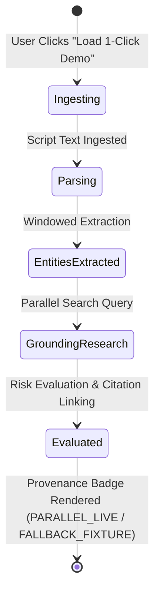

# Data Model: 020 Live Operator Access and Cloud-Mode First Run

## 1. Client-Side Authentication State Model

```typescript
export interface ClientAuthState {
  /** The stored demo/judge token (persisted in localStorage key 'clearance_demo_token') */
  token: string | null;
  /** Whether the active session has been authenticated or flagged 401 */
  isAuthenticated: boolean;
  /** Whether the blocking token gate modal is currently active */
  isAuthModalOpen: boolean;
  /** Optional error message displayed within the token gate modal */
  authError?: string | null;
}
```

### Storage Lifecycle & Event Flow
1. **Initial Hydration**: On app boot, `token` is read from `localStorage.getItem('clearance_demo_token')`.
2. **401 Interception**: When any API fetch returns `401 Unauthorized`:
   - `isAuthenticated` is set to `false`.
   - `isAuthModalOpen` is set to `true`.
   - Workspace data loading enters an `AUTH_REQUIRED` state instead of an empty collection.
3. **Token Save**:
   - `token` is written to `localStorage.setItem('clearance_demo_token', newToken)`.
   - `isAuthenticated` is set to `true`.
   - `isAuthModalOpen` is set to `false`.
   - Immediate re-trigger of project/workspace bootstrap.

---

## 2. Server-Sent Events (SSE) Query Contract

```typescript
export interface TimelineStreamQueryParams {
  /** The active project ID whose observable events are streamed */
  projectId?: string;
  /** The authentication token required in CLOUD_MODE or when server token is set */
  token?: string;
  /** Alternative alias for token query parameter */
  demoToken?: string;
}
```

---

## 3. Extended Health Status Response

```typescript
export interface HealthStatusResponse {
  status: 'HEALTHY' | 'DEGRADED';
  executionMode: 'TEST_MODE' | 'DEMO_MODE' | 'CLOUD_MODE';
  uptimeSeconds: number;
  timestamp: string;
  version: string;
  credentials: {
    geminiConfigured: boolean;
    parallelWebConfigured: boolean;
  };
  /** Explicit Google Cloud Firestore reachability state */
  firestoreConnected: boolean;
  missingCredentials?: string[];
  error?: string;
}
```

---

## 4. Entity State Transitions in 1-Click Demo (CLOUD_MODE)


