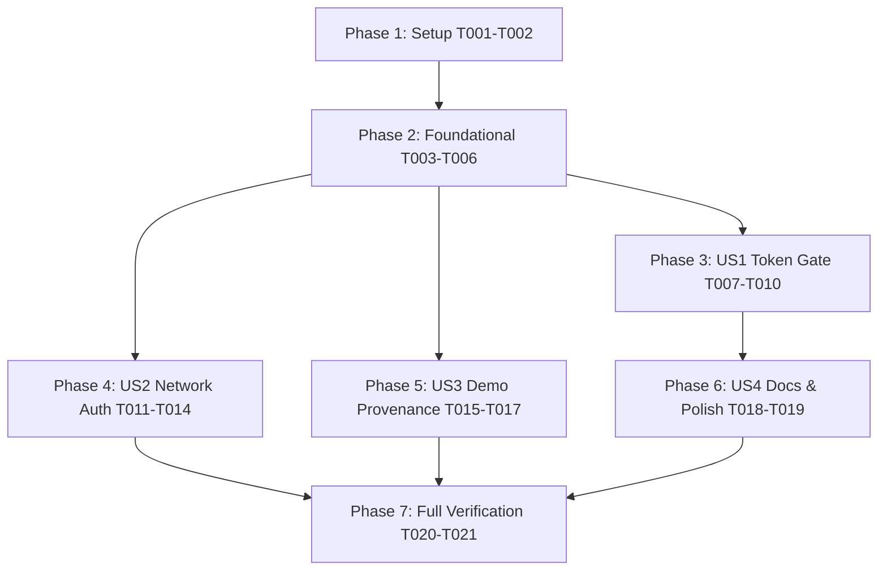

# Tasks: 020 Live Operator Access and Cloud-Mode First Run

**Input**: Feature Specification from `specs/020-live-operator-access/spec.md` and Implementation Plan from `specs/020-live-operator-access/plan.md`

---

## Phase 1: Setup (Shared Infrastructure)

**Purpose**: Establish test suites and foundational fixtures for operator access validation.

- [X] T001 [P] Create contract test suite `tests/contract/test_live_operator_access.test.ts` defining test cases for 401 interception, token storage events, and authenticated client requests per SC-001 and SC-002
- [X] T002 [P] Create integration test suite `tests/integration/test_live_operator_access_workflow.test.ts` for end-to-end first-run bootstrap and token retry workflow per SC-003

---

## Phase 2: Foundational (Blocking Prerequisites)

**Purpose**: Core client authentication interceptor, header helpers, and server health diagnostics.

**⚠️ CRITICAL**: Must complete before user story implementation.

- [X] T003 Update `src/utils/apiClient.ts` to attach both `Authorization: Bearer <token>` and `x-demo-token` headers in `apiFetch` and `getAuthHeaders()` per FR-004
- [X] T004 Update `src/utils/apiClient.ts` to intercept `401 Unauthorized` responses and dispatch a custom `clearancescout:auth_required` window event per FR-001
- [X] T005 Update `server/types/healthTypes.ts` and `server/api/healthRoutes.ts` to include `firestoreConnected: boolean` in `HealthStatusResponse` and `GET /api/health` response payloads per FR-007
- [X] T006 Update `tests/contract/test_health_api.test.ts` to assert `firestoreConnected` presence in health response per SC-005

**Checkpoint**: Foundation ready — client interceptors and health diagnostics active.

---

## Phase 3: User Story 1 - Blocking Live Token Gate & First-Run Bootstrap (Priority: P1) 🎯 MVP

**Goal**: When accessing `CLOUD_MODE` unauthenticated, surface a blocking token prompt on 401 and immediately retry project loading upon saving token.

**Independent Test**: Load application in clean storage; verify 401 triggers token modal, saving token immediately loads projects from Firestore without page reload.

### Implementation for User Story 1

- [X] T007 [US1] Update `src/App.tsx` to listen for `clearancescout:auth_required` events and automatically open `isTokenModalOpen` in blocking mode on initial `GET /api/projects` 401 error per FR-001
- [X] T008 [US1] Update `src/App.tsx` `handleSaveToken` to immediately re-execute `loadProjects()` and `initProject()` upon token save without requiring page reload per FR-002
- [X] T009 [US1] Update `src/pages/WorkspacePage.tsx` and `src/components/ProjectListModal.tsx` to render an explicit "Authentication Required" state with a "Configure Token" action when projects fail with 401 instead of "No projects found" per FR-006
- [X] T010 [US1] Update `src/App.tsx` token configuration modal UI copy to state that the token authorizes both live project data access and clearance mutations, with placeholder `judge-pass-2026` per FR-003

**Checkpoint**: User Story 1 complete — first-time visitors in `CLOUD_MODE` are gated seamlessly and onboarded.

---

## Phase 4: User Story 2 - Comprehensive Authenticated Client Network Layer (Priority: P1)

**Goal**: Guarantee 100% of client network requests (SSE streams, markdown export, dashboard metrics) attach authorization credentials.

**Independent Test**: Verify timeline stream connects with query token, markdown binder downloads successfully, and operations dashboard renders metrics without 401 errors.

### Implementation for User Story 2

- [X] T011 [US2] Update `src/hooks/useTimelineSSE.ts` to use `apiFetch` for initial timeline history and append `?token=${encodeURIComponent(token)}` to the `EventSource` URL per FR-004
- [X] T012 [US2] Update `src/components/BinderExportModal.tsx` to use `apiFetch` instead of raw `fetch` for `/api/projects/:id/binder/markdown` download per FR-004
- [X] T013 [US2] Update `src/components/ProductionDashboardModal.tsx` to use `apiFetch` instead of raw `fetch` for `/api/projects/:id/dashboard` metrics loading per FR-004
- [X] T014 [US2] Update `tests/contract/test_demo_auth.test.ts` to assert that SSE stream requests with `?token=` query parameter are successfully authorized in `CLOUD_MODE` per SC-002

**Checkpoint**: User Story 2 complete — all background streams and modal downloads pass authentication.

---

## Phase 5: User Story 3 - Honest Live Demo Execution & Provenance Integrity (Priority: P1)

**Goal**: 1-Click Demo in `CLOUD_MODE` executes parsing and clearance evaluation with non-zero entity counts and honest provenance badges.

**Independent Test**: Trigger 1-Click Demo in a `CLOUD_MODE` project; verify non-zero evaluated entities and accurate provenance citations.

### Implementation for User Story 3

- [X] T015 [US3] Update `server/workflows/demoAutomationWorkflow.ts` to allow auto-evaluation in `CLOUD_MODE` when `autoEvaluate !== false`, populating non-zero evaluated entities per FR-005
- [X] T016 [US3] Update `server/workflows/demoAutomationWorkflow.ts` to assign authentic provenance badges (`PARALLEL_LIVE` or `FALLBACK_FIXTURE`) based on active runtime grounding per FR-005
- [X] T017 [US3] Update `tests/integration/judge_demo_workflow.test.ts` to verify 1-Click Demo populates non-zero evaluation counts in both `DEMO_MODE` and `CLOUD_MODE` per SC-004

**Checkpoint**: User Story 3 complete — live demonstration accurately reflects agentic clearance capability.

---

## Phase 6: User Story 4 - Accurate Security Messaging, Diagnostics & Documentation (Priority: P2)

**Goal**: Ensure documentation and diagnostic probes provide transparent operator guidance and cloud health status.

**Independent Test**: Verify `GET /api/health` returns `firestoreConnected: true` and `README.md` documents judge token onboarding.

### Implementation for User Story 4

- [X] T018 [P] [US4] Update `README.md` Live Demo section with token authentication instructions and documented judge token `judge-pass-2026` per FR-008
- [X] T019 [P] [US4] Update `PROVENANCE.md` with Feature 020 operator access and token gate specifications per FR-008

**Checkpoint**: User Story 4 complete — documentation and diagnostics up to date.

---

## Phase 7: Polish & Full Verification

**Purpose**: Execute end-to-end regression validation and build verification.

- [X] T020 Run `npm test` across all 74+ test suites to verify 100% test pass rate per SC-005
- [X] T021 Run `npm run build` to confirm clean TypeScript compilation and Vite production bundle output

---

## Dependencies & Execution Order

### Parallel Opportunities

- **Phase 1**: `T001` and `T002` can be authored concurrently.
- **Phase 2**: `T003`/`T004` (client) and `T005`/`T006` (server health) can run in parallel.
- **Phase 4**: `T011`, `T012`, `T013` can be implemented concurrently across separate components.
- **Phase 6**: `T018` and `T019` documentation tasks can be completed in parallel.
