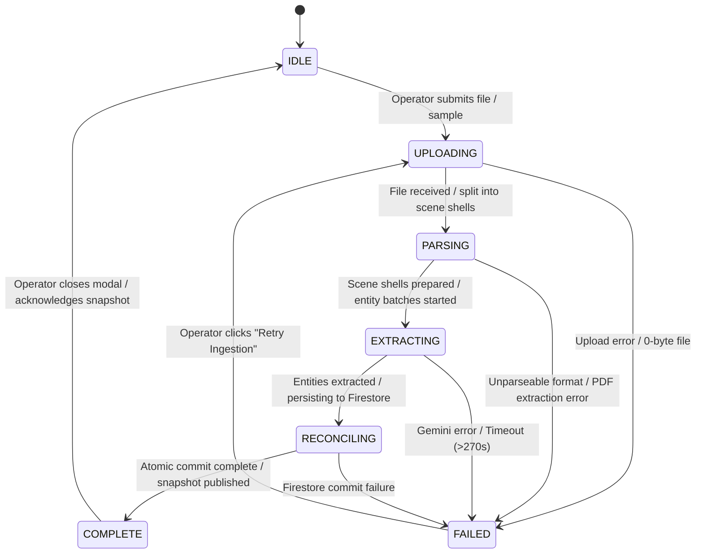

# Data Model: Feature 021 Release State Integrity and Operator Trust

## 1. Ingestion State Machine Model

### IngestionState
Represents the observable lifecycle of an active screenplay upload or sample ingestion.

```typescript
export type IngestionPhase =
  | 'IDLE'
  | 'UPLOADING'
  | 'PARSING'
  | 'EXTRACTING'
  | 'RECONCILING'
  | 'COMPLETE'
  | 'FAILED';

export interface IngestionState {
  projectId: string;
  phase: IngestionPhase;
  progressPercent: number; // 0 to 100
  elapsedSeconds: number;
  currentChunkIndex?: number;
  totalChunks?: number;
  scenesCount?: number;
  entitiesCount?: number;
  sourceType: 'UPLOADED_FILE' | 'BUNDLED_DEMO' | 'PASTED_TEXT';
  sourceFilename?: string;
  format: 'PLAINTEXT' | 'FOUNTAIN' | 'PDF';
  errorDetails?: {
    code: string;
    stage: IngestionPhase;
    message: string;
    isRetryable: boolean;
    suggestedAction?: string;
  };
  startedAt: string;
  completedAt?: string;
}
```

### State Transitions


---

## 2. Canonical Entity Model with Current-Draft Scoping

### CanonicalEntityData (Updated)
```typescript
export interface CanonicalEntityData {
  id: string;
  projectId: string;
  canonicalName: string;
  entityCategory: EntityCategory;
  description: string;
  overallClearanceStatus: ClearanceStatus;
  origin?: EntityOrigin;

  // Generic Alias Normalization (P0-3)
  aliases: string[]; // Normalized alternate forms (e.g. ["A.P.", "AP", "Associated Press / A.P."])
  acronyms?: string[]; // Generated initials (e.g. ["AP"])
  parentEntityId?: string;
  parentEntityName?: string;
  relationshipType?: EntityRelationshipType;

  // Current-Draft Scoping & Historical Archival (P0-4)
  activeInCurrentDraft: boolean; // True if ≥1 occurrence in current draft
  occurrencesCount: number; // Count of occurrences in current draft
  draftVersionId?: string; // Identifier of draft where entity was last observed
  isArchivedHistorical?: boolean; // True if superseded by a new draft omitting this entity

  // Grounding & Cache Invalidation
  groundingCacheVersion?: number;
  isStale?: boolean;

  // Counsel Overrides & Cards
  isOverridden?: boolean;
  latestOverride?: {
    overrideId: string;
    overrideStatus: ClearanceStatus;
    rationale: string;
    counselName: string;
    timestamp: string;
  };
  replacementCard?: any;
  createdAt: string;
  updatedAt: string;
}
```

---

## 3. Atomic Project Snapshot Payload

Returned upon ingestion completion to refresh all UI components simultaneously from a single database commit.

```typescript
export interface ProjectWorkspaceSnapshot {
  project: {
    id: string;
    title: string;
    productionCompany: string;
    scriptVersion: string;
    executionMode: 'TEST_MODE' | 'DEMO_MODE' | 'CLOUD_MODE';
    sourceType: 'BUNDLED_DEMO' | 'UPLOADED_FILE';
    sourceLabel: string;
    totalScenes: number;
    totalActiveEntities: number;
  };
  scenes: SceneData[];
  entities: CanonicalEntityData[]; // Filtered to activeInCurrentDraft: true by default
  historicalEntitiesCount: number;
  occurrences: SceneEntityOccurrenceData[];
  readiness: {
    shootingReadinessPercentage: number;
    totalScenes: number;
    clearedScenes: number;
    blockedScenes: number;
    totalBlockers: number;
    sceneStatuses: Array<{
      sceneNumber: number;
      heading: string;
      readinessTier: 'FINAL_CLEAR' | 'PROVISIONAL_CLEAR' | 'SHOOTING_BLOCKED';
      blockerCount: number;
    }>;
  };
  actionsSummary: {
    totalActions: number;
    openActions: number;
    criticalActions: number;
  };
  snapshotTimestamp: string;
}
```

---

## 4. Timeline Event Stream Model (Idempotent)

```typescript
export interface ExecutionEvent {
  id: string; // Unique UUID (e.g. "evt-a1b2c3d4")
  projectId: string;
  eventType: TimelineEventType;
  label: string;
  payload: Record<string, any>;
  timestamp: string; // ISO 8601 string
}
```

### Invariants:
1. **Deduplication Key**: `id` is primary key; client event sets ignore incoming events where `existing.some(e => e.id === incoming.id)`.
2. **Side-Effect Free Reads**: HTTP GET requests and SSE stream openings NEVER trigger `timelineEmitter.emit`.
3. **Chain-of-Thought Concealment**: Internal reasoning keys (`thought`, `reasoningSteps`) are strictly stripped before broadcasting.
