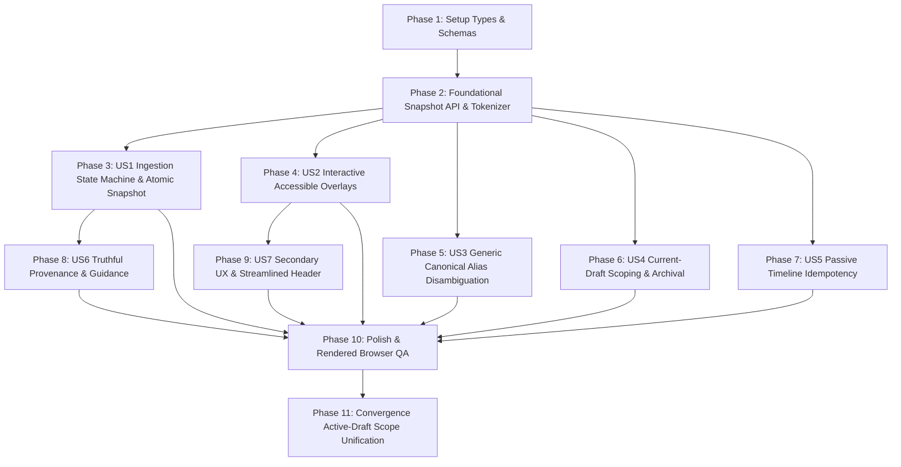

# Tasks: Feature 021 Release State Integrity and Operator Trust

**Input Documents**:
- Spec: [`specs/021-release-state-integrity/spec.md`](spec.md)
- Plan: [`specs/021-release-state-integrity/plan.md`](plan.md)
- Data Model: [`specs/021-release-state-integrity/data-model.md`](data-model.md)
- Contracts: [`specs/021-release-state-integrity/contracts/`](contracts/)
- Quickstart Guide: [`specs/021-release-state-integrity/quickstart.md`](quickstart.md)

---

## Phase 1: Setup & Foundational Preparation

**Purpose**: Shared type declarations, state machine interfaces, and project snapshot schemas required across all user stories.

- [X] T001 [P] Declare `IngestionState` and `IngestionPhase` lifecycle types in `src/components/ScriptUploadModal.tsx` and `server/workflows/canonicalRegistryWorkflow.ts`
- [X] T002 [P] Define `ProjectWorkspaceSnapshot` schema and single-commit response type in `server/repositories/ProjectRepo.ts` and `src/pages/WorkspacePage.tsx`
- [X] T003 [P] Add `activeInCurrentDraft` and `occurrencesCount` fields to `CanonicalEntityData` in `server/repositories/EntityRepo.ts`

---

## Phase 2: Foundational (Blocking Prerequisites)

**Purpose**: Core infrastructure and contract foundations that MUST be in place before story implementations.

- [X] T004 Define atomic snapshot getter method `ProjectRepo.getProjectSnapshot(projectId)` in `server/repositories/ProjectRepo.ts`
- [X] T005 [P] Implement snapshot serializer endpoint `GET /api/projects/:id/snapshot` in `server/api/projectRoutes.ts`
- [X] T006 [P] Add multi-tier token extraction helper for acronym and parenthetical normalization in `server/workflows/entityResolutionEngine.ts`

---

## Phase 3: User Story 1 - Deterministic Ingestion State Machine & Atomic Snapshot Synchronization (Priority: P1) 🎯 MVP

**Goal**: Implement the 7-phase ingestion state machine (`IDLE` → `UPLOADING` → `PARSING` → `EXTRACTING` → `RECONCILING` → `COMPLETE` / `FAILED`), lock duplicate submits, enforce live elapsed progress, and synchronize workspace UI atomically from a single committed snapshot.

**Independent Test**: Ingest `Big-Fish.fountain.txt` and verify sequential state transitions with live elapsed timers, duplicate-click blocking, no intermediate count jumps, and simultaneous single-snapshot UI refresh.

### Tests for User Story 1
- [X] T007 [P] [US1] Contract test for atomic ingestion lifecycle and single snapshot response in `tests/contract/test_chunked_script_ingestion.test.ts`
- [X] T008 [P] [US1] Interaction test for upload button locking, elapsed timer, and snapshot update in `tests/contract/test_script_upload_modal_ui.test.ts`

### Implementation for User Story 1
- [X] T009 [US1] Update `CanonicalRegistryWorkflow.processScriptUpload` to return unified `ProjectWorkspaceSnapshot` in `server/workflows/canonicalRegistryWorkflow.ts`
- [X] T010 [US1] Update `POST /api/projects/:id/script` and `POST /api/projects/:id/script/upload` routes to respond with atomic snapshot in `server/api/projectRoutes.ts`
- [X] T011 [US1] Refactor `ScriptUploadModal.tsx` with explicit 7-phase state machine, honest progress (max 75% before complete), elapsed timer, duplicate submit lock, and `UPLOAD_TIMEOUT_MS = 270000` in `src/components/ScriptUploadModal.tsx`
- [X] T012 [US1] Update `WorkspacePage.tsx` to refresh scenes, entities, summary banner, shooting readiness, and actions concurrently from `snapshot` upon ingestion in `src/pages/WorkspacePage.tsx`

---

## Phase 4: User Story 2 - Interactive Accessible Overlays & Action Drawer Stacking (Priority: P1)

**Goal**: Guarantee visible, high-z-index modal and drawer rendering for "Actions" and "Timeline" with full keyboard navigation and accessible dismissals.

**Independent Test**: Click "Actions" and "Timeline" triggers and verify visible rendering above header (`z-100`) and workspace surfaces (`zIndex: 1400` / `1350`), focus management, and `Escape` key dismissal.

### Tests for User Story 2
- [X] T013 [P] [US2] Interaction test for Actions modal trigger, visibility, backdrop styling, and `Escape` dismiss in `tests/contract/test_action_notifications.test.ts`
- [X] T014 [P] [US2] Interaction test for Timeline drawer trigger, slide-in visibility, focus trap, and close button in `tests/contract/test_timeline_sse.test.ts`

### Implementation for User Story 2
- [X] T015 [US2] Standardize `ActionListModal.tsx` container with `zIndex: 1400`, `position: fixed`, backdrop filter, `role="dialog"`, and `aria-modal="true"` in `src/components/ActionListModal.tsx`
- [X] T016 [US2] Standardize `TimelineDrawer.tsx` container with `zIndex: 1350`, `position: fixed`, high-contrast styling, and keyboard listener in `src/components/TimelineDrawer.tsx`
- [X] T017 [US2] Ensure `ProductionDashboardModal.tsx` and `AccessTokenModal.tsx` match stacking standards (`zIndex: 1400`) in `src/components/ProductionDashboardModal.tsx` and `src/components/AccessTokenModal.tsx`
- [X] T018 [US2] Add keyboard `Escape` handling and focus restoration across modal triggers in `src/pages/WorkspacePage.tsx` and `src/App.tsx`

---

## Phase 5: User Story 3 - Generic Canonical Entity Disambiguation & Alias Normalization (Priority: P1)

**Goal**: Implement multi-tier generic lexical normalization to automatically merge acronyms, punctuation variations, parenthetical forms, and composite mentions (e.g. `Associated Press`, `A.P.`, `AP`, `A.P. (Associated Press)`, `Associated Press / A.P.`).

**Independent Test**: Ingest script mentions of `Associated Press`, `A.P.`, and `Associated Press / A.P.` and assert exactly 1 canonical entity is created with all aliases mapped and authentic surface excerpts preserved.

### Tests for User Story 3
- [X] T019 [P] [US3] Contract tests verifying generic alias merge matrix (`Associated Press`, `A.P.`, `AP`, `A.P. (Associated Press)`, `Associated Press / A.P.`) in `tests/contract/test_entity_resolution.test.ts`

### Implementation for User Story 3
- [X] T020 [US3] Implement parenthetical splitting and compound delimiter extraction (`/`, `|`, `aka`) in `server/workflows/entityResolutionEngine.ts`
- [X] T021 [US3] Implement multi-word acronym generation and dotted-token normalization in `server/workflows/entityResolutionEngine.ts`
- [X] T022 [US3] Update `CanonicalRegistryWorkflow` to register extracted surface aliases onto resolved canonical entities in `server/workflows/canonicalRegistryWorkflow.ts`

---

## Phase 6: User Story 4 - Occurrence-Grounded Current Draft Scoping & Historical Archival (Priority: P1)

**Goal**: Ground all active canonical entities by at least one valid occurrence on a current-draft scene, marking entities from superseded drafts as `NOT_IN_CURRENT_DRAFT` and excluding them from shooting readiness metrics.

**Independent Test**: Upload Draft 1 with Entity A and B, then upload Draft 2 with only Entity B; assert Entity A is archived as `NOT_IN_CURRENT_DRAFT` and shooting readiness calculates only against active Draft 2 items.

### Tests for User Story 4
- [X] T023 [P] [US4] Contract test for draft revision replacement, occurrence grounding, and `NOT_IN_CURRENT_DRAFT` scoping in `tests/contract/test_screenplay_versioning_lifecycle.test.ts`

### Implementation for User Story 4
- [X] T024 [US4] Update `EntityRepo` to compute `activeInCurrentDraft` and filter active registry items by `occurrencesCount > 0` in `server/repositories/EntityRepo.ts`
- [X] T025 [US4] Update `SceneReadinessEngine` to calculate blockers and readiness percentages strictly against active draft entities in `server/workflows/sceneReadinessEngine.ts`
- [X] T026 [US4] Add "Include Historical Revisions" toggle filter in `src/components/CanonicalEntityRegistry.tsx` and `src/pages/WorkspacePage.tsx`

---

## Phase 7: User Story 5 - Passive Timeline Idempotency & Side-Effect Free Observation (Priority: P1)

**Goal**: Ensure GET endpoints, dashboard polls, and SSE stream reconnections are completely side-effect free, eliminating timeline runaway and bounding event growth.

**Independent Test**: Open the workspace with an active SSE stream, simulate 5 minutes of passive polling and tab switches, and assert timeline event count remains strictly constant with 0 synthetic growth.

### Tests for User Story 7
- [X] T027 [P] [US5] Contract test verifying 0 new timeline events during passive GET polling and SSE reconnect cycles in `tests/contract/test_timeline_sse.test.ts`

### Implementation for User Story 7
- [X] T028 [US5] Audit all GET routes (`/api/projects`, `/api/projects/:id/timeline`, `/api/projects/:id/readiness`) to guarantee zero `timelineEmitter.emit` calls in `server/api/projectRoutes.ts` and `server/api/clearanceRoutes.ts`
- [X] T029 [US5] Implement client-side event deduplication by `id` in `useTimelineSSE.ts` (`setEvents(prev => prev.some(e => e.id === evt.id) ? prev : [...prev, evt])`) in `src/hooks/useTimelineSSE.ts`
- [X] T030 [US5] Prevent redundant history re-broadcast on SSE stream connect in `server/events/timelineEmitter.ts`

---

## Phase 8: User Story 6 - Truthful Provenance Labeling & Operational Recovery Guidance (Priority: P2)

**Goal**: Truthfully label screenplay source provenance (`The Neon Horizon (Bundled Fictional Demo)` vs authentic user uploads) and present actionable recovery guidance for operations exceeding 30 seconds.

**Independent Test**: Load the bundled demo screenplay and assert truthful fixture labeling; trigger a simulated delay and assert stage-specific guidance and cancel options appear.

### Tests for User Story 6
- [X] T031 [P] [US6] Contract test for truthful demo fixture labeling in `tests/contract/test_demo_fixture.test.ts`

### Implementation for User Story 6
- [X] T032 [US6] Update `demoAutomationWorkflow.ts` and `fixtureRoutes.ts` to explicitly set `source = 'The Neon Horizon (Bundled Fictional Demo)'` in `server/workflows/demoAutomationWorkflow.ts` and `server/api/fixtureRoutes.ts`
- [X] T033 [US6] Add 30-second duration recovery guidance banner and safe cancel trigger in `src/components/ScriptUploadModal.tsx`
- [X] T034 [US6] Update error alert banners with stage, error code, plain-language description, and single-click retry action in `src/components/ScriptUploadModal.tsx` and `src/pages/WorkspacePage.tsx`

---

## Phase 9: User Story 7 - Secondary Interface Refinement & Streamlined Header Controls (Priority: P3)

**Goal**: Polish application header, consolidate Binder Export into a single unified control, group table row actions, and ensure WCAG AA high-contrast status badges.

**Independent Test**: Verify clean header presentation with prominent project title, unified Binder Export menu, grouped table actions, and accessible contrast across all viewports.

### Implementation for User Story 7
- [X] T035 [US7] Refactor top header bar in `src/App.tsx` with quiet administrative controls, high-contrast project title, and unmistakable production company label in `src/App.tsx`
- [X] T036 [US7] Consolidate redundant binder export buttons into a single "Export Binder" dropdown control in `src/pages/WorkspacePage.tsx` and `src/components/ExportBinderModal.tsx`
- [X] T037 [US7] Group row actions (Edit, Delete, Research, Match, Replace) in `src/components/CanonicalEntityRegistry.tsx`
- [X] T038 [US7] Verify high-contrast text and color status badges with ARIA labels across `src/components/CanonicalEntityRegistry.tsx` and `src/components/SceneBreakdownView.tsx`

---

## Phase 10: Polish & End-to-End Rendered Browser QA Validation

**Purpose**: Execute full end-to-end rendered browser verification sequence and independent test suite.

- [X] T039 Execute full automated regression test suite via `npm test` across all 77 suites in `tests/`
- [X] T040 Execute clean production build validation via `npm run build`
- [X] T041 Execute end-to-end rendered browser verification sequence per `specs/021-release-state-integrity/quickstart.md` (Authenticate → Create project → Verify empty count agreement → Ingest script with progress → Assert atomic snapshot refresh → Trigger Actions & Timeline overlays → Verify alias merging → Verify 5-minute passive timeline stability → Verify historical draft archival)

---

## Phase 11: Convergence (Round-2 QA & Active-Draft Scope Unification)

**Purpose**: Address Round-2 QA findings, enforce strict active-draft scope across all backend surfaces (eliminating the 41-vs-6 entity split), wire sample loading to the visible 7-phase state machine, unify open action counts, and provide safe canonical alias reconciliation.

- [X] T042 [CRITICAL] Unify active-draft entity universe across backend repositories (`EntityRepo`, `ProjectRepo`, `SceneRepo`) so `activeEntityCount == distinct canonicalEntityId across active occurrences` per FR-012, FR-013, SC-005 (missing)
- [X] T043 [CRITICAL] Reconcile header counts, default registry view, batch-research queue (`useBatchResearch`), dashboard blockers, and clearance binder export to the unified active-draft universe per FR-012, SC-005 (contradicts)
- [X] T044 [HIGH] Implement operator re-ingest choice modal (`Replace Current Screenplay` vs `Merge as New Version` vs `Cancel`) and screenplay version identity per FR-001, FR-004 (missing)
- [X] T045 [HIGH] Route "Load Bundled Fictional Demo Screenplay" through the visible 7-phase `ScriptUploadModal` state machine (`Preparing` → `Parsing` → `Extracting` → `Reconciling` → `Updating readiness` → `Complete` / `Failed`) per FR-001, FR-002, FR-017 (partial)
- [X] T046 [HIGH] Unify Open Actions calculation across header indicator and Action Center (showing `0 Open Actions` when only resolved actions exist) per FR-004, FR-009 (contradicts)
- [X] T047 [HIGH] Implement safe migration and reconciliation for legacy duplicate canonical entities (`Associated Press`, `A.P.`, `AP`) preserving occurrences, citations, aliases, and overrides per FR-010, FR-011 (missing)
- [X] T048 [HIGH] Create automated contract and invariant test suite `tests/contract/test_active_draft_invariants.test.ts` asserting the active-draft invariant at data/query level per FR-012, FR-013, SC-005 (missing)
- [X] T049 [MEDIUM] Humanize scene IDs (no raw `scene-33c3482f`), status enums (`INSUFFICIENT_EVIDENCE` → `Research Required`), action spacing ("0 Open Actions"), and grouped row actions per FR-020, FR-022, FR-023 (partial)
- [X] T050 [HIGH] Execute complete T041-style rendered browser QA validation sequence in live `CLOUD_MODE` per SC-001..SC-008 (missing)

---

## Phase 12: Convergence (Round-3 UX Polish, Taxonomy Alignment & Accessible Density)

**Purpose**: Execute final small UX/copy pass: derive preview entities (7 items) from actual bundled sample, align preview badges to clearance product taxonomy, centralize global pluralization and enum formatting, consolidate duplicate binder export triggers, add accessible post-ingest aria-live toast, and enhance dashboard density, contrast, and sticky headers.

- [X] T051 [HIGH] Align bundled demo preview list and count to exact 7 entities (*AeroTech Prism Laptop*, *Summit Cola*, *Elena Vance*, *Nocturne of the Wild*, *Veloce GT*, *Midtown Spire Tower*, *Titan Industrial Hazard Placard*) derived from single source of truth in `ScriptUploadModal.tsx` per FR-001, FR-017 (partial)
- [X] T052 [MEDIUM] Align demo preview category badges to 5 official clearance product taxonomies (`Brand`, `Art & Music`, `Public Figure`, `Proprietary Location`, `Graphic Prop`) per FR-017 (partial)
- [X] T053 [MEDIUM] Create central shared pluralization and enum formatting helpers in `src/utils/formatters.ts` and apply globally across `App.tsx`, `WorkspacePage.tsx`, `EntityRegistryTable.tsx`, and `ActionListModal.tsx` per FR-020, FR-022 (partial)
- [X] T054 [MEDIUM] Consolidate duplicate "Export Clearance Binder" action triggers by keeping the primary header trigger with SHA-256 digest export and removing redundant duplicate from workspace toolbar per FR-024 (partial)
- [X] T055 [HIGH] Implement brief accessible auto-dismissing `aria-live="polite"` toast notification after script ingestion showing actual scene and entity counts and distinguishing Replace vs Merge per FR-002, FR-004 (missing)
- [X] T056 [HIGH] Optimize Production Dashboard modal density by grouping blocker cards by scene with compact layout, preserving Placeholder / Add Rights / Override actions and adding sticky header during modal scrolling per FR-015, FR-016 (partial)
- [X] T057 [MEDIUM] Enhance text contrast on small muted labels (`#94a3b8` / `#cbd5e1`), ensure keyboard focus outline compliance, and accessible screen reader announcements per FR-018, FR-021 (partial)
- [X] T058 [HIGH] Execute rendered browser and contract regression suite verifying 7-entity preview truth, taxonomy, pluralization, enum formatting, sticky dashboard, and accessible toast per SC-001..SC-008 (missing)

---

## Phase 13: Convergence (Round-4 Staged Draft Replacement, Pre-Activation Invariants & Action Regeneration)

**Purpose**: Fix release-blocking REPLACE screenplay regression: implement staged BUILDING→VALIDATED→ACTIVE draft replacement pipeline in `CanonicalRegistryWorkflow`, guarantee pre-activation graph invariant checks before committing, ensure superseded actions never block new current-version OPEN actions, harden generic match boundaries against duplicate entity collapse, and humanize scene IDs and secondary labels.

- [X] T059 [CRITICAL] Implement staged `BUILDING` -> `VALIDATED` -> `ACTIVE` draft replacement pipeline with strict pre-activation graph invariant verification (`activeSceneCount == parsedSceneCount`, `distinct canonicalEntityId across occurrences == current active canonical universe`, `every new occurrence references existing new scene and existing canonical entity`, `every AUTO_EXTRACTED active entity has >= 1 occurrence`, `every ACTION_REQUIRED item has required OPEN actions`, and bundled demo has 7 active entities) and fail-closed rollback in `server/workflows/canonicalRegistryWorkflow.ts` per FR-001, FR-011, FR-012, Constitution II (missing)
- [X] T060 [HIGH] Ensure superseded actions (`RESOLVED`, `SCRIPT_REVISION_SUPERSEDED`) never suppress new current-version `OPEN` department actions for `ACTION_REQUIRED` occurrences upon screenplay replacement in `server/workflows/actionDispatcher.ts` and `server/repositories/ActionNotificationRepo.ts` per FR-019, FR-020 (missing)
- [X] T061 [HIGH] Harden `isGenericMatch` token and acronym boundary heuristics in `server/workflows/entityResolutionEngine.ts` to prevent false-positive duplicate merging across distinct entities while preserving legitimate acronym equivalence (`Associated Press` <-> `A.P.`) per FR-017, FR-018 (partial)
- [X] T062 [MEDIUM] Humanize scene IDs (`scene-xxxx` -> `Scene N: Heading`), humanize `SCRIPT_REVISION_SUPERSEDED` via `formatStatus`, enforce `Art & Music` display formatting, include scene count in script viewer heading, and default Action Center to 'OPEN' tab in `src/components/ActionListModal.tsx`, `src/components/ScriptViewer.tsx`, and `src/pages/WorkspacePage.tsx` per FR-020, FR-022 (partial)
- [X] T063 [HIGH] Implement contract and invariant test suite for staged replacement (`replace_same_screenplay_is_idempotent`, `replace_never_commits_dangling_occurrence_entity_links`, `replacement_failure_preserves_previous_active_snapshot`, `current_action_required_items_regenerate_open_actions`, `superseded_actions_do_not_block_new_action_creation`, `completion_counts_equal_committed_active_snapshot`, `bundled_demo_replace_preserves_7_entities`) in `tests/contract/test_replace_integrity.test.ts` per SC-001..SC-008 (missing)
- [X] T064 [HIGH] Execute rendered browser and contract verification covering authentication -> fresh project -> initial bundled demo load -> 3/7/actions verified -> replace same demo -> complete -> 3/7 Elena in both places, all links valid, open actions regenerated, counts agree -> reload identical in `tests/contract/test_rendered_sample_load_ui.test.ts` per SC-001..SC-008 (missing)

---

## Phase 14: Convergence (Round-5 Completion-Barrier, Deterministic Workspace Sync & Clarified Task Labels)

**Purpose**: Guarantee that screenplay ingestion HTTP success occurs ONLY when the active project snapshot is queryably coherent across scenes, occurrences, canonical entities, assessments, open actions, readiness, and project summary. Introduce explicit frontend `SYNCING` state in `ScriptUploadModal`, atomic workspace refresh in `WorkspacePage`, truthful completion toasts from committed snapshots, and clearly separate Clearance Entity Statuses from Department Action Tasks.

- [X] T065 [CRITICAL] Enforce backend ingestion completion barrier in `canonicalRegistryWorkflow.ts` and `projectRoutes.ts` guaranteeing that HTTP 200 is returned ONLY after the active snapshot is fully committed and queryably coherent across scenes, occurrences, canonical entities, assessments, open actions, and readiness per FR-001, FR-011, Constitution II (missing)
- [X] T066 [HIGH] Implement explicit frontend `SYNCING` state in `ScriptUploadModal.tsx` keeping conflicting controls disabled and transitioning to `COMPLETE` only after the workspace has refreshed from the committed snapshot per FR-002, FR-004 (missing)
- [X] T067 [HIGH] Implement atomic workspace state application with snapshot revision timestamp tracking and parallel override fetching in `WorkspacePage.tsx` and `App.tsx` per FR-001, FR-012 (partial)
- [X] T068 [MEDIUM] Derive completion toast counts directly from committed active snapshot and clearly distinguish Clearance Blockers (ACTION_REQUIRED entities), Review Recommended entities, and Department Open Actions across header, workspace toolbar, and Action Center per FR-019, FR-020 (partial)
- [X] T069 [MEDIUM] Verify side-effect-free GET endpoints for actions, readiness, and snapshot, and enforce "Showing N of N entities" table formatting and `Art & Music` badge formatting per FR-016, FR-022 (partial)
- [X] T070 [HIGH] Implement contract test suite in `tests/contract/test_completion_barrier_sync.test.ts` verifying immediate query coherence upon HTTP success without requiring secondary modal opens or client mutations per SC-001..SC-008 (missing)
- [X] T071 [HIGH] Execute rendered browser QA in `tests/contract/test_rendered_sample_load_ui.test.ts` verifying full replace lifecycle through named stages (Uploading -> Parsing -> Extracting -> Reconciling -> Syncing -> Complete), immediate 3/7 Elena truth in highlighter and registry without opening modals, and identical reload consistency per SC-001..SC-008 (missing)

---

## Phase 15: Convergence (Round-6 Truthful Completion Barrier, Read-Only GETs, and Rendered Browser Convergence)

**Purpose**: Eliminate hardcoded fallbacks in completion toast, ensure `COMPLETE` state is only reached on successful workspace state application, make all GET snapshot/readiness/action endpoints strictly read-only, synchronize header/workspace atomically from the committed snapshot, clarify Clearance Blockers vs Department Tasks labels across all surfaces, and execute rendered browser validation.

- [X] T072 [HIGH] Eliminate `|| 3` and `|| 7` fallbacks in `ScriptUploadModal.tsx` and `WorkspacePage.tsx`, deriving completion toast counts strictly from committed snapshot with Replace vs Merge accuracy and including department tasks (`N scenes processed · N entities registered · N department tasks created`) via `aria-live="polite"` per FR-002, FR-004 (partial)
- [X] T073 [HIGH] Enforce fail-closed `COMPLETE` state machine in `ScriptUploadModal.tsx` so that `COMPLETE` is declared ONLY if `onUploadSuccess` snapshot application succeeds, transitioning to `FAILED` with error message if sync fails per FR-004 (partial)
- [X] T074 [HIGH] Synchronously pass and apply committed snapshot to `onRefreshProjectSummary` in `App.tsx` and `WorkspacePage.tsx` to eliminate render lag across header summary, registry, scenes, and department tasks per FR-001, FR-012 (partial)
- [X] T075 [HIGH] Convert `ProjectRepo.getProjectSnapshot` and `GET /scenes/readiness` to strictly read-only queries (retrieving existing evaluated scene readiness without invoking `sceneRepo.updateSceneReadiness` or emitting timeline events on GET) per FR-011, Constitution II (contradicts)
- [X] T076 [MEDIUM] Standardize operator-facing terminology across header aria-labels, workspace toolbar (`📋 Department Tasks (N)`), Action Center header, and Operations Dashboard KPI to clearly distinguish Clearance Blockers, Review Recommended, and Department Tasks per FR-019, FR-020 (partial)
- [X] T077 [HIGH] Strengthen contract test suite in `tests/contract/test_completion_barrier_sync.test.ts` and `tests/contract/test_rendered_sample_load_ui.test.ts` to assert exact 7 department tasks, Elena Vance present, 2 blockers / 5 review distribution, and strictly read-only GET behavior per SC-001..SC-008 (partial)
- [ ] T078 [HIGH] Execute complete rendered browser validation sequence against live/running application, capturing timestamped evidence across initial demo load, replacement, SYNCING progress stage, immediate Complete truth without modal opens, 20-30s idle stability, and reload persistence per SC-001..SC-008 (missing)

---

## Dependencies & Execution Order

### Parallel Execution Opportunities
- **Foundational Phase**: T001, T002, T003 can execute in parallel.
- **Contract Tests**: T007, T008, T013, T014, T019, T023, T027, T031 can execute in parallel.
- **User Stories**: Once Phase 2 completes, US1, US2, US3, US4, and US5 can be developed in parallel across their respective files.

---

## Implementation Strategy (MVP First)

1. **Step 1 (Foundations)**: Deliver T001–T006 to establish snapshot schema and resolution tokenizers.
2. **Step 2 (MVP - US1)**: Complete T007–T012 to guarantee deterministic ingestion state transitions and atomic single-snapshot UI synchronization.
3. **Step 3 (P0 Overlay & Disambiguation Integrity - US2, US3, US4, US5)**: Complete T013–T030 to fix overlay z-index stacking, merge generic aliases (`Associated Press` / `A.P.`), ground active occurrences, and eliminate timeline runaway.
4. **Step 4 (Transparency & Polish - US6, US7)**: Complete T031–T038 for truthful provenance labels, recovery banners, quiet header, and consolidated export controls.
5. **Step 5 (Validation)**: Complete T039–T041 to verify the full suite and browser journey.
