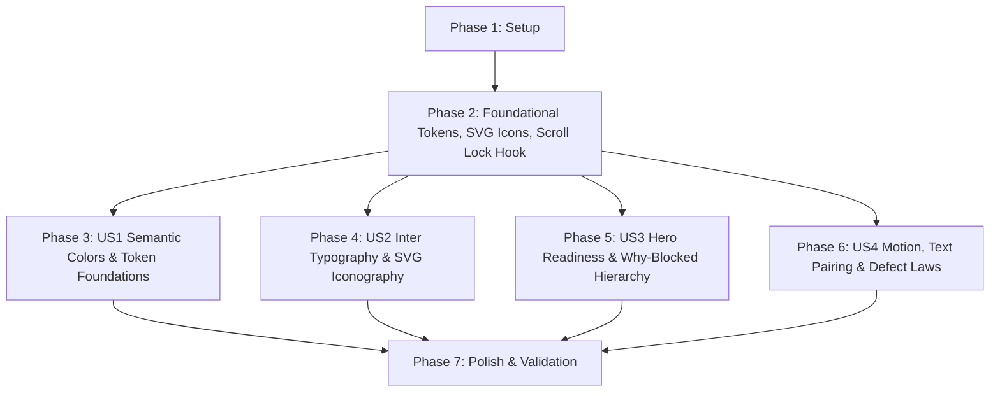

# Tasks: Restyle ClearanceScout UI to Constitution v1.1.0

**Feature**: Restyle ClearanceScout UI to Constitution v1.1.0 | **Branch**: `022-design-system-restyling` | **Spec**: [`spec.md`](spec.md)

## Phase 1: Setup (Shared Infrastructure)

**Purpose**: Verify repository environment, baseline audits, and design log structure per Constitution v1.1.0.

- [x] T001 Audit `src/` codebase for hardcoded hex colors, raw emoji characters, and un-locked modal scroll handlers
- [x] T002 [P] Verify `DESIGN_LOG.md` append-only structure and initial Constitution v1.1.0 entry

---

## Phase 2: Foundational (Blocking Prerequisites)

**Purpose**: Core CSS tokens, icon components, and scroll lock hook required by all user stories.

**⚠️ CRITICAL**: No user story work can begin until this phase is complete.

- [x] T003 [P] Define sacred status HSL colors, single brand accent, typography variables, and motion custom properties in `src/index.css`
- [x] T004 [P] Create `useBodyScrollLock.ts` hook in `src/hooks/useBodyScrollLock.ts` supporting nested modal counter and body scroll locking
- [x] T005 [P] Create lightweight inline stroke SVG icon component library in `src/components/icons/` (`CheckCircleIcon.tsx`, `AlertTriangleIcon.tsx`, `XCircleIcon.tsx`, `HelpCircleIcon.tsx`, `FilmIcon.tsx`, `FileTextIcon.tsx`, `SearchIcon.tsx`, `RefreshCwIcon.tsx`, `XIcon.tsx`, `ChevronRightIcon.tsx`)

**Checkpoint**: Foundation ready - user story implementation can now begin.

---

## Phase 3: User Story 1 - Visual System & Semantic Token Foundations (Priority: P1) 🎯 MVP

**Goal**: Establish sacred semantic color system (Green = Cleared, Amber = Review, Red = Blocks Shooting; single brand accent; zero raw hex in JSX/TSX).

**Independent Test**: Can be verified by running `grep -rn "#[0-9a-fA-F]\{3,6\}" src/components src/pages` and confirming zero raw hex matches.

- [x] T006 [P] [US1] Refactor `src/components/StatusBadge.tsx` and `src/components/RiskBadge.tsx` to use HSL CSS custom properties (`var(--color-status-green)`, `var(--color-status-amber)`, `var(--color-status-red)`)
- [x] T007 [P] [US1] Refactor `src/pages/WorkspacePage.tsx` inline style/color overrides to use CSS custom properties
- [x] T008 [P] [US1] Refactor `src/components/EntityRegistryTable.tsx` filter badges, action buttons, and row colors to derive exclusively from `src/index.css` CSS custom properties
- [x] T009 [US1] Audit and eliminate raw hex strings across all remaining component files in `src/components/`

**Checkpoint**: User Story 1 complete - all application styling derives strictly from centralized CSS custom properties.

---

## Phase 4: User Story 2 - Chrome Typography, Provenance & SVG Iconography (Priority: P1)

**Goal**: Apply Inter variable font to UI chrome while reserving Courier Prime monospace exclusively for text artifacts (screenplay/JSON logs) and replace all emoji in chrome with inline stroke SVG icons.

**Independent Test**: Can be verified by inspecting rendered chrome font-family (`Inter`) vs `.fountain-script` font-family (`Courier Prime`) and asserting 100% of chrome icons render as inline `<svg>` elements with zero emoji.

- [x] T010 [P] [US2] Configure Inter variable font for UI chrome and Courier Prime for `.fountain-script` and `.json-log` elements in `src/index.css`
- [x] T011 [P] [US2] Replace emoji in `src/pages/WorkspacePage.tsx` header, toolbar, and action triggers with inline SVG icons
- [x] T012 [P] [US2] Replace emoji in `src/components/ScriptUploadModal.tsx`, `src/components/ProductionDashboardModal.tsx`, and `src/components/ActionListModal.tsx` modal headers and buttons with inline SVG icons
- [x] T013 [P] [US2] Replace emoji in `src/components/EntityRegistryTable.tsx` filter bar, status badges, and overflow dropdown with inline SVG icons
- [x] T014 [US2] Replace emoji across remaining modals (`ProjectListModal`, `BinderExportModal`, `CitationDrawer`, `RightsModal`, `PlaceholderManagerModal`, `ComparisonModal`, `EntityDetailModal`, `ItemEditModal`, `ReplacementCardModal`)

**Checkpoint**: User Story 2 complete - UI chrome is clean, professional, and free of emoji artifacts.

---

## Phase 5: User Story 3 - Hero Readiness Index & Per-Scene Blocked Reasons Hierarchy (Priority: P1)

**Goal**: Make the Shooting Readiness Index and per-scene why-blocked reasons the primary visual hero of the workspace.

**Independent Test**: Can be verified by rendering the main header and Operations Dashboard modal and confirming hero readiness card has the highest font-size and visual weight, and blocked scenes render why-blocked alert callouts at top of section.

- [x] T015 [P] [US3] Redesign Shooting Readiness Index hero card in `src/pages/WorkspacePage.tsx` header with `--font-size-4xl` hero typography, high-contrast surface, and primary visual weight
- [x] T016 [P] [US3] Redesign Operations Dashboard modal in `src/components/ProductionDashboardModal.tsx` to feature the hero readiness metric and prominent why-blocked alert callouts for blocked scenes
- [x] T017 [US3] Add per-scene why-blocked highlight cards to scene breakdown views in `src/components/ScriptViewer.tsx` for `BLOCKS_SHOOTING` / `ACTION_REQUIRED` scenes

**Checkpoint**: User Story 3 complete - shooting readiness and why-blocked reasons take top visual priority.

---

## Phase 6: User Story 4 - Motion Orchestration, Status Text Pairing & Defect Law Compliance (Priority: P2)

**Goal**: Implement single load sequence animation, single looping red signal, prefers-reduced-motion collapse, paired status text, modal body scroll locking, and safe HTML entity character encoding.

**Independent Test**: Can be verified by opening any modal and checking `document.body.style.overflow === 'hidden'`, inspecting status badges for text pairing, and verifying HTML entities for non-ASCII characters.

- [x] T018 [P] [US4] Integrate `useBodyScrollLock` into `useModalFocus.ts` and ensure all 13 modal overlays lock `document.body` scrolling when open
- [x] T019 [P] [US4] Ensure every status badge in `src/components/StatusBadge.tsx` and `src/components/RiskBadge.tsx` pairs color with explicit text labels
- [x] T020 [P] [US4] Configure single load sequence `@keyframes heroEntrance` and single looping animation `@keyframes pulseBlockSignal` in `src/index.css` with full `@media (prefers-reduced-motion: reduce)` collapse
- [x] T021 [US4] Audit non-ASCII typographic characters across `src/` and replace with safe HTML entities (`&mdash;`, `&rdquo;`, `&lsquo;`, `&nbsp;`)

**Checkpoint**: User Story 4 complete - complete WCAG accessibility, body scroll locking, and HTML entity safety verified.

---

## Phase 7: Polish & Cross-Cutting Concerns

**Purpose**: Automated test suite validation, build verification, live Playwright browser validation, and design log audit.

- [x] T022 [P] Execute full automated unit/contract test suite `npm test` and verify 100% pass across all test suites
- [x] T023 [P] Execute clean production build validation via `npm run build`
- [x] T024 Create live browser validation script `tests/live_design_system_validation.js` and verify against live Cloud Run deployment
- [x] T025 Append final design system restyling entry to `DESIGN_LOG.md` per Constitution v1.1.0 Article 8

---

## Dependencies & Execution Order

### Parallel Opportunities

- **Phase 2 Foundational**: T003, T004, and T005 can execute in parallel.
- **User Stories (Phases 3-6)**: Once Phase 2 completes, US1, US2, US3, and US4 tasks marked `[P]` can execute in parallel across independent component files.

---

## Implementation Strategy (MVP First)

1. **Step 1 (Foundations)**: Deliver T001–T005 to establish `src/index.css` tokens, `useBodyScrollLock`, and SVG icon components.
2. **Step 2 (MVP - US1)**: Complete T006–T009 to enforce sacred semantic color tokens and eliminate raw hex strings.
3. **Step 3 (US2 & US3 Chrome & Hero Hierarchy)**: Complete T010–T017 to replace emoji with inline stroke SVGs, configure Inter typography, and elevate Shooting Readiness Index hero cards.
4. **Step 4 (US4 Defect Laws & Motion)**: Complete T018–T021 for modal body scroll locking, status text pairing, motion budgets, and HTML entity protection.
5. **Step 5 (Validation)**: Complete T022–T025 for unit tests, clean build, live browser validation, and design log audit.
